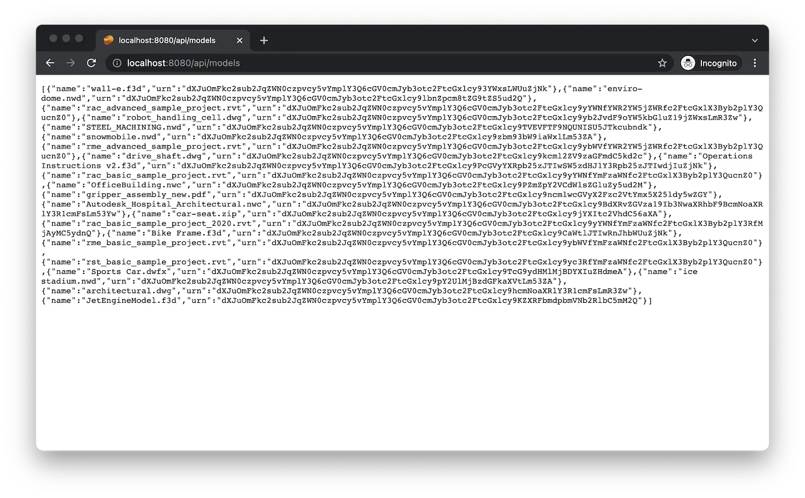

import EnvTabs from '@site/src/components/EnvTabs.js';

import NodeJsVsCodeData from './_shared/nodejs-vscode/data/data.mdx';
import NodeJsVsCodeDerivatives from './_shared/nodejs-vscode/data/derivatives.mdx';
import NodeJsVsCodeEndpoints from './_shared/nodejs-vscode/data/endpoints.mdx';

import DotNetData from './_shared/dotnet/data/data.mdx';
import DotNetDerivatives from './_shared/dotnet/data/derivatives.mdx';
import DotNetEndpoints from './_shared/dotnet/data/endpoints.mdx';

# Data a deriváty

V tomto kroku rozšíříme náš server, abychom mohli vypsat modely, nahrát je,
a připravte je k prohlížení.

## Správa dat

Nejprve se ujistěte, že naše aplikace má ve službě Správa dat kbelík
do kterého můžete ukládat své soubory. Kontejner by se obvykle vytvořil jenom jednou jako součást zřizování
krok, ale v naší ukázce implementujeme pomocnou funkci, která zajistí, že kbelík
je k dispozici a použijte ho v jiných částech serverové aplikace.

Při vytváření kontejnerů je nutné, aby aplikace nastavily zásady uchovávání informací pro objekty uložené v kontejneru. To nelze později změnit. Zásady uchovávání informací v kontejneru se vztahují na všechny objekty uložené uvnitř. Při vytváření kontejneru konkrétně nastavte **policyKey** na **přechodný**, **dočasný** nebo **trvalý**.

:::info

**Zásady uchovávání údajů**

Transient – objekty starší než 24 hodin se automaticky odeberou.

Temporary – když objekt dosáhne stáří 30 dnů, odstraní se.

Persistent – k dispozici, dokud uživatel objekt neodstraní.

:::

<EnvTabs NodeJsVsCode={NodeJsVsCodeData} DotNetVsCode={DotNetData} DotNetVs2022={DotNetData} />

:::caution

Všimněte si, že služba Správa dat vyžaduje, aby názvy kbelíků byly **globálně jedinečné**.
a pokusy o vytvoření kbelíku s již použitým názvem selžou s "konfliktem 409".
Podívejte se na [dokumentaci](https://aps.autodesk.com/en/docs/data/v2/reference/http/buckets-POST)
pro více podrobností.

:::

## Deriváty

Dále implementujeme několik pomocných funkcí, které budou odvozovat/extrahovat různé typy informací
z nahraných souborů - například 2D výkresů, 3D geometrie a metadat - které můžeme později načíst
do prohlížeče na našich webových stránkách. Abychom tak mohli učinit, budeme muset spustit novou úlohu převodu
v [derivát modelu](https://aps.autodesk.com/en/docs/model-derivative/v2/developers_guide/overview)
a kontrola stavu převodu.

Služba odvození modelu vyžaduje, aby všechna ID, která používáme ve voláních API, byla kódována [base64](https://wikipedia.org/wiki/Base64).
Zahrnuli jsme tedy malou obslužnou funkci, která vám s tím pomůže.

:::info

ID s kódováním Base64 se označují jako _URNs_.

:::

<EnvTabs NodeJsVsCode={NodeJsVsCodeDerivatives} DotNetVsCode={DotNetDerivatives} DotNetVs2022={DotNetDerivatives} />

## Koncové body serveru

Nyní zpřístupníme novou funkcionalitu klientovi prostřednictvím jiného
sada koncových bodů.

<EnvTabs NodeJsVsCode={NodeJsVsCodeEndpoints} DotNetVsCode={DotNetEndpoints} DotNetVs2022={DotNetEndpoints} />

## Vyzkoušejte si to

Spusťte (nebo restartujte) aplikaci obvyklým způsobem a přejděte na [http://localhost:8080/api/models](http://localhost:8080/api/models)
v prohlížeči. Server by měl odpovědět seznamem JSON s názvy a URN všech objektů
k dispozici v nakonfigurovaném kbelíku.

:::info

Pokud s APS pracujete poprvé, můžete získat odpověď JSON
s prázdným polem ('[]'), které je očekáváno. Na níže uvedeném snímku obrazovky můžeme
Již vidím několik souborů, které byly v minulosti nahrány do našeho kbelíku.

:::

:::tip

Pokud používáte Google Chrome, zvažte instalaci [formátovače JSON](https://chrome.google.com/webstore/detail/json-formatter/bcjindcccaagfpapjjmafapmmgkkhgoa?hl=en)
nebo podobné rozšíření pro automatické formátování odpovědí JSON.

:::

