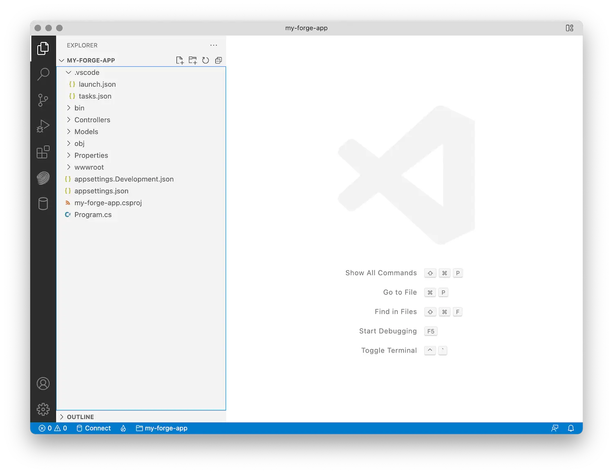

Vytvořte novou složku pro projekt, přejděte do ní v příkazovém řádku a inicializujte novou složku
ASP.NET Základní projekt:

```bash
dotnet new web
```

Dále budeme muset nainstalovat závislosti. V tomto případě to bude jen pár
balíčky z oficiálního APS SDK:

```bash
dotnet add package Autodesk.SdkManager
dotnet add package Autodesk.Authentication
dotnet add package Autodesk.OSS
dotnet add package Autodesk.ModelDerivative
```

Soubor *.csproj v projektu by teď měl vypadat podobně jako tento (pravděpodobně s
mírně odlišná čísla verzí a další nastavení .NET):

```xml
<Project Sdk="Microsoft.NET.Sdk.Web">
  <PropertyGroup>
    <TargetFramework>net6.0</TargetFramework>
  </PropertyGroup>
  <ItemGroup>
    <PackageReference Include="Autodesk.Authentication" Version="1.0.0" />
    <PackageReference Include="Autodesk.ModelDerivative" Version="1.0.0" />
    <PackageReference Include="Autodesk.OSS" Version="1.0.0" />
    <PackageReference Include="Autodesk.SdkManager" Version="1.0.0" />
  </ItemGroup>
</Project>
```

Nakonec vytvoříme ve složce projektu několik dalších podsložek, které budeme potřebovat později:

- "Řadiče" – zde budeme implementovat všechny koncové body serveru
- "Modely" – tady zachováme veškerou logiku na straně serveru, kterou je možné sdílet různými koncovými body
- 'wwwroot' - to je místo, kam umístíme všechny prostředky na straně klienta (HTML, CSS, JavaScript, obrázky atd.)

Když teď poprvé otevřete složku projektu v editoru Visual Studio Code, zobrazí se výzva
k nastavení projektu pro vývoj v .NET. Přijměte výzvu a editor automaticky vytvoří
podsložka .vscode s dalšími nastaveními specifickými pro .NET, jako je výchozí [konfigurace spuštění](https://code.visualstudio.com/docs/editor/debugging#_launch-configurations).
Struktura složek v editoru by měla vypadat podobně jako tato:




:::note

Pokud se složka .vscode nevytvoří automaticky, můžete ji vytvořit prostřednictvím postranního panelu Spustit a ladit


:::


Chcete-li vytvořit složku .vscode, klikněte na nástroj *Spustit a ladit na levém bočním panelu > vytvořte soubor launch.json > vyberte . NET5+ & .NET Core*.