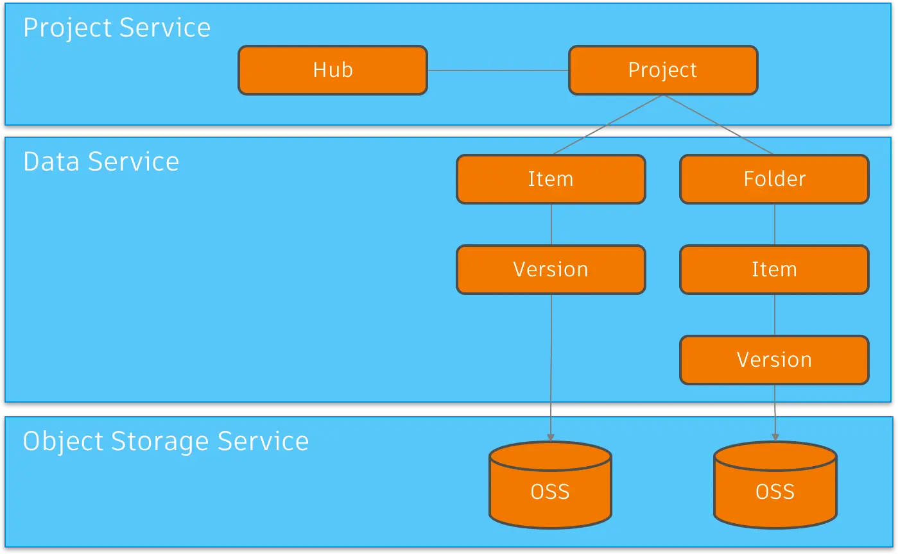

import EnvTabs from '@site/src/components/EnvTabs.js';

import NodeJsVsCodeHubs from './_shared/nodejs-vscode/data/hubs.mdx';
import NodeJsVsCodeEndpoints from './_shared/nodejs-vscode/data/endpoints.mdx';

import DotNetHubs from './_shared/dotnet/data/hubs.mdx';
import DotNetEndpoints from './_shared/dotnet/data/endpoints.mdx';

# Procházení dat

V tomto kroku rozšíříme náš server, abychom mohli procházet obsah jiných APS
aplikace, jako je BIM 360 Docs nebo Autodesk Docs. V zásadě se budeme řídit správou dat
Hierarchie center, projektů, složek, položek a verzí služby:

## Procházení rozbočovačů

Nejprve přidáme několik pomocných metod pro procházení hubů, projektů,
Složky, položky a verze:

<EnvTabs NodeJsVsCode={NodeJsVsCodeHubs} DotNetVsCode={DotNetHubs} DotNetVs2022={DotNetHubs} />

## Koncové body serveru

V dalším kroku zpřístupníme novou funkci kódu na straně klienta prostřednictvím jiného
sada koncových bodů.

<EnvTabs NodeJsVsCode={NodeJsVsCodeEndpoints} DotNetVsCode={DotNetEndpoints} DotNetVs2022={DotNetEndpoints} />

## Vyzkoušejte si to

A to je ze strany serveru vše. Je čas to vyzkoušet!

Spusťte (nebo restartujte) aplikaci z editoru Visual Studio Code obvyklým způsobem a přejděte na
[http://localhost:8080/api/hubs](http://localhost:8080/api/hubs) v prohlížeči.
Server by měl odpovědět seznamem JSON všech center, ke kterým máte přístup.
Zkuste zkopírovat ID jednoho z hubů a použít ho na jiné adrese: http://localhost:8080/api/hubs/your-hub-id/projects.
V takovém případě by serverová aplikace měla odpovědět seznamem JSON všech projektů
K dispozici v zadaném rozbočovači.

:::info

Pokud jste v předchozím kroku přeskočili postup přihlášení nebo restartovali serverovou aplikaci,
Možná budete muset přejít na [http://localhost:8080/api/auth/login](http://localhost:8080/api/auth/login)
znovu, abyste se před testováním ujistili, že všechna ověřovací data jsou k dispozici v souborech cookie
Koncový bod /api/hubs.

:::

:::tip

Pokud používáte Google Chrome, zvažte instalaci [formátovače JSON](https://chrome.google.com/webstore/detail/json-formatter/bcjindcccaagfpapjjmafapmmgkkhgoa?hl=en)
nebo podobné rozšíření pro automatické formátování odpovědí JSON.

:::

