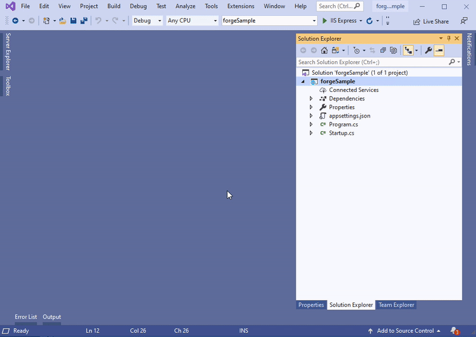

Tento krok vám pomůže vytvořit základní zásuvný modul aplikace Inventor. Další informace naleznete ve výukovém programu [Můj první zásuvný modul aplikace Inventor](https://knowledge.autodesk.com/support/inventor-products/learn-explore/caas/simplecontent/content/my-first-inventor-plug-overview.html).

> Můžete si [stáhnout soubor ZIP sady](https://github.com/autodesk-platform-services/aps-design-automation-nodejs/tree/nodejs/bundles/UpdateIPTParam.zip) do složky "bundles/" (Node.js) nebo "/designAutomationSample/wwwroot/bundles" (.NET Core) a [přeskočit na **část Upload Plugin Bundle**](#upload-plugin-bundle).

## Předpoklady

- **Šablona Automatizace návrhu pro aplikaci Inventor**: Přejděte na web Visual Studio Market Place, stáhněte si ji a otevřete z [tohoto odkazu](https://marketplace.visualstudio.com/items?itemName=Autodesk.DesignAutomation) a poté postupujte podle pokynů k instalaci.


## Vytvoření nového projektu

Klikněte pravým tlačítkem myši na řešení, **Přidat** >> **Nový projekt**. Vyhledejte šablony aplikace Inventor**, poté projekt modulu plug-in a nakonec jej pojmenujte UpdateIPTParam. Klikněte pravým tlačítkem myši na projekt, přejděte na **Spravovat balíčky NuGet...**, v části **Procházet** můžete vybrat Newtonsoft.Json a aktualizovat (tento balíček je již v řešení, pokud ne, nainstalujte)

> Vyberte prosím .NET Framework 4.7. Pokud není uvedeno, [nainstalujte prosím vývojový balíček](https://dotnet.microsoft.com/download/dotnet-framework/net47).



## SampleAutomation.cs

Otevřete soubor "SampleAutomation.cs" a zkopírujte do něj následující obsah. To je místo, kde se parametry aktualizují metodou 'Run'.

```dotnet title=SampleAutomation.cs
using Inventor;
using Newtonsoft.Json;
using System;
using System.Collections.Generic;
using System.Diagnostics;
using System.Runtime.InteropServices;
using System.Threading;
namespace UpdateIPTParam
{
    [ComVisible(true)]
    public class SampleAutomation
    {
        private InventorServer m_server;
        public SampleAutomation(InventorServer app) { m_server = app; }
        public void Run(Document doc)
        {
            try
            {
                // update parameters in the doc
                ChangeParameters(doc);
                // generate outputs
                var docDir = System.IO.Path.GetDirectoryName(doc.FullFileName);
                // save output file
                var documentType = doc.DocumentType;
                if (documentType == DocumentTypeEnum.kPartDocumentObject)
                {
                    // the name must be in sync with OutputIpt localName in Activity
                    var fileName = System.IO.Path.Combine(docDir, "outputFile.ipt");
                    // save file
                    doc.SaveAs(fileName, false);
                }
            }
            catch (Exception e) { LogTrace("Processing failed: {0}", e.ToString()); }
        }
        /// <summary>
        /// Change parameters in Inventor document.
        /// </summary>
        /// <param name="doc">The Inventor document.</param>
        /// <param name="json">JSON with changed parameters.</param>
        public void ChangeParameters(Document doc)
        {
            var theParams = GetParameters(doc);
            Dictionary<string, string> parameters = JsonConvert.DeserializeObject<Dictionary<string, string>>(System.IO.File.ReadAllText("params.json"));
            foreach (KeyValuePair<string, string> entry in parameters)
            {
                try
                {
                    Parameter param = theParams[entry.Key.ToLower()];
                    param.Expression = entry.Value;
                }
                catch (Exception e) { LogTrace("Cannot update {0}: {1}", entry.Key, e.Message); }
            }
            doc.Update();
        }
        /// <summary>
        /// Get parameters for the document.
        /// </summary>
        /// <returns>Parameters. Throws exception if parameters are not found.</returns>
        private static Parameters GetParameters(Document doc)
        {
            var docType = doc.DocumentType;
            switch (docType)
            {
                case DocumentTypeEnum.kAssemblyDocumentObject:
                    var asm = doc as AssemblyDocument;
                    return asm.ComponentDefinition.Parameters;
                case DocumentTypeEnum.kPartDocumentObject:
                    var ipt = doc as PartDocument;
                    return ipt.ComponentDefinition.Parameters;
                default:
                    throw new ApplicationException(string.Format("Unexpected document type ({0})", docType));
            }
        }
        /// <summary>
        /// This will appear on the Design Automation output
        /// </summary>
        private static void LogTrace(string format, params object[] args) { Trace.TraceInformation(format, args); }
    }
}
```

## Událost po sestavení

> Pro Node.js je nutné upravit výstupní složku ZIP sady AppBundle.

Nyní musíme zazipovat složku '.bundle'. Klikněte pravým tlačítkem myši na projekt, vyberte **Vlastnosti**, pak otevřete **Události sestavení** a zkopírujte následující do pole **Příkazový řádek události po sestavení**, jak je znázorněno na obrázku níže.

```
xcopy /Y /F "$(ProjectDir)PackageContents.xml" "$(TargetDir)\Bundle\$(MSBuildProjectName).bundle\"
xcopy /Y /F "$(TargetDir)*.*" "$(TargetDir)\Bundle\$(MSBuildProjectName).bundle\Contents\"
del /F "$(ProjectDir)..\designAutomationSample\wwwroot\bundles\UpdateIPTParam.zip"
"C:\Program Files\7-Zip\7z.exe" a -tzip "$(ProjectDir)../designAutomationSample/wwwroot/bundles/UpdateIPTParam.zip" "$(TargetDir)\bundle\$(MSBuildProjectName).bundle\" -xr0!*.pdb
```

Tím se zkopíruje DLL z '/bin/debug/' do složky '.bundle/Contents', poté pomocí [7zip](https://www.7-zip.org/) vytvořte zip a nakonec zkopírujte ZIP do složek '/bundles' webové aplikace.


Pokud teď sestavíte projekt UpdateIPTParam, mělo by se v okně **Output** zobrazit něco takového. Všimněte si 2 složek a několika zazipovaných souborů. Soubor ZIP se vytvoří přímo ve složce /wwwroot/bundles. To znamená, že si vedete skvěle!


