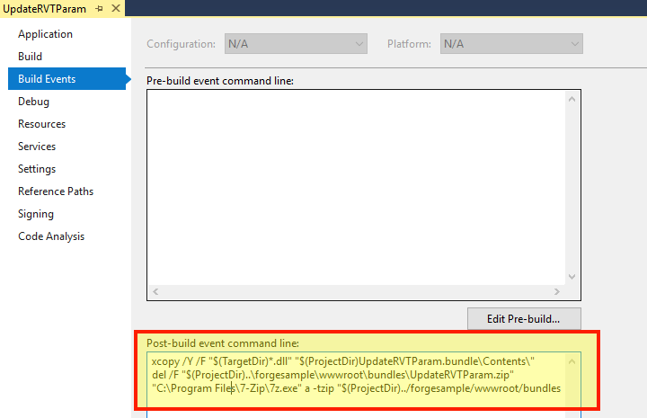

Tento krok vám pomůže vytvořit základní zásuvný modul Revit pro automatizaci návrhu. Další informace naleznete ve výukovém programu [My First Revit Plugin](https://knowledge.autodesk.com/support/revit-products/learn-explore/caas/simplecontent/content/my-first-revit-plug-overview.html).

> Můžete si [stáhnout soubor ZIP sady](https://github.com/autodesk-platform-services/aps-design-automation-nodejs/tree/nodejs/bundles/UpdateRVTParam.zip) do složky "bundles/" (Node.js) nebo "/designAutomationSample/wwwroot/bundles" (.NET 6) a [přeskočit na část **Upload Plugin Bundle**](#upload-plugin-bundle).

### Vytvoření nového projektu

Klikněte na řešení, **Přidat** >> **Nový projekt**. Vyberte **Windows Desktop**, pak **Knihovna tříd** a nakonec ji pojmenujte 'UpdateRVTParam'.

> Vyberte prosím .NET Framework 4.8. Pokud není uvedeno, [nainstalujte prosím vývojový balíček](https://dotnet.microsoft.com/download/dotnet-framework/net48).

Klikněte pravým tlačítkem myši na **Reference**, poté na **Přidat referenci** a **Procházet** pro "RevitAPI.dll" (ve výchozím nastavení ve složce "C:\Program Files\Autodesk\Revit 201x"). Pak klikněte pravým tlačítkem myši na tento odkaz **RevitAPI**, přejděte na **Vlastnosti** a nastavte **Kopírovat místní** na **Nepravda**.

Poté klikněte pravým tlačítkem myši na projekt, přejděte na **Spravovat balíčky NuGet...**, v části **Prohlížeč** můžete vyhledat **DesignAutomation.Revit** a nainstalovat 'Autodesk.Forge.DesignAutomation.Revit' (vyberte příslušnou verzi Revitu, kterou potřebujete). Pak vyhledejte a nainstalujte Newtonsoft.Json (který se používá k analýze vstupních dat ve formátu JSON).


```xml title=package.config
<?xml version="1.0" encoding="utf-8"?>
<packages>
  <package id="Autodesk.Forge.DesignAutomation.Revit" version="2021.0.0" targetFramework="net48" />
  <package id="Microsoft.CSharp" version="4.5.0" targetFramework="net48" />
  <package id="Newtonsoft.Json" version="12.0.1" targetFramework="net48" />
</packages>
```

Projekt by měl obsahovat třídu 'Class1.cs', přejmenujme soubor na Commands.cs (kvůli konzistenci).

V tomto okamžiku by projekt měl vypadat takto


```cs title=Commands.cs
using Autodesk.Revit.ApplicationServices;
using Autodesk.Revit.Attributes;
using Autodesk.Revit.DB;
using DesignAutomationFramework;
using Newtonsoft.Json;
using System.Collections.Generic;
using System.IO;
namespace Autodesk.Forge.Sample.DesignAutomation.Revit
{
    [Transaction(TransactionMode.Manual)]
    [Regeneration(RegenerationOption.Manual)]
    public class Commands : IExternalDBApplication
    {
        //Path of the project(i.e)project where your Window family files are present
        string OUTPUT_FILE = "OutputFile.rvt";
        public ExternalDBApplicationResult OnStartup(ControlledApplication application)
        {
            DesignAutomationBridge.DesignAutomationReadyEvent += HandleDesignAutomationReadyEvent;
            return ExternalDBApplicationResult.Succeeded;
        }
        private void HandleDesignAutomationReadyEvent(object sender, DesignAutomationReadyEventArgs e)
        {
            LogTrace("Design Automation Ready event triggered...");
            e.Succeeded = true;
            EditWindowParametersMethod(e.DesignAutomationData.RevitDoc);
        }
        private void EditWindowParametersMethod(Document doc)
        {
            InputParams inputParameters = JsonConvert.DeserializeObject<InputParams>(File.ReadAllText("params.json"));
            //Modifying the window parameters
            //Open transaction
            using (Transaction trans = new Transaction(doc))
            {
                trans.Start("Update window parameters");
                //Filter for windows
                FilteredElementCollector WindowCollector = new FilteredElementCollector(doc).OfCategory(BuiltInCategory.OST_Windows).WhereElementIsNotElementType();
                IList<ElementId> windowIds = WindowCollector.ToElementIds() as IList<ElementId>;
                foreach (ElementId windowId in windowIds)
                {
                    Element Window = doc.GetElement(windowId);
                    FamilyInstance FamInst = Window as FamilyInstance;
                    FamilySymbol FamSym = FamInst.Symbol;
                    SetElementParameter(FamSym, BuiltInParameter.WINDOW_HEIGHT, inputParameters.Height);
                    SetElementParameter(FamSym, BuiltInParameter.WINDOW_WIDTH, inputParameters.Width);
                }
                //To save all the changes commit the transaction
                trans.Commit();
            }
            //Save the updated file by overwriting the existing file
            ModelPath ProjectModelPath = ModelPathUtils.ConvertUserVisiblePathToModelPath(OUTPUT_FILE);
            SaveAsOptions SAO = new SaveAsOptions();
            SAO.OverwriteExistingFile = true;
            //Save the project file with updated window's parameters
            LogTrace("Saving file...");
            doc.SaveAs(ProjectModelPath, SAO);
        }
        public ExternalDBApplicationResult OnShutdown(ControlledApplication application)
        {
            return ExternalDBApplicationResult.Succeeded;
        }
        private void SetElementParameter(FamilySymbol FamSym, BuiltInParameter paraMeter, double parameterValue)
        {
            FamSym.get_Parameter(paraMeter).Set(parameterValue);
        }
        public class InputParams
        {
            public double Width { get; set; }
            public double Height { get; set; }
        }
        /// <summary>
        /// This will appear on the Design Automation output
        /// </summary>
        private static void LogTrace(string format, params object[] args) { System.Console.WriteLine(format, args); }
    }
}
```

Vytvořte složku s názvem UpdateRVTParam.bundle a uvnitř soubor s názvem PackageContents.xml a zkopírujte do něj následující obsah. Další informace najdete v PackageContents.xml Referenční příručka k formátu. Tento soubor říká aplikaci Revit, aby načetla náš zásuvný modul .addin.

```xml title=PackageContents.xml
<?xml version="1.0" encoding="utf-8" ?>
<ApplicationPackage Name="RevitDesignAutomation" Description="Sample Plugin for Revit" Author="tutorials.autodesk.io">
  <CompanyDetails Name="Autodesk, Inc" Url="http://tutorials.autodesk.io" Email="forge.help@autodesk.com"/>
  <Components Description="Modify window parameters">
    <RuntimeRequirements SeriesMax="R2021" SeriesMin="R2019" Platform="Revit" OS="Win64"/>
    <ComponentEntry LoadOnRevitStartup="True" LoadOnCommandInvocation="False" AppDescription="Modify Window Parameters" ModuleName="./Contents/Autodesk.Forge.Sample.DesignAutomation.Revit.addin" Version="1.0.0" AppName="Modify Window Parameters"/>
  </Components>
</ApplicationPackage>
```

#### Autodesk.Forge.Sample.DesignAutomation.Revit.addin

Ve složce UpdateRVTParam.bundle vytvořte podsložku s názvem Contents a v této složce nový soubor s názvem Autodesk.Forge.Sample.DesignAutomation.Revit.addin. To aplikaci Revit sděluje, jak má modul plug-in načíst.

```xml
<?xml version="1.0" encoding="utf-8" standalone="no"?>
<RevitAddIns>
  <AddIn Type="DBApplication">
    <Name>Modify Window Parameters</Name>
    <FullClassName>Autodesk.Forge.Sample.DesignAutomation.Revit.Commands</FullClassName>
    <Text>Revit for Design Automation</Text>
    <Description>Revit for Design Automation</Description>
    <VisibilityMode>AlwaysVisible</VisibilityMode>
    <Assembly>.\UpdateRVTParam.dll</Assembly>
    <AddInId>000BD853-36E4-461f-9171-C5ACEDA4E723</AddInId>
    <VendorId>ADSK</VendorId>
    <VendorDescription>Autodesk, Inc, www.autodesk.com</VendorDescription>
  </AddIn>
</RevitAddIns>
```


#### Událost po sestavení

> Pro Node.js je nutné upravit výstupní složku ZIP sady AppBundle.

Nyní musíme složku .bundle zazipovat. Klikněte pravým tlačítkem myši na projekt, vyberte **Vlastnosti**, pak otevřete **Události sestavení** a zkopírujte následující do pole **Příkazový řádek události po sestavení**, jak je znázorněno na obrázku níže.

```
xcopy /Y /F "$(TargetDir)*.dll" "$(ProjectDir)UpdateRVTParam.bundle\Contents\"
del /F "$(ProjectDir)..\designAutomationSample\wwwroot\bundles\UpdateRVTParam.zip"
"C:\Program Files\7-Zip\7z.exe" a -tzip "$(ProjectDir)../designAutomationSample/wwwroot/bundles/UpdateRVTParam.zip" "$(ProjectDir)UpdateRVTParam.bundle\" -xr0!*.pdb
```

Tím se zkopíruje DLL z '/bin/debug/' do složky '.bundle/Contents', poté pomocí [7zip](https://www.7-zip.org/) vytvořte zip a nakonec zkopírujte ZIP do složek '/bundles' webové aplikace.



> Všimněte si, jak událost **Po sestavení** používá názvy projektů a složek, takže se ujistěte, že používáte tyto názvy.

Pokud teď sestavíte projekt UpdateRVTParam, mělo by se v okně **Output** zobrazit něco podobného. Všimněte si 2 složek a 3 souborů zazipovaných. Soubor ZIP se vytvoří přímo ve /wwwroot/bundles složce. To znamená, že si vedete skvěle!


> Pokud výstup sestavení zobrazuje více než **2 složek, 5 zkopírovaných souborů**, vraťte se zpět a ujistěte se, že odkaz **RevitAPI** je nastaven na **Kopírovat místně**:**Nepravda**. Možná budete muset odebrat všechny knihovny DLL ze složky UpdateRVTParam.bundle/Contents/.