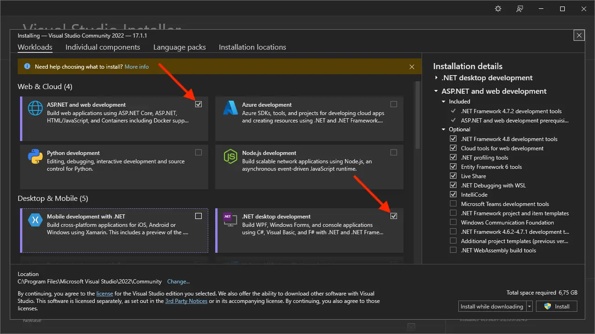

En nuestros tutoriales, usaremos Visual Studio Community 2022. Puedes descargar _Visual Studio Installer_
desde [aquí](https://visualstudio.microsoft.com/vs/community/) y, a continuación, instale la versión y la edición deseadas
de Visual Studio desde la aplicación de instalación:

Asegúrese de incluir el componente _ASP.NET y web development_, y considere la posibilidad de incluir
el componente de development_ de escritorio _.NET también si planea desarrollar complementos para aplicaciones de escritorio
como Revit o Inventor.

