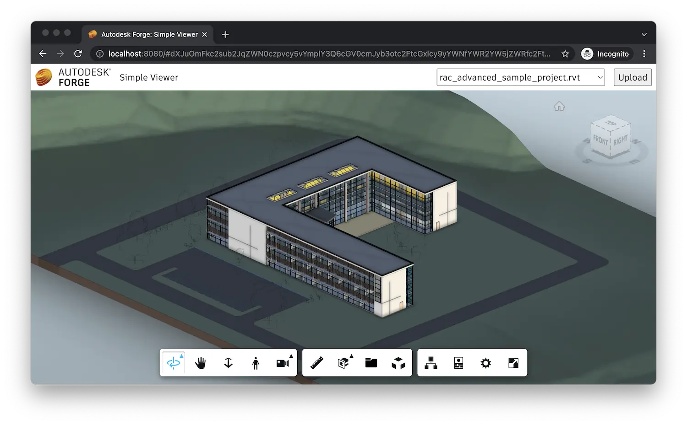

¡Y eso es todo! Su solicitud ya está completa. Inicie (o reinicie) la aplicación desde Visual Studio Code como de costumbre,
y navegue hasta [http://localhost:8080](http://localhost:8080) en su navegador. Se le debe presentar
una interfaz de usuario simple, con un menú desplegable en la esquina superior derecha que eventualmente se completará con todos los modelos
disponible en el bucket de la aplicación y con un botón para cargar nuevos modelos. Tan pronto como
Seleccione uno de los nombres del menú desplegable, el modelo correspondiente se cargará en el visor que ocupa
el resto de la página web.

