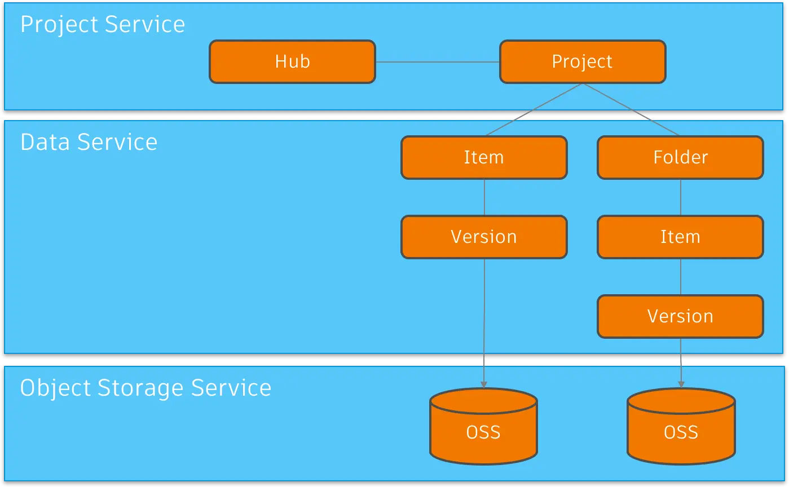

import EnvTabs from '@site/src/components/EnvTabs.js';

import NodeJsVsCodeHubs from './_shared/nodejs-vscode/data/hubs.mdx';
import NodeJsVsCodeEndpoints from './_shared/nodejs-vscode/data/endpoints.mdx';

import DotNetHubs from './_shared/dotnet/data/hubs.mdx';
import DotNetEndpoints from './_shared/dotnet/data/endpoints.mdx';

# Navegación de datos

En este paso, ampliaremos nuestro servidor para que podamos navegar por el contenido de otros
aplicaciones como BIM 360 Docs o Autodesk Docs. Básicamente seguiremos la Gestión de Datos
Jerarquía de centros, proyectos, carpetas, elementos y versiones del servicio:

## Centros de navegación

Primero, agreguemos un par de métodos auxiliares para navegar a través de los centros, proyectos,
Carpetas, elementos y versiones:

<EnvTabs NodeJsVsCode={NodeJsVsCodeHubs} DotNetVsCode={DotNetHubs} DotNetVs2022={DotNetHubs} />

## Puntos de conexión del servidor

A continuación, vamos a exponer la nueva funcionalidad al código del lado cliente a través de otro
conjunto de puntos finales.

<EnvTabs NodeJsVsCode={NodeJsVsCodeEndpoints} DotNetVsCode={DotNetEndpoints} DotNetVs2022={DotNetEndpoints} />

## Pruébalo

Y eso es todo para el lado del servidor. ¡Es hora de probarlo!

Inicie (o reinicie) la aplicación desde Visual Studio Code como de costumbre y vaya a
[http://localhost:8080/api/hubs](http://localhost:8080/api/hubs) en el navegador.
El servidor debe responder con una lista JSON de todos los concentradores a los que tiene acceso.
Intente copiar el ID de uno de los concentradores y utilícelo en otra dirección: http://localhost:8080/api/hubs/your-hub-id/projects.
En este caso, la aplicación de servidor debe responder con una lista JSON de todos los proyectos
disponible en el concentrador especificado.

:::info

Si omitió el procedimiento de inicio de sesión en el paso anterior o reinició la aplicación de servidor,
Es posible que tengas que ir a [http://localhost:8080/api/auth/login](http://localhost:8080/api/auth/login)
De nuevo, para asegurarse de que todos los datos de autenticación están disponibles en las cookies antes de realizar la prueba
El punto de conexión '/api/hubs'.

:::

:::tip

Si está utilizando Google Chrome, considere la posibilidad de instalar [Formateador JSON](https://chrome.google.com/webstore/detail/json-formatter/bcjindcccaagfpapjjmafapmmgkkhgoa?hl=en)
o una extensión similar para dar formato automáticamente a las respuestas JSON.

:::

