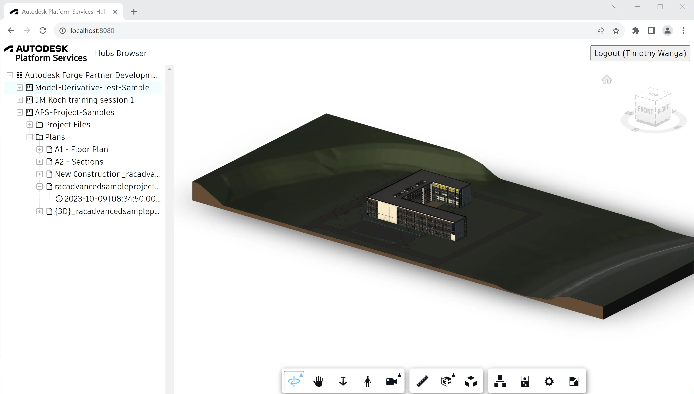

import EnvTabs from '@site/src/components/EnvTabs.js';

import NodeJsVsCodeStructure from './_shared/nodejs-vscode/final-folder-structure.mdx';
import DotNetVsCodeStructure from './_shared/dotnet-vscode/final-folder-structure.mdx';
import DotNetVs2022Structure from './_shared/dotnet-vs2022/final-folder-structure.mdx';

# Visor y interfaz de usuario

Finalmente, estamos listos para construir la parte del lado del cliente de nuestra aplicación.


:::tip

 
If you're developing with Node.js, you can use TypeScript definitions for the Viewer.
Run
```bash
npm install --save-dev @types/forge-viewer
``` 
in your terminal to add the TypeScript definition file to your project.


:::


## Lógica del visor

Comencemos implementando la funcionalidad Visor para nuestra aplicación.
Cree un archivo 'viewer.js' en la subcarpeta 'wwwroot' con el siguiente código:

```js title="wwwroot/viewer.js"
async function getAccessToken(callback) {
    try {
        const resp = await fetch('/api/auth/token');
        if (!resp.ok)
            throw new Error(await resp.text());
        const { access_token, expires_in } = await resp.json();
        callback(access_token, expires_in);
    } catch (err) {
        alert('Could not obtain access token. See the console for more details.');
        console.error(err);        
    }
}
export function initViewer(container) {
    return new Promise(function (resolve, reject) {
            Autodesk.Viewing.Initializer({ env: 'AutodeskProduction', getAccessToken }, function () {
            const config = {
                extensions: ['Autodesk.DocumentBrowser']
            };
            const viewer = new Autodesk.Viewing.GuiViewer3D(container, config);
            viewer.start();
            viewer.setTheme('light-theme');
            resolve(viewer);
        });
    });
}
export function loadModel(viewer, urn) {
    function onDocumentLoadSuccess(doc) {
        viewer.loadDocumentNode(doc, doc.getRoot().getDefaultGeometry());
    }
    function onDocumentLoadFailure(code, message) {
        alert('Could not load model. See console for more details.');
        console.error(message);
    }
    Autodesk.Viewing.Document.load('urn:' + urn, onDocumentLoadSuccess, onDocumentLoadFailure);
}
```

El script es un [módulo ES6](https://developer.mozilla.org/en-US/docs/Web/JavaScript/Guide/Modules)
que exporta dos funciones:

- 'initViewer' creará una nueva instancia del visor en el contenedor DOM especificado
- 'loadModel' para cargar un modelo específico en el visor

## Lógica de la barra lateral

A continuación, implementaremos el comportamiento de una barra lateral donde vamos a mostrar
Todos los concentradores, proyectos, carpetas, elementos y versiones de un componente de vista de árbol de terceros.
Cree un archivo 'sidebar.js' en la subcarpeta 'wwwroot' con el siguiente código:

```js title="wwwroot/sidebar.js"
async function getJSON(url) {
    const resp = await fetch(url);
    if (!resp.ok) {
        alert('Could not load tree data. See console for more details.');
        console.error(await resp.text());
        return [];
    }
    return resp.json();
}
function createTreeNode(id, text, icon, children = false) {
    return { id, text, children, itree: { icon } };
}
async function getHubs() {
    const hubs = await getJSON('/api/hubs');
    return hubs.map(hub => createTreeNode(`hub|${hub.id}`, hub.attributes.name, 'icon-hub', true));
}
async function getProjects(hubId) {
    const projects = await getJSON(`/api/hubs/${hubId}/projects`);
    return projects.map(project => createTreeNode(`project|${hubId}|${project.id}`, project.attributes.name, 'icon-project', true));
}
async function getContents(hubId, projectId, folderId = null) {
    const contents = await getJSON(`/api/hubs/${hubId}/projects/${projectId}/contents` + (folderId ? `?folder_id=${folderId}` : ''));
    return contents.map(item => {
        if (item.type === 'folders') {
            return createTreeNode(`folder|${hubId}|${projectId}|${item.id}`, item.attributes.displayName, 'icon-my-folder', true);
        } else {
            return createTreeNode(`item|${hubId}|${projectId}|${item.id}`, item.attributes.displayName, 'icon-item', true);
        }
    });
}
async function getVersions(hubId, projectId, itemId) {
    const versions = await getJSON(`/api/hubs/${hubId}/projects/${projectId}/contents/${itemId}/versions`);
    return versions.map(version => createTreeNode(`version|${version.id}`, version.attributes.createTime, 'icon-version'));
}
export function initTree(selector, onSelectionChanged) {
    // See http://inspire-tree.com
    const tree = new InspireTree({
        data: function (node) {
            if (!node || !node.id) {
                return getHubs();
            } else {
                const tokens = node.id.split('|');
                switch (tokens[0]) {
                    case 'hub': return getProjects(tokens[1]);
                    case 'project': return getContents(tokens[1], tokens[2]);
                    case 'folder': return getContents(tokens[1], tokens[2], tokens[3]);
                    case 'item': return getVersions(tokens[1], tokens[2], tokens[3]);
                    default: return [];
                }
            }
        }
    });
    tree.on('node.click', function (event, node) {
        event.preventTreeDefault();
        const tokens = node.id.split('|');
        if (tokens[0] === 'version') {
            onSelectionChanged(tokens[1]);
        }
    });
    return new InspireTreeDOM(tree, { target: selector });
}
```

## Lógica de aplicación

Ahora vamos a conectar todos los componentes de la interfaz de usuario. Cree un archivo 'main.js' en
la carpeta 'wwwroot' y rellénela con el siguiente código:

```js title="wwwroot/main.js"
import { initViewer, loadModel } from './viewer.js';
import { initTree } from './sidebar.js';
const login = document.getElementById('login');
try {
    const resp = await fetch('/api/auth/profile');
    if (resp.ok) {
        const user = await resp.json();
        login.innerText = `Logout (${user.name})`;
        login.onclick = () => {
            const iframe = document.createElement('iframe');
            iframe.style.visibility = 'hidden';
            iframe.src = 'https://accounts.autodesk.com/Authentication/LogOut';
            document.body.appendChild(iframe);
            iframe.onload = () => {
                window.location.replace('/api/auth/logout');
                document.body.removeChild(iframe);
            };
        }
        const viewer = await initViewer(document.getElementById('preview'));
        initTree('#tree', (id) => loadModel(viewer, window.btoa(id).replace(/=/g, '')));
    } else {
        login.innerText = 'Login';
        login.onclick = () => window.location.replace('/api/auth/login');
    }
    login.style.visibility = 'visible';
} catch (err) {
    alert('Could not initialize the application. See console for more details.');
    console.error(err);
}
```

El script primero intentará obtener los detalles del usuario para verificar si hemos iniciado sesión o no.
Si es así, el código puede inicializar el visor, así como el componente de vista de árbol.
La función de devolución de llamada pasada a 'initTree' se asegura de que cuando hacemos clic en un nodo hoja
En el árbol, el visor comenzará a cargar el modelo correspondiente.

## Interfaz de usuario

Y, por último, vamos a construir la interfaz de usuario de nuestra aplicación.

Crea un archivo 'main.css' en la subcarpeta 'wwwroot' y rellénalo con las siguientes reglas CSS:

```css title="wwwroot/main.css"
body, html {
    margin: 0;
    padding: 0;
    height: 100vh;
    font-family: ArtifaktElement;
}
#header, #sidebar, #preview {
    position: absolute;
}
#header {
    height: 3em;
    width: 100%;
    display: flex;
    flex-flow: row nowrap;
    justify-content: space-between;
    align-items: center;
}
#sidebar {
    width: 25%;
    left: 0;
    top: 3em;
    bottom: 0;
    overflow-y: scroll;
}
#preview {
    width: 75%;
    right: 0;
    top: 3em;
    bottom: 0;
}
#header > * {
    height: 2em;
    margin: 0 0.5em;
}
#login {
    font-family: ArtifaktElement;
    font-size: 1em;
}
#header .title {
    height: auto;
    margin-right: auto;
}
#tree {
    margin: 0.5em;
}
@media (max-width: 768px) {
    #sidebar {
        width: 100%;
        top: 3em;
        bottom: 75%;
    }
    #preview {
        width: 100%;
        top: 25%;
        bottom: 0;
    }
}
.icon-hub:before {
    background-image: url(https://raw.githubusercontent.com/primer/octicons/main/icons/apps-16.svg); /* or https://raw.githubusercontent.com/primer/octicons/main/icons/stack-16.svg */
    background-size: cover;
}
.icon-project:before {
    
    background-image: url(https://raw.githubusercontent.com/primer/octicons/main/icons/project-16.svg); /* or https://raw.githubusercontent.com/primer/octicons/main/icons/organization-16.svg */
    background-size: cover;
}
.icon-my-folder:before {
    background-image: url(https://raw.githubusercontent.com/primer/octicons/main/icons/file-directory-16.svg);
    background-size: cover;
}
.icon-item:before {
    background-image: url(https://raw.githubusercontent.com/primer/octicons/main/icons/file-16.svg);
    background-size: cover;
}
.icon-version:before {
    background-image: url(https://raw.githubusercontent.com/primer/octicons/main/icons/clock-16.svg);
    background-size: cover;
}
```

A continuación, crea un archivo 'index.html' en la misma carpeta con el siguiente contenido:

```html title="wwwroot/index.html"
<!doctype html>
<html lang="en">
<head>
    <meta charset="utf-8">
    <meta name="viewport" content="width=device-width, initial-scale=1">
    <link rel="icon" type="image/x-icon" href="https://cdn.autodesk.io/favicon.ico">
    <link rel="stylesheet" href="https://developer.api.autodesk.com/modelderivative/v2/viewers/7.*/style.css">
    <link rel="stylesheet" href="https://unpkg.com/inspire-tree-dom@4.0.6/dist/inspire-tree-light.min.css">
    <link rel="stylesheet" href="/main.css">
    <title>Autodesk Platform Services: Hubs Browser</title>
</head>
<body>
    <div id="header">
        
        <span class="title">Hubs Browser</span>
        <button id="login" style="visibility: hidden;">Login</button>
    </div>
    <div id="sidebar">
        <div id="tree"></div>
    </div>
    <div id="preview"></div>
    <script src="https://developer.api.autodesk.com/modelderivative/v2/viewers/7.*/viewer3D.js"></script>
    <script src="https://cdnjs.cloudflare.com/ajax/libs/lodash.js/4.17.21/lodash.min.js"></script>
    <script src="https://unpkg.com/inspire-tree@4.3.1/dist/inspire-tree.js"></script>
    <script src="https://unpkg.com/inspire-tree-dom@4.0.6/dist/inspire-tree-dom.min.js"></script>
    <script src="/main.js" type="module"></script>
</body>
</html>
```

> Note that since `main.js` is also an ES6 module, we have to use `type="module"` in its `<script>` tag.

La estructura final de carpetas del código fuente de la aplicación debería tener un aspecto similar al siguiente:

<EnvTabs NodeJsVsCode={NodeJsVsCodeStructure} DotNetVsCode={DotNetVsCodeStructure} DotNetVs2022={DotNetVs2022Structure} />

## Pruébalo

¡Y eso es todo! Su aplicación ya está lista para la acción. Comience como de costumbre, y cuando vaya a
[http://localhost:8080](http://localhost:8080), se le debe presentar una interfaz de usuario simple, con
una vista de árbol en el lado izquierdo y un visor vacío a la derecha. Intenta navegar a través del árbol,
y seleccione una versión específica de uno de sus archivos. Después de eso, se debe cargar el modelo correspondiente
en el espectador.


:::caution

Tenga en cuenta que los diseños cargados en Fusion Teams no se procesan para su visualización automática.
Primero querrá abrir estos diseños en el sitio web de Fusion Teams y, cuando estén listos,
puede verlos en su propia aplicación Hubs Browser.


:::



