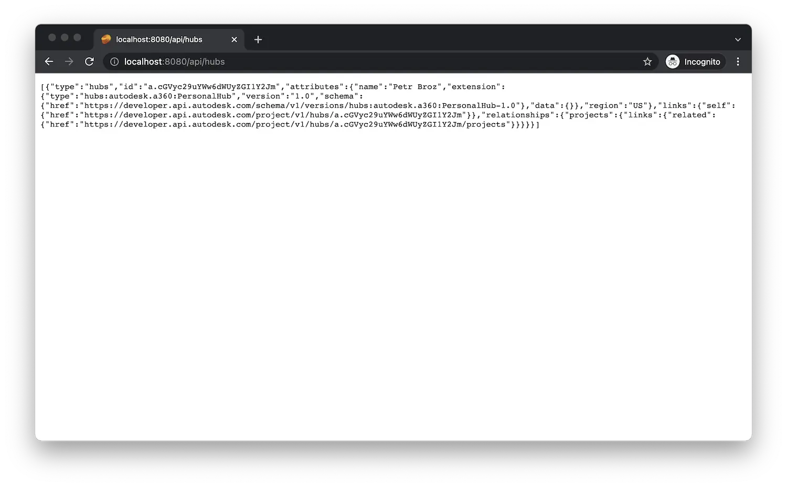

Inicie (o reinicie) la aplicación desde Visual Studio Code como de costumbre y vaya a
[http://localhost:8080/api/hubs](http://localhost:8080/api/hubs) en el navegador.
El servidor debe responder con una lista JSON de todos los concentradores a los que tiene acceso.
Intente copiar el ID de uno de los concentradores y utilícelo en otra dirección: http://localhost:8080/api/hubs/your-hub-id/projects.
En este caso, la aplicación de servidor debe responder con una lista JSON de todos los proyectos
disponible en el concentrador especificado.

