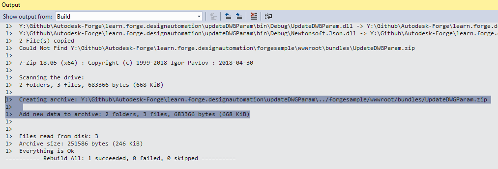

Este paso le ayudará a crear un complemento básico de AutoCAD para Design Automation. Para obtener más información, visite el tutorial [Mi primer complemento de AutoCAD](https://knowledge.autodesk.com/support/autocad/learn-explore/caas/simplecontent/content/my-first-autocad-plug-overview.html).

> Puede [descargar el paquete ZIP](https://github.com/autodesk-platform-services/aps-design-automation-dotnet/blob/master/designAutomationSample/wwwroot/bundles/UpdateDWGParam.zip) en la carpeta 'bundles/' (Node.js) o '/designAutomationSample/wwwroot/bundles' (.NET 6) y [saltar a la sección **Upload Plugin Bundle**](#upload-plugin-bundle).

### Crear un nuevo proyecto

- Haga clic con el botón derecho en la solución, el **Agregar** >> **Nuevo proyecto**.
- Selecciona **Escritorio de Windows**, luego **Biblioteca de clases** y, finalmente, nómbralo 'UpdateDWGParam'.
- A continuación, haga clic con el botón derecho en el proyecto, vaya a **Administrar paquetes NuGet...**, en **Navegador** puede buscar **AutoCAD.NET** e instalar 'AutoCAD.NET.Core' (que también instala 'AutoCAD.NET.Model').
- A continuación, busque e instale 'Newtonsoft.Json' (que se utiliza para analizar los datos de entrada en formato JSON).

> Seleccione .NET Framework 4.8. Si no aparece en la lista, [instala el Dev Pack](https://dotnet.microsoft.com/download/dotnet-framework/net48).


Como resultado, el **package.config** debería tener un aspecto similar al siguiente. En este ejemplo se usa la versión 20, que debería funcionar en todas las versiones disponibles. Puede ajustarse a una versión específica.

El proyecto debe contener una clase 'Class1.cs', cambiemos el nombre del archivo a 'Commands.cs' (para mantener la coherencia).

```cs title=Commands.cs
using Autodesk.AutoCAD.ApplicationServices.Core;
using Autodesk.AutoCAD.DatabaseServices;
using Autodesk.AutoCAD.Runtime;
using Newtonsoft.Json;
using System.IO;
[assembly: CommandClass(typeof(UpdateDWGParam.Commands))]
[assembly: ExtensionApplication(null)]
namespace UpdateDWGParam
{
    public class Commands
    {
        [CommandMethod("UpdateParam", CommandFlags.Modal)]
        public static void UpdateParam()
        {
            //Get active document of drawing with Dynamic block
            var doc = Application.DocumentManager.MdiActiveDocument;
            var db = doc.Database;
            // read input parameters from JSON file
            InputParams inputParams = JsonConvert.DeserializeObject<InputParams>(File.ReadAllText("params.json"));
            using (Transaction t = db.TransactionManager.StartTransaction())
            {
                var bt = t.GetObject(db.BlockTableId, OpenMode.ForRead) as BlockTable;
                foreach (ObjectId btrId in bt)
                {
                    //get the blockDef and check if is anonymous
                    BlockTableRecord btr = (BlockTableRecord)t.GetObject(btrId, OpenMode.ForRead);
                    if (btr.IsDynamicBlock)
                    {
                        //get all anonymous blocks from this dynamic block
                        ObjectIdCollection anonymousIds = btr.GetAnonymousBlockIds();
                        ObjectIdCollection dynBlockRefs = new ObjectIdCollection();
                        foreach (ObjectId anonymousBtrId in anonymousIds)
                        {
                            //get the anonymous block
                            BlockTableRecord anonymousBtr = (BlockTableRecord)t.GetObject(anonymousBtrId, OpenMode.ForRead);
                            //and all references to this block
                            ObjectIdCollection blockRefIds = anonymousBtr.GetBlockReferenceIds(true, true);
                            foreach (ObjectId id in blockRefIds)
                            {
                                dynBlockRefs.Add(id);
                            }
                        }
                        if (dynBlockRefs.Count > 0)
                        {
                            //Get the first dynamic block reference, we have only one Dyanmic Block reference in Drawing
                            var dBref = t.GetObject(dynBlockRefs[0], OpenMode.ForWrite) as BlockReference;
                            UpdateDynamicProperties(dBref, inputParams);
                        }
                    }
                }
                t.Commit();
            }
            LogTrace("Saving file...");
            db.SaveAs("outputFile.dwg", DwgVersion.Current);
        }
        /// <summary>
        /// This updates the Dyanmic Blockreference with given Width and Height
        /// The initial parameters of Dynamic Blockrefence, Width =20.00 and Height =40.00
        /// </summary>
        /// <param Editor="ed"></param>
        /// <param BlockReference="br"></param>
        /// <param String="name"></param>
        private static void UpdateDynamicProperties(BlockReference br, InputParams inputParams)
        {
            // Only continue is we have a valid dynamic block
            if (br != null && br.IsDynamicBlock)
            {
                // Get the dynamic block's property collection
                DynamicBlockReferencePropertyCollection pc = br.DynamicBlockReferencePropertyCollection;
                foreach (DynamicBlockReferenceProperty prop in pc)
                {
                    switch (prop.PropertyName)
                    {
                        case "Width":
                            prop.Value = inputParams.Width;
                            break;
                        case "Height":
                            prop.Value = inputParams.Height;
                            break;
                        default:
                            break;
                    }
                }
            }
        }
        /// <summary>
        /// This will appear on the Design Automation output
        /// </summary>
        private static void LogTrace(string format, params object[] args) { Application.DocumentManager.MdiActiveDocument.Editor.WriteMessage(format, args); }
    }
    public class InputParams
    {
        public double Width { get; set; }
        public double Height { get; set; }
    }
}
```

Este es el código principal que se ejecutará con AutoCAD. Copie el siguiente contenido en 'Commands.cs'. La clase contiene un comando personalizado de AutoCAD, 'UpdateParam', definido como un método con el mismo nombre. Este comando es llamado por el motor de Design Automation, como se especificará en la **Actividad** (siguiente paso de este tutorial)

```xml title=PackageContents.xml
<?xml version="1.0" encoding="utf-8" ?>
<ApplicationPackage SchemaVersion="1.0" Version="1.0" ProductCode="{F11EA57A-1E7E-4B6D-8E81-986B071E3E07}" Name="AutoCADDesignAutomation" Description="Sample Plugin for AutoCAD" Author="tutorials.autodesk.io>">
  <CompanyDetails Name="Autodesk, Inc" Url="http://tutorials.autodesk.io" Email="forge.help@autodesk.com"/>
  <Components>
    <RuntimeRequirements OS="Win64" Platform="AutoCAD"/>
    <ComponentEntry AppName="UpdateWindowParameters" ModuleName="./Contents/UpdateDWGParam.dll" AppDescription="AutoCAD .NET App to update parameters of Dynamic blockreference in AutoCAD Drawing" LoadOnCommandInvocation="True" LoadOnAutoCADStartup="True">
      <Commands GroupName="FPDCommands">
        <Command Global="UpdateParam" Local="UpdateParam"/>
      </Commands>
    </ComponentEntry>
  </Components>
</ApplicationPackage>
```

Cree una carpeta llamada 'UpdateDWGParam.bundle' y, dentro, un archivo llamado 'PackageContents.xml', luego copie el siguiente contenido en ella. Obtenga más información en [Referencia de formato PackageContents.xml](https://help.autodesk.com/view/ACD/2023/ENU/?guid=GUID-BC76355D-682B-46ED-B9B7-66C95EEF2BD0). Este archivo define el nuevo comando personalizado de AutoCAD "UpdateParam" al que se llamará cuando se ejecute Design Automation.

Finalmente, crea una subcarpeta llamada 'Contenido' y déjala vacía. En este punto, el proyecto debería tener el siguiente aspecto:

## Evento posterior a la compilación

> Para Node.js es necesario ajustar la carpeta de salida ZIP de AppBundle.

Ahora necesitamos comprimir la carpeta .bundle. Haga clic con el botón derecho en el proyecto, seleccione **Propiedades**, luego abra **Eventos de compilación** y copie lo siguiente en el campo **Línea de comandos de evento posterior a la compilación**, como se muestra en la imagen a continuación.

```bash
xcopy /Y /F "$(TargetDir)*.dll" "$(ProjectDir)UpdateDWGParam.bundle\Contents\"
del /F "$(ProjectDir)..\designAutomationSample\wwwroot\bundles\UpdateDWGParam.zip"
"C:\Program Files\7-Zip\7z.exe" a -tzip "$(ProjectDir)../designAutomationSample/wwwroot/bundles/UpdateDWGParam.zip" "$(ProjectDir)UpdateDWGParam.bundle\" -xr0!*.pdb
```

This will copy the DLL from `/bin/debug/` into `.bundle/Contents` folder, then use [7zip](https://www.7-zip.org/) to create a zip, then finally copy the ZIP into `/bundles` folders of the webapp.


> Tenga en cuenta cómo el **evento posterior a la compilación** usa los nombres de proyecto y carpeta, así que asegúrese de usar estos nombres.

Si compila el proyecto 'UpdateDWGParam' ahora, debería ver algo como esto en la ventana **Salida**. Tenga en cuenta las 2 carpetas y los 3 archivos comprimidos. El archivo zip se crea directamente en la carpeta '/wwwroot/bundles'. ¡Esto significa que lo estás haciendo muy bien!


