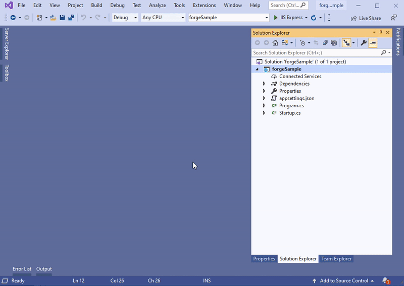

Este paso le ayudará a crear un plugin básico de Inventor. Para obtener más información, visite el tutorial de [My First Inventor Plugin](https://knowledge.autodesk.com/support/inventor-products/learn-explore/caas/simplecontent/content/my-first-inventor-plug-overview.html).

> Puede [descargar el paquete ZIP](https://github.com/autodesk-platform-services/aps-design-automation-nodejs/tree/nodejs/bundles/UpdateIPTParam.zip) en la carpeta 'bundles/' (Node.js) o '/designAutomationSample/wwwroot/bundles' (.NET Core) y [saltar a la sección **Upload Plugin Bundle**](#upload-plugin-bundle).

## Requisitos previos

- **Plantilla de Design Automation for Inventor**: vaya a Visual Studio Market Place, descárguela y ábrala desde [este vínculo](https://marketplace.visualstudio.com/items?itemName=Autodesk.DesignAutomation) y, a continuación, siga los pasos para instalarla.


## Crear un nuevo proyecto

Haga clic con el botón derecho en la solución, el >> **Agregar** **Nuevo proyecto**. Busca las plantillas de **Inventor**, luego **Proyecto de plugin** y, por último, nómbralo 'UpdateIPTParam'. Haga clic con el botón derecho en el proyecto, vaya a **Administrar paquetes NuGet...**, en **Examinar** puede seleccionar 'Newtonsoft.Json' y actualizar (este paquete ya está en la solución, si no, instalar)

> Seleccione .NET Framework 4.7. Si no aparece en la lista, [instale el paquete de desarrollo](https://dotnet.microsoft.com/download/dotnet-framework/net47).



## SampleAutomation.cs

Abra el archivo 'SampleAutomation.cs' y copie el siguiente contenido en él. Aquí es donde se actualizan los parámetros bajo el método 'Run'.

```dotnet title=SampleAutomation.cs
using Inventor;
using Newtonsoft.Json;
using System;
using System.Collections.Generic;
using System.Diagnostics;
using System.Runtime.InteropServices;
using System.Threading;
namespace UpdateIPTParam
{
    [ComVisible(true)]
    public class SampleAutomation
    {
        private InventorServer m_server;
        public SampleAutomation(InventorServer app) { m_server = app; }
        public void Run(Document doc)
        {
            try
            {
                // update parameters in the doc
                ChangeParameters(doc);
                // generate outputs
                var docDir = System.IO.Path.GetDirectoryName(doc.FullFileName);
                // save output file
                var documentType = doc.DocumentType;
                if (documentType == DocumentTypeEnum.kPartDocumentObject)
                {
                    // the name must be in sync with OutputIpt localName in Activity
                    var fileName = System.IO.Path.Combine(docDir, "outputFile.ipt");
                    // save file
                    doc.SaveAs(fileName, false);
                }
            }
            catch (Exception e) { LogTrace("Processing failed: {0}", e.ToString()); }
        }
        /// <summary>
        /// Change parameters in Inventor document.
        /// </summary>
        /// <param name="doc">The Inventor document.</param>
        /// <param name="json">JSON with changed parameters.</param>
        public void ChangeParameters(Document doc)
        {
            var theParams = GetParameters(doc);
            Dictionary<string, string> parameters = JsonConvert.DeserializeObject<Dictionary<string, string>>(System.IO.File.ReadAllText("params.json"));
            foreach (KeyValuePair<string, string> entry in parameters)
            {
                try
                {
                    Parameter param = theParams[entry.Key.ToLower()];
                    param.Expression = entry.Value;
                }
                catch (Exception e) { LogTrace("Cannot update {0}: {1}", entry.Key, e.Message); }
            }
            doc.Update();
        }
        /// <summary>
        /// Get parameters for the document.
        /// </summary>
        /// <returns>Parameters. Throws exception if parameters are not found.</returns>
        private static Parameters GetParameters(Document doc)
        {
            var docType = doc.DocumentType;
            switch (docType)
            {
                case DocumentTypeEnum.kAssemblyDocumentObject:
                    var asm = doc as AssemblyDocument;
                    return asm.ComponentDefinition.Parameters;
                case DocumentTypeEnum.kPartDocumentObject:
                    var ipt = doc as PartDocument;
                    return ipt.ComponentDefinition.Parameters;
                default:
                    throw new ApplicationException(string.Format("Unexpected document type ({0})", docType));
            }
        }
        /// <summary>
        /// This will appear on the Design Automation output
        /// </summary>
        private static void LogTrace(string format, params object[] args) { Trace.TraceInformation(format, args); }
    }
}
```

## Evento posterior a la compilación

> Para Node.js es necesario ajustar la carpeta de salida ZIP de AppBundle.

Ahora tenemos que comprimir la carpeta '.bundle'. Haga clic con el botón derecho en el proyecto, seleccione **Propiedades**, luego abra **Eventos de compilación** y copie lo siguiente en el campo **Línea de comandos de evento posterior a la compilación**, como se muestra en la imagen a continuación.

```
xcopy /Y /F "$(ProjectDir)PackageContents.xml" "$(TargetDir)\Bundle\$(MSBuildProjectName).bundle\"
xcopy /Y /F "$(TargetDir)*.*" "$(TargetDir)\Bundle\$(MSBuildProjectName).bundle\Contents\"
del /F "$(ProjectDir)..\designAutomationSample\wwwroot\bundles\UpdateIPTParam.zip"
"C:\Program Files\7-Zip\7z.exe" a -tzip "$(ProjectDir)../designAutomationSample/wwwroot/bundles/UpdateIPTParam.zip" "$(TargetDir)\bundle\$(MSBuildProjectName).bundle\" -xr0!*.pdb
```

Esto copiará la DLL de '/bin/debug/' en la carpeta '.bundle/Contents', luego usará [7zip](https://www.7-zip.org/) para crear un zip y, finalmente, copiará el ZIP en las carpetas '/bundles' de la aplicación web.


Si compilas el proyecto 'UpdateIPTParam' ahora, deberías ver algo como esto en la ventana **Salida**. Tenga en cuenta las 2 carpetas y varios archivos comprimidos. El archivo zip se crea directamente en la carpeta '/wwwroot/bundles'. ¡Esto significa que lo estás haciendo muy bien!


