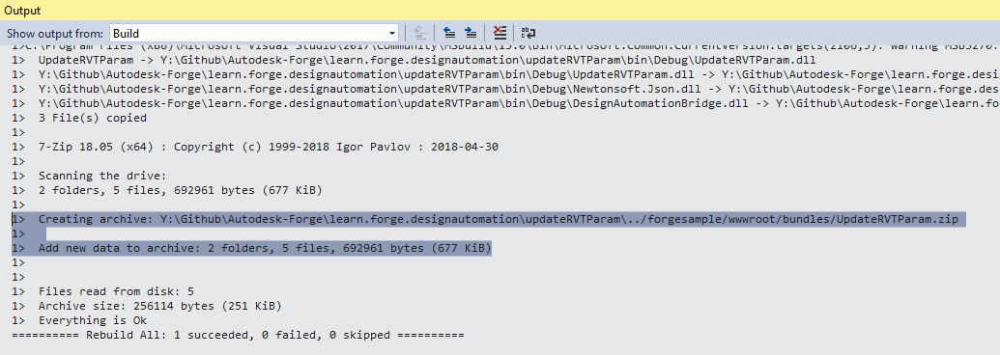

Este paso le ayudará a crear un complemento básico de Revit para Design Automation. Para obtener más información, visite el tutorial [Mi primer complemento de Revit](https://knowledge.autodesk.com/support/revit-products/learn-explore/caas/simplecontent/content/my-first-revit-plug-overview.html).

> Puede [descargar el paquete ZIP](https://github.com/autodesk-platform-services/aps-design-automation-nodejs/tree/nodejs/bundles/UpdateRVTParam.zip) en la carpeta 'bundles/' (Node.js) o '/designAutomationSample/wwwroot/bundles' (.NET 6) y [saltar a la sección **Upload Plugin Bundle**](#upload-plugin-bundle).

### Crear un nuevo proyecto

Haga clic en la solución, el botón **Agregar** >> **Nuevo proyecto**. Seleccione **Escritorio de Windows**, luego **Biblioteca de clases** y, finalmente, asígnele el nombre 'UpdateRVTParam'.

> Seleccione .NET Framework 4.8. Si no aparece en la lista, [instala el Dev Pack](https://dotnet.microsoft.com/download/dotnet-framework/net48).

Haga clic con el botón derecho en **Referencias**, luego **Agregar referencia** y **Examinar** para 'RevitAPI.dll' (de forma predeterminada en la carpeta 'C:\Archivos de programa\Autodesk\Revit 201x'). A continuación, haga clic con el botón derecho en esta referencia de **RevitAPI**, vaya a **Propiedades** y, a continuación, establezca **Copiar local** en **False**.

A continuación, haga clic con el botón derecho en el proyecto, vaya a **Administrar paquetes NuGet...**, en **Navegador** puede buscar **DesignAutomation.Revit** e instalar 'Autodesk.Forge.DesignAutomation.Revit' (elija la versión de Revit adecuada que necesite). A continuación, busque e instale 'Newtonsoft.Json' (que se utiliza para analizar los datos de entrada en formato JSON).


```xml title=package.config
<?xml version="1.0" encoding="utf-8"?>
<packages>
  <package id="Autodesk.Forge.DesignAutomation.Revit" version="2021.0.0" targetFramework="net48" />
  <package id="Microsoft.CSharp" version="4.5.0" targetFramework="net48" />
  <package id="Newtonsoft.Json" version="12.0.1" targetFramework="net48" />
</packages>
```

El proyecto debe contener una clase 'Class1.cs', cambiemos el nombre del archivo a Commands.cs (para mantener la coherencia).

En este punto, el proyecto debería tener el siguiente aspecto


```cs title=Commands.cs
using Autodesk.Revit.ApplicationServices;
using Autodesk.Revit.Attributes;
using Autodesk.Revit.DB;
using DesignAutomationFramework;
using Newtonsoft.Json;
using System.Collections.Generic;
using System.IO;
namespace Autodesk.Forge.Sample.DesignAutomation.Revit
{
    [Transaction(TransactionMode.Manual)]
    [Regeneration(RegenerationOption.Manual)]
    public class Commands : IExternalDBApplication
    {
        //Path of the project(i.e)project where your Window family files are present
        string OUTPUT_FILE = "OutputFile.rvt";
        public ExternalDBApplicationResult OnStartup(ControlledApplication application)
        {
            DesignAutomationBridge.DesignAutomationReadyEvent += HandleDesignAutomationReadyEvent;
            return ExternalDBApplicationResult.Succeeded;
        }
        private void HandleDesignAutomationReadyEvent(object sender, DesignAutomationReadyEventArgs e)
        {
            LogTrace("Design Automation Ready event triggered...");
            e.Succeeded = true;
            EditWindowParametersMethod(e.DesignAutomationData.RevitDoc);
        }
        private void EditWindowParametersMethod(Document doc)
        {
            InputParams inputParameters = JsonConvert.DeserializeObject<InputParams>(File.ReadAllText("params.json"));
            //Modifying the window parameters
            //Open transaction
            using (Transaction trans = new Transaction(doc))
            {
                trans.Start("Update window parameters");
                //Filter for windows
                FilteredElementCollector WindowCollector = new FilteredElementCollector(doc).OfCategory(BuiltInCategory.OST_Windows).WhereElementIsNotElementType();
                IList<ElementId> windowIds = WindowCollector.ToElementIds() as IList<ElementId>;
                foreach (ElementId windowId in windowIds)
                {
                    Element Window = doc.GetElement(windowId);
                    FamilyInstance FamInst = Window as FamilyInstance;
                    FamilySymbol FamSym = FamInst.Symbol;
                    SetElementParameter(FamSym, BuiltInParameter.WINDOW_HEIGHT, inputParameters.Height);
                    SetElementParameter(FamSym, BuiltInParameter.WINDOW_WIDTH, inputParameters.Width);
                }
                //To save all the changes commit the transaction
                trans.Commit();
            }
            //Save the updated file by overwriting the existing file
            ModelPath ProjectModelPath = ModelPathUtils.ConvertUserVisiblePathToModelPath(OUTPUT_FILE);
            SaveAsOptions SAO = new SaveAsOptions();
            SAO.OverwriteExistingFile = true;
            //Save the project file with updated window's parameters
            LogTrace("Saving file...");
            doc.SaveAs(ProjectModelPath, SAO);
        }
        public ExternalDBApplicationResult OnShutdown(ControlledApplication application)
        {
            return ExternalDBApplicationResult.Succeeded;
        }
        private void SetElementParameter(FamilySymbol FamSym, BuiltInParameter paraMeter, double parameterValue)
        {
            FamSym.get_Parameter(paraMeter).Set(parameterValue);
        }
        public class InputParams
        {
            public double Width { get; set; }
            public double Height { get; set; }
        }
        /// <summary>
        /// This will appear on the Design Automation output
        /// </summary>
        private static void LogTrace(string format, params object[] args) { System.Console.WriteLine(format, args); }
    }
}
```

Cree una carpeta denominada UpdateRVTParam.bundle y, dentro, un archivo denominado PackageContents.xml y, a continuación, copie el siguiente contenido en ella. Obtenga más información en la Referencia de formatos de PackageContents.xml. Este archivo le dice a Revit que cargue nuestro complemento .addin.

```xml title=PackageContents.xml
<?xml version="1.0" encoding="utf-8" ?>
<ApplicationPackage Name="RevitDesignAutomation" Description="Sample Plugin for Revit" Author="tutorials.autodesk.io">
  <CompanyDetails Name="Autodesk, Inc" Url="http://tutorials.autodesk.io" Email="forge.help@autodesk.com"/>
  <Components Description="Modify window parameters">
    <RuntimeRequirements SeriesMax="R2021" SeriesMin="R2019" Platform="Revit" OS="Win64"/>
    <ComponentEntry LoadOnRevitStartup="True" LoadOnCommandInvocation="False" AppDescription="Modify Window Parameters" ModuleName="./Contents/Autodesk.Forge.Sample.DesignAutomation.Revit.addin" Version="1.0.0" AppName="Modify Window Parameters"/>
  </Components>
</ApplicationPackage>
```

#### Autodesk.Forge.Sample.DesignAutomation.Revit.addin

En la carpeta 'UpdateRVTParam.bundle', cree una subcarpeta llamada 'Contenido' y, dentro de esta carpeta, un nuevo archivo llamado 'Autodesk.Forge.Sample.DesignAutomation.Revit.addin'. Esto le indica a Revit cómo cargar el complemento.

```xml
<?xml version="1.0" encoding="utf-8" standalone="no"?>
<RevitAddIns>
  <AddIn Type="DBApplication">
    <Name>Modify Window Parameters</Name>
    <FullClassName>Autodesk.Forge.Sample.DesignAutomation.Revit.Commands</FullClassName>
    <Text>Revit for Design Automation</Text>
    <Description>Revit for Design Automation</Description>
    <VisibilityMode>AlwaysVisible</VisibilityMode>
    <Assembly>.\UpdateRVTParam.dll</Assembly>
    <AddInId>000BD853-36E4-461f-9171-C5ACEDA4E723</AddInId>
    <VendorId>ADSK</VendorId>
    <VendorDescription>Autodesk, Inc, www.autodesk.com</VendorDescription>
  </AddIn>
</RevitAddIns>
```


#### Evento posterior a la compilación

> Para Node.js es necesario ajustar la carpeta de salida ZIP de AppBundle.

Ahora necesitamos comprimir la carpeta .bundle. Haga clic con el botón derecho en el proyecto, seleccione **Propiedades**, luego abra **Eventos de compilación** y copie lo siguiente en el campo **Línea de comandos de evento posterior a la compilación**, como se muestra en la imagen a continuación.

```
xcopy /Y /F "$(TargetDir)*.dll" "$(ProjectDir)UpdateRVTParam.bundle\Contents\"
del /F "$(ProjectDir)..\designAutomationSample\wwwroot\bundles\UpdateRVTParam.zip"
"C:\Program Files\7-Zip\7z.exe" a -tzip "$(ProjectDir)../designAutomationSample/wwwroot/bundles/UpdateRVTParam.zip" "$(ProjectDir)UpdateRVTParam.bundle\" -xr0!*.pdb
```

Esto copiará la DLL de '/bin/debug/' en la carpeta '.bundle/Contents', luego usará [7zip](https://www.7-zip.org/) para crear un zip y, finalmente, copiará el ZIP en las carpetas '/bundles' de la aplicación web.


> Tenga en cuenta cómo el **evento posterior a la compilación** usa los nombres de proyecto y carpeta, así que asegúrese de usar estos nombres.

Si compila el proyecto 'UpdateRVTParam' ahora, debería ver algo como esto en la ventana **Salida**. Tenga en cuenta las 2 carpetas y los 3 archivos comprimidos. El archivo zip se crea directamente en la carpeta /wwwroot/bundles. ¡Esto significa que lo estás haciendo muy bien!



> Si el resultado de la compilación muestra más de **2 carpetas, 5 archivos** copiados, vuelva atrás y asegúrese de que la referencia **RevitAPI** esté establecida en **Copy Local**:**False**. Es posible que deba eliminar todos los archivos DLL de la carpeta 'UpdateRVTParam.bundle/Contents/'