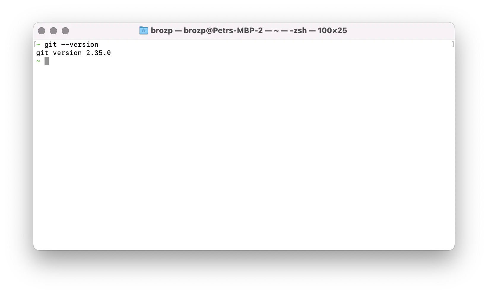

Une autre partie essentielle du développement logiciel moderne, en particulier pour le web, est le code source
outil de gestion [git](https://git-scm.com). Allez dans le menu [Téléchargements](https://git-scm.com/downloads)
et installez la dernière version pour votre plate-forme. Comme mentionné dans la section précédente,
le programme d’installation Windows est également livré avec l’interface de ligne de commande 'bash'.

Pour vérifier si 'git' est installé et disponible, essayez d’exécuter la commande suivante dans 'bash' :

```bash
git --version
```

Vous devriez voir quelque chose comme ceci :


