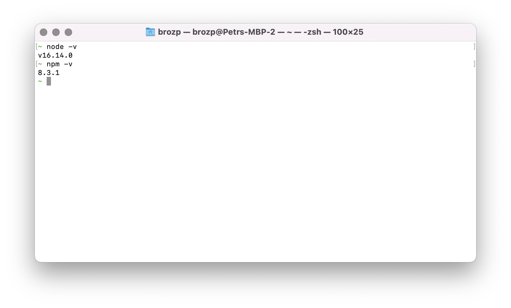

import CliSetup from '../cli.mdx';
import GitSetup from '../git.mdx';
import VSCodeSetup from '../vscode.mdx';

## Interface en ligne de commande

<CliSetup />

## Gestion du code source

<GitSetup />

## Durée d’exécution

Nous aurons également besoin du Node.js _runtime_ pour exécuter notre code, et du gestionnaire de paquets Node.js, _NPM_,
pour gérer les dépendances tierces. Vous pouvez obtenir un installateur pour votre plateforme sur https://nodejs.org/en/download
qui installera les deux.

Pour vous assurer que les outils sont disponibles, essayez d’exécuter les deux commandes suivantes dans 'bash' :

```bash
node -v
npm -v
```

Vous devriez voir quelque chose comme ceci :



## Éditeur

<VSCodeSetup />
