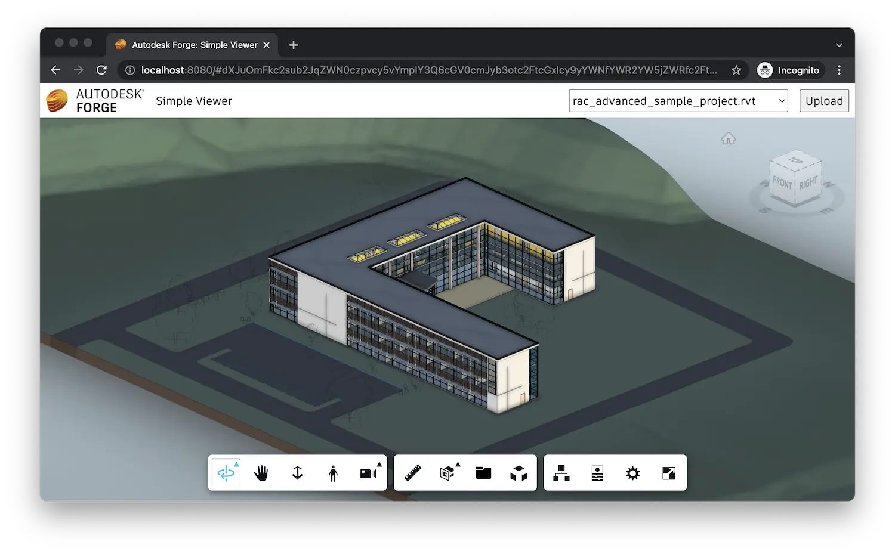

Et c’est tout ! Votre application est maintenant prête à être mise en œuvre. Démarrez-le à partir de la ligne de commande comme d’habitude :

```bash
export APS_CLIENT_ID=your-own-aps-client-id
export APS_CLIENT_SECRET=your-own-aps-client-secret
export APS_BUCKET=optional-custom-bucket-name
dotnet run
```

Ensuite, accédez à [http://localhost:8080](http://localhost:8080) dans votre navigateur. Vous devriez être
présenté avec une interface utilisateur simple, avec une liste déroulante dans le coin supérieur droit qui finira par être remplie
avec tous les modèles disponibles dans votre compartiment configuré et avec un bouton pour télécharger de nouveaux modèles.
Et dès que vous sélectionnez l’une des options dans la liste déroulante, le modèle correspondant sera chargé
dans le visualiseur occupant le reste de la page Web.


