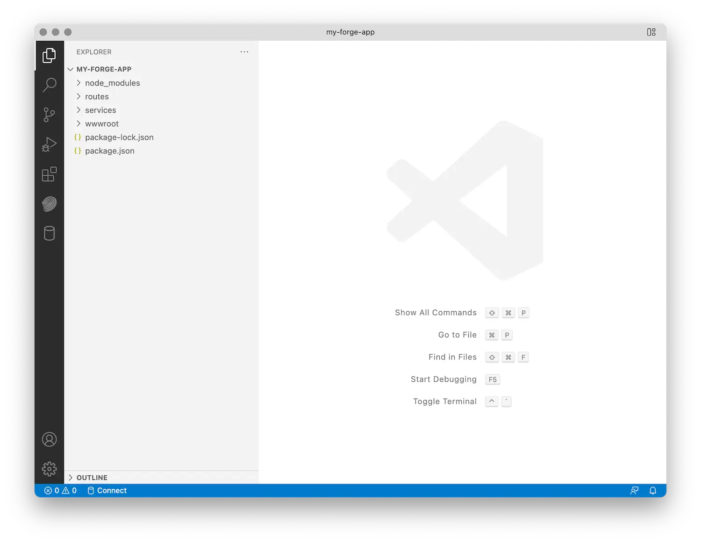

Créez un dossier pour votre projet, accédez-y dans la ligne de commande et initialisez un nouveau dossier
Node.js projet :

```bash
npm init -y
```

Ensuite, installez toutes les dépendances Node.js que nous allons utiliser. Dans ce cas, ce sera
[dotenv](https://www.npmjs.com/package/dotenv) (utilitaire d’initialisation des variables d’environnement à partir d’un fichier),
[Express.js](https://expressjs.com) (framework web), un Express.js [middleware](https://expressjs.com/en/guide/using-middleware.html)
pour gérer les requêtes 'multipart/form-data', et enfin les différents packages du SDK APS officiel :


:::caution

Depuis avril 2024, le SDK APS pour Node.js est en version bêta, ce qui signifie que les interfaces publiques peuvent encore changer.
Pour éviter tout problème potentiel, nous vous recommandons d’installer les versions spécifiques de ces packages comme indiqué ci-dessous.


:::


```bash
npm install --save dotenv express express-formidable
npm install --save @aps_sdk/autodesk-sdkmanager@0.0.7-beta.1
npm install --save @aps_sdk/authentication@0.1.0-beta.1
npm install --save @aps_sdk/oss@0.1.0-beta.1
npm install --save @aps_sdk/model-derivative@0.1.0-beta.1
```

Les '"dépendances"' dans votre fichier 'package.json' devraient maintenant ressembler à ceci
(potentiellement avec des numéros de version légèrement différents) :

```json
// ...
  "dependencies": {
    "@aps_sdk/authentication": "0.1.0-beta.1",
    "@aps_sdk/autodesk-sdkmanager": "0.0.7-beta.1",
    "@aps_sdk/model-derivative": "0.1.0-beta.1",
    "@aps_sdk/oss": "0.1.0-beta.1",
    "dotenv": "^16.4.1",
    "express": "^4.18.2",
    "express-formidable": "^1.2.0"
  },
// ...
```

Enfin, créons quelques sous-dossiers supplémentaires dans le dossier de projet que nous allons utiliser
Pour avoir besoin plus tard :

- 'wwwroot' - c’est là que nous allons mettre tous les actifs côté client (HTML, CSS, JavaScript, images, etc.)
- 'routes' - c’est là que nous allons implémenter tous les points de terminaison du serveur
- 'services' - ici, nous allons conserver toute la logique côté serveur qui peut être partagée par différents points de terminaison

Désormais, lorsque vous ouvrez votre dossier de projet dans Visual Studio Code pour la première fois, la structure de dossiers
devrait ressembler à ceci :


