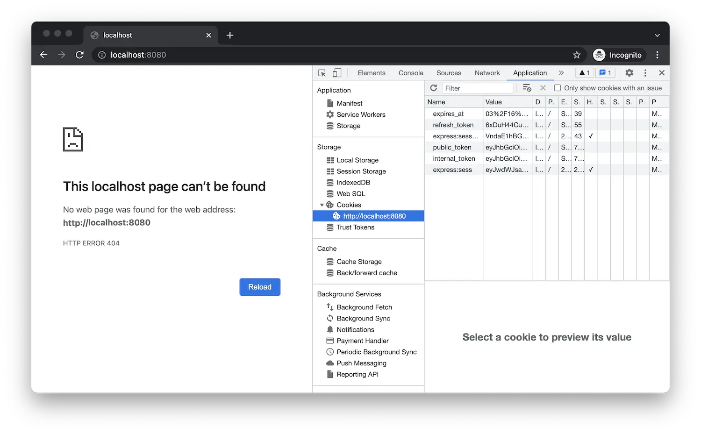

Si l’application est toujours en cours d’exécution, redémarrez-la (par exemple, à l’aide de _Run > Redémarrer Debugging_,
soit en cliquant sur l’icône verte de redémarrage), sinon redémarrez-le (en utilisant _Run > Démarrer Debugging_,
ou en appuyant sur 'F5').

Lorsque vous accédez à [http://localhost:8080/api/auth/login](http://localhost:8080/api/auth/login)
dans le navigateur, vous devez être redirigé vers la page de connexion d’Autodesk et, après vous être connecté, vous devez
être redirigé vers votre application, pour l’instant simplement renvoyer 404. C’est attendu car nous n’avons pas
implémenté le point de terminaison 'GET /' pour le moment. Cependant, si vous utilisez des outils de développement de navigateur et explorez les cookies
stocké par votre navigateur pour l’origine 'localhost', vous remarquerez que l’application est déjà
y stocker les données d’authentification.

:::info

Voici où vous pouvez trouver les cookies de votre site Web dans différents navigateurs :
- [Chrome](https://developer.chrome.com/docs/devtools/storage/sessionstorage/)
- [Firefox](https://developer.mozilla.org/en-US/docs/Tools/Storage_Inspector/Cookies)
- [Bord](https://docs.microsoft.com/en-us/microsoft-edge/devtools-guide-chromium/storage/cookies)
- [Safari](https://developer.apple.com/safari/tools/)

:::

