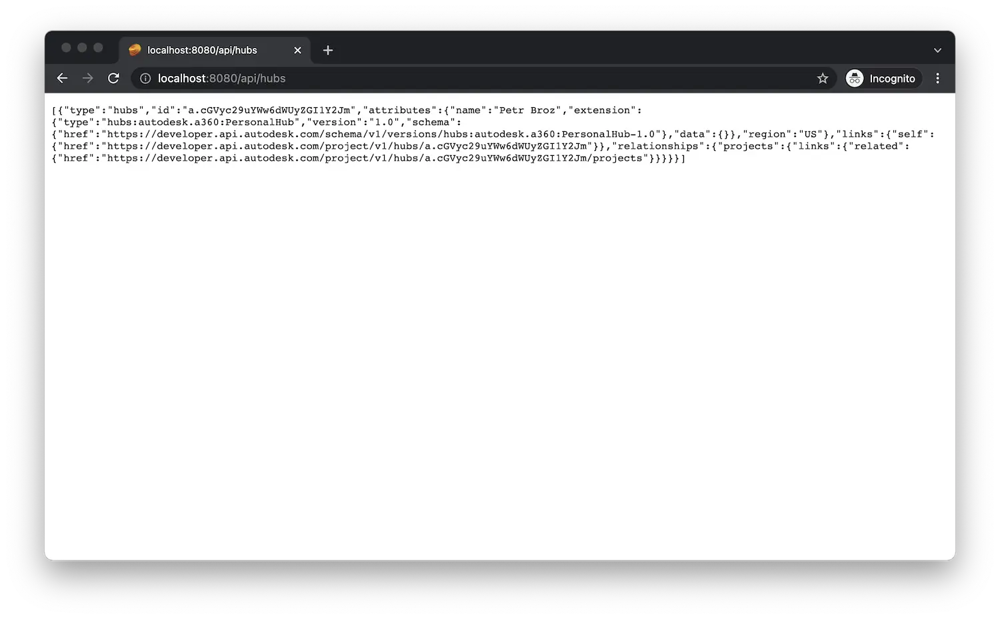

Démarrez (ou redémarrez) l’application à partir de Visual Studio Code comme d’habitude, puis accédez à
[http://localhost:8080/api/hubs](http://localhost:8080/api/hubs) dans le navigateur.
Le serveur doit répondre avec une liste JSON de tous les hubs auxquels vous avez accès.
Essayez de copier l’ID de l’un des hubs et utilisez-le à une autre adresse : http://localhost:8080/api/hubs/your-hub-id/projects.
Dans ce cas, l’application serveur doit répondre avec une liste JSON de tous les projets
disponible sous le hub spécifié.

