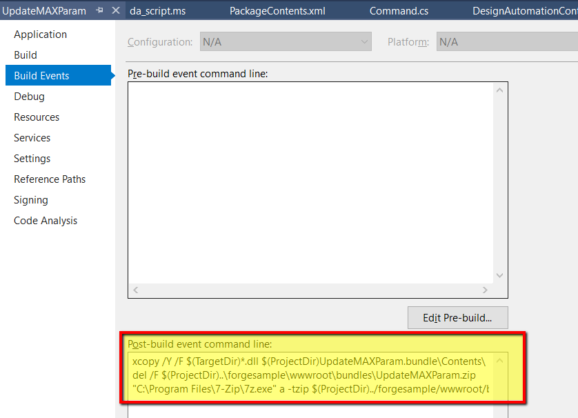

Cette étape vous aidera à créer un plug-in 3ds Max de base pour Design Automation. L’ensemble du didacticiel utilise le framework Microsoft .NET, y compris le plug-in pour 3ds Max. Notez que 3ds Max peut être automatisé par MAXScript, Python, NET API et C++. L’API .NET 3ds Max n’est probablement pas la plus utilisée pour les plugins, cependant, pour d’autres produits Design Automatiuon, c’est l’API typique. Les ressources 3ds Max pour l’API .NET sont disponibles ici (liens 2019, mais l’API .NET est prise en charge pour toutes les versions disponibles des moteurs d’automatisation de la conception 3ds Max) :

- [Écriture de plug-ins .NET 3ds Max](http://help.autodesk.com/view/3DSMAX/2019/ENU/?guid=__developer_3ds_max_sdk___the_learning_path_lesson_7_writing__net_plug_ins_html)
- [Kit de développement logiciel (SDK) .NET 3ds Max](http://help.autodesk.com/view/3DSMAX/2019/ENU/?guid=__developer_3ds_max__net_sdk_html)
- [Exemples .NET du blog GetCOREInterface](https://getcoreinterface.typepad.com/blog/2017/10/updated-net-api-samples-for-3ds-max-2018.html)

N’oubliez pas que pour l’automatisation de la conception, il ne doit pas y avoir d’interface utilisateur ou d’invites qui ne peuvent pas être automatisées. Pour automatiser le moteur DA 3ds Max, vous devez fournir des MAXScript. C’est généralement très facile car la plupart des personnalisations peuvent être exposées rapidement à MAXScript (voir [publication de fonctions pour C++](http://help.autodesk.com/view/3DSMAX/2019/ENU/?guid=__developer_3ds_max_sdk_features_function_publishing_html) et [gestion de MAXScript .NET](http://help.autodesk.com/view/3DSMAX/2019/ENU/?guid=GUID-779FD7AC-953D-4567-B2A8-60B1D8695B95))

> Vous pouvez [télécharger le fichier ZIP de l’offre groupée](https://github.com/autodesk-platform-services/aps-design-automation-nodejs/tree/nodejs/bundles/UpdateMAXParam.zip) dans le dossier 'bundles/' (Node.js) ou '/designAutomationSample/wwwroot/bundles' (.NET 6) et [passer à la section **Télécharger l’ensemble de plug-ins**](#upload-plugin-bundle).

### Créer un projet .NET

Cliquez avec le bouton droit de la souris sur la solution, le bouton **Ajouter** >> **Nouveau projet**. Sélectionnez **Bureau Windows**, puis **Bibliothèque de classes** et, enfin, nommez-le 'UpdateMAXParam'. Vous devrez ensuite référencer l’assembly managé 'Autodesk.Max.Dll' (module principal de l’API .NET 3ds Max). Ce module se trouve dans le dossier '3dsmax.exe' et lors du référencement, assurez-vous de désactiver l’indicateur « Copier local ». Il existe quelques autres modules utilisés pour la prise en charge de l’API .NET (voir [Le SDK .NET 3ds Max](http://help.autodesk.com/view/3DSMAX/2019/ENU/?guid=__developer_3ds_max__net_sdk_html)), mais pour ce tutoriel, nous n’utiliserons que Autodesk.Max.dll. Recherchez et installez ensuite 'Newtonsoft.Json' (qui est utilisé pour analyser les données d’entrée au format JSON).

> Sélectionnez .NET Framework 4.8. S’il n’est pas répertorié, [veuillez installer le Dev Pack](https://dotnet.microsoft.com/download/dotnet-framework/net48).


Par conséquent, le fichier **package.config** devrait ressembler à ce qui suit pour le module Newtonsoft.Json.

```xml title=package.config
<?xml version="1.0" encoding="utf-8"?>
<packages>
    <package id="Newtonsoft.Json" version="12.0.1" targetFramework="net47" />
</packages>
```

Il s’agit du code principal qui s’exécutera avec 3ds Max. Copiez le contenu suivant dans 'Command.cs'. Il existe trois classes pour gérer le porcessing Design Automation. Tout d’abord, les 'InputParams' qui seront utilisés pour s’interfacer avec les données d’entrée JSON. Vient ensuite la classe 'ParameterChanger' qui est utilisée pour itérer la scène et trouver toutes les fenêtres Casement (mais peut être n’importe quel type d’objet identifié par les identifiants de classe). Enfin, le 'RuntimeExecute' est utilisé pour prendre l’entrée et piloter l’automatisation. Notez également qu’il existe une journalisation spécialisée qui génère des informations dans la console Design Automation. Voir la fonction LogTrace. Notez que la classe managée 3ds Max « ILogSys » est utilisée à cet effet et que les indicateurs utilisés avec l’API « LogEntry » indiqués sont nécessaires pour que la sortie s’affiche dans la console Design Automation.

```cs title=Commands.cs
using System;
using System.Collections.Generic;
using System.Linq;
using System.IO;
using Newtonsoft.Json;
using Autodesk.Max;
namespace Autodesk.Forge.Sample.DesignAutomation.Max
{
    /// <summary>
    /// Used to hold the parameters to change
    /// </summary>
    public class InputParams
    {
        public float Width { get; set; }
        public float Height { get; set; }
    }
    /// <summary>
    /// Changes parameters in automated way.
    /// Iterate entire scene to get all nodes
    /// In this example we specifically find Casement Windows by object class ID
    /// Then modify the width and height based on inputs.
    ///
    /// Could be expanded to find other window types, other objects, etc.
    /// </summary>
    static public class ParameterChanger
    {
        static List<IINode> m_sceneNodes = new List<IINode> { };
        /// <summary>
        /// Recursively go through the scene and get all nodes
        /// Use the Autodesk.Max APIs to get the children nodes
        /// </summary>
        static private void GetSceneNodes(IINode node)
        {
            m_sceneNodes.Add(node);
            for (int i = 0; i < node.NumberOfChildren; i++)
                GetSceneNodes(node.GetChildNode(i));
        }
        /// <summary>
        /// Function to specifically update Case Windows with input wedth and height parameters
        /// </summary>
        /// <param name="width">The new Width to set the Window</param>
        /// <param name="height">The new Height to set the Window</param>
        /// <returns>window count</returns>
        static public int UpdateWindowNodes(float width, float height)
        {
            IGlobal globalInterface = Autodesk.Max.GlobalInterface.Instance;
            IInterface14 coreInterface = globalInterface.COREInterface14;
            IINode nodeRoot = coreInterface.RootNode;
            m_sceneNodes.Clear();
            GetSceneNodes(nodeRoot);
            // 3ds Max uses a class ID for all object types. This is easiest way to find specific type.
            // ClassID (1902665597L, 1593788199L) == 0x71685F7D, 0x5EFF4727 for casement window
            IClass_ID cidCasementWindow = globalInterface.Class_ID.Create(0x71685F7D, 0x5EFF4727);
            // Use LINQ to filter for windows only - in case scene has more than one,
            // but this should still give us at least one for single window scene!
            var sceneWindows = from node in m_sceneNodes
                               where ((node.ObjectRef != null) && // In some cases the ObjectRef can be null for certain node types.
                                      (node.ObjectRef.ClassID.PartA == cidCasementWindow.PartA) &&
                                      (node.ObjectRef.ClassID.PartB == cidCasementWindow.PartB))
                               select node;
            // Iterate the casement windws and update the hight and width parameters.
            foreach (IINode item in sceneWindows)
            {
                // window is using old-style ParamArray rather than newer ParamBlk2
                IIParamArray pb = item.ObjectRef.ParamBlock;
                pb.SetValue(0, coreInterface.Time, height); // window height is at index zero.
                pb.SetValue(1, coreInterface.Time, width); // window width is at index one.
            }
            // If there are windows, save the window updates
            int status;
            if (sceneWindows.Count() > 0)
            {
                // The output file name must match what the Design Automation work item is specifying as output file.
                string full_filename = coreInterface.CurFilePath;
                string filename = coreInterface.CurFileName;
                string new_filename = full_filename.Replace(filename, "outputFile.max");
                status = coreInterface.SaveToFile(new_filename, true, false);
                if (status == 0) //error
                    return -1;
            }
            // return how many windows were modified.
            return sceneWindows.Count();
        }
    }
    /// <summary>
    /// This class is used to execute the automation. Above class could be connected to UI elements, or run by scripts directly.
    /// This class takes the input from JSON input and uses those values. This way it is more cohesive to web development.
    /// </summary>
    static public class RuntimeExecute
    {
        static public int ModifyWindowWidthHeight()
        {
            int count = 0;
            // Run entire code block with try/catch to help determine errors
            try
            {
                // read input parameters from JSON file
                InputParams inputParams = JsonConvert.DeserializeObject<InputParams>(File.ReadAllText("params.json"));
                count = ParameterChanger.UpdateWindowNodes(inputParams.Width, inputParams.Height);
            }
            catch (Exception e)
            {
                LogTrace("Exception Error: " + e.Message);
                return -1; //fail
            }
            LogTrace("Changed {0} Window objects.", count);
            return count; // 0+ means success, and how many objects were changed.
        }
        /// <summary>
        /// Information sent to this LogTrace will appear on the Design Automation output
        /// </summary>
        private static void LogTrace(string format, params object[] args)
        {
            System.Reflection.Assembly a = System.Reflection.Assembly.GetExecutingAssembly();
            string output_msg = string.Format("DLL {0} compiled on {1}; {2}",
                System.IO.Path.GetFileName(a.Location),
                File.GetLastWriteTime(a.Location),
                string.Format(format, args));
            IGlobal globalInterface = Autodesk.Max.GlobalInterface.Instance;
            IInterface14 coreInterface = globalInterface.COREInterface14;
            ILogSys log = coreInterface.Log;
            // Note flags are necessary to produce Design Automation output. This is same as C++:
            // SYSLOG_INFO | SYSLOG_IGNORE_VERBOSITY | SYSLOG_BROADCAST
            log.LogEntry(0x00000004 | 0x00040000 | 0x00010000, false, "", output_msg);
        }
    }
}
```

Créez un dossier nommé « UpdateMAXParam.bundle » et à l’intérieur de ce dossier, ajoutez un fichier nommé « PackageContents.xml ». Copiez le contenu répertorié ci-dessous dans la section XML dans le fichier PackageContents.xml. Pour en savoir plus, consultez la [Référence du format PackageContents.xml](https://help.autodesk.com/view/ACD/2023/ENU/?guid=GUID-BC76355D-682B-46ED-B9B7-66C95EEF2BD0). Pour plus d’informations spécifiques à 3ds Max sur l’empaquetage de vos plug-ins 3ds Max, voir ici [Plug-ins d’empaquetage](http://help.autodesk.com/view/3DSMAX/2019/ENU/?guid=__developer_writing_plug_ins_packaging_plugins_html)

Ce fichier indiquera à 3ds Max les modules à charger (dans ce cas, l’assembly de plug-in d’API .NET que nous créons, mais peut également inclure des plug-ins MAXScripts, Python et/ou C++). Étant donné que le plugin est chargé via cette fonctionnalité, vous n’avez qu’à vous soucier des instructions pour déclencher votre tâche d’automatisation. Veuillez noter qu’un ID unique pour ProductCode et UpgradeCode est requis pour que 3ds Max charge correctement votre code. Voir la documentation mentionnée ci-dessus pour plus de détails.

```xml tilte=PackageContents.xml
<?xml version="1.0" encoding="utf-8"?>
<ApplicationPackage
    SchemaVersion="1.0"
    AutodeskProduct="3ds Max"
    Name="Sample Design Automation Plugin for 3ds Max"
    Description="A sample package to update parameters of a 3ds Max scene file containing a casement window"
    AppVersion="2019.0.0"
    FriendlyVersion="2019.0.0"
    ProductType="Application"
    SupportedLocales="Enu"
    AppNameSpace="apps.autodesk.com"
    Author="Autodesk Forge"
    ProductCode="{6A8D06F4-C3DD-42DD-A69E-9B9617A7ABC0}"
    UpgradeCode="{CE88CEA5-47F6-423E-B9EC-E9FA683B5228}"
    >
    <CompanyDetails Name="Autodesk"
        Phone=" "
        Url="http://forge.autodesk.com"
        Email="noreply@autodesk.com" />
    <RuntimeRequirements OS="Win64" Platform="3ds Max" SeriesMin="2019" SeriesMax="2021" />
    <Components Description="assemblies parts">
        <RuntimeRequirements OS="Win64" Platform="3ds Max" SeriesMin="2019" SeriesMax="2021" />
        <ComponentEntry AppName="UpdateMAXParam" Version="2019.0.0" ModuleName="./Contents/UpdateMAXParam.dll" AppDescription="The Sample Design Automation Plugin managed assembly module" />
    </Components>
</ApplicationPackage>
```

Finally, create a subfolder named `Contents` and leave it empty. At this point, the project should look like.


## Événement post-build

> Pour Node.js il est nécessaire d’ajuster le dossier de sortie ZIP de l’AppBundle.

Nous devons maintenant compresser le dossier '.bundle'. Cliquez avec le bouton droit de la souris sur le projet, sélectionnez **Propriétés**, puis ouvrez **Événements de build** et copiez ce qui suit dans le champ **Ligne de commande de l’événement post-build**, comme indiqué sur l’image ci-dessous.

```
xcopy /Y /F "$(TargetDir)*.dll" "$(ProjectDir)UpdateMAXParam.bundle\Contents\"
del /F "$(ProjectDir)..\designAutomationSample\wwwroot\bundles\UpdateMAXParam.zip"
"C:\Program Files\7-Zip\7z.exe" a -tzip "$(ProjectDir)../designAutomationSample/wwwroot/bundles/UpdateMAXParam.zip" "$(ProjectDir)UpdateMAXParam.bundle\" -xr0!*.pdb
```

Cela copiera la DLL de '/bin/debug/' dans le dossier '.bundle/Contents', puis utilisera [7zip](https://www.7-zip.org/) pour créer un zip, puis enfin copiera le ZIP dans les dossiers /bundles de l’application web.



> Notez comment l’événement post-build utilise les noms de projet et de dossier, alors assurez-vous d’utiliser ces noms.

Si vous construisez le projet 'UpdateMAXParam' maintenant, vous devriez voir quelque chose comme ci-dessous dans la fenêtre **Sortie**. Notez que 2 dossiers et 3 fichiers ont été zippés. Le fichier zip est créé directement dans le dossier /wwwroot/bundles. Cela signifie que vous vous débrouillez très bien !


À ce stade, vous pouvez tester la fonctionnalité à l’aide de l’outil de traitement par lots 3ds Max. Il fonctionne de la même manière que le moteur d’automatisation de la conception 3ds Max et constitue un bon moyen de tester toute votre automatisation localement avant d’envoyer le travail aux services cloud Forge DA. Pour que les classes .NET soient instanciées dans l’environnement MAXScript, nous pouvons utiliser la fonction MAXScript 'dotNetClass'. Pour cet exemple de projet, le code MAXScript ressemblerait à ceci :

```ms title=MAXScript
fn UpdateParam =
(
	da = dotNetClass("Autodesk.Forge.Sample.DesignAutomation.Max.RuntimeExecute")
	da.ModifyWindowWidthHeight()
)
UpdateParam()
```

Pour exécuter cela localement, nous pourrions tester une invite en ligne de commande avec quelque chose comme ceci :

```CommandLine
"%ADSK_3DSMAX_x64_2019%\3dsmaxbatch.exe" -sceneFile <myTestScene>.max da_script.ms
```

Plus loin dans ce didacticiel, vous verrez ces mêmes instructions envoyées au moteur 3ds Max Design Automation.