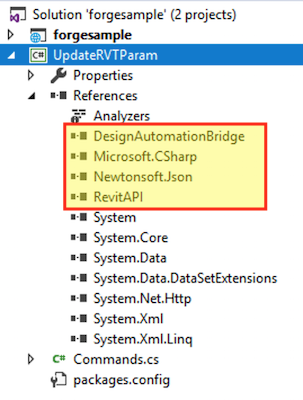

Cette étape vous aidera à créer un plug-in Revit de base pour Design Automation. Pour plus d’informations, consultez le tutoriel [Mon premier plug-in Revit](https://knowledge.autodesk.com/support/revit-products/learn-explore/caas/simplecontent/content/my-first-revit-plug-overview.html).

> Vous pouvez [télécharger le fichier ZIP du bundle](https://github.com/autodesk-platform-services/aps-design-automation-nodejs/tree/nodejs/bundles/UpdateRVTParam.zip) dans le dossier 'bundles/' (Node.js) ou '/designAutomationSample/wwwroot/bundles' (.NET 6) et [passer à la section **Télécharger le bundle de plugins**](#upload-plugin-bundle).

### Créer un nouveau projet

Cliquez sur la solution, le bouton **Ajouter** >> **Nouveau projet**. Sélectionnez **Bureau Windows**, puis **Bibliothèque de classes** et, enfin, nommez-le 'UpdateRVTParam'.

> Sélectionnez .NET Framework 4.8. S’il n’est pas répertorié, [veuillez installer le Dev Pack](https://dotnet.microsoft.com/download/dotnet-framework/net48).

Cliquez avec le bouton droit de la souris sur **Références**, puis sur **Ajouter une référence** et **Parcourir** pour 'RevitAPI.dll' (par défaut dans le dossier 'C :\Program Files\Autodesk\Revit 201x'). Cliquez ensuite avec le bouton droit de la souris sur cette référence **RevitAPI**, allez dans **Propriétés**, puis définissez **Copy Local** sur **False**.

Cliquez ensuite avec le bouton droit sur le projet, accédez à **Gérer les packages NuGet...**, sous **Navigateur**, vous pouvez rechercher **DesignAutomation.Revit** et installer 'Autodesk.Forge.DesignAutomation.Revit' (choisissez la version de Revit appropriée dont vous avez besoin). Recherchez et installez ensuite 'Newtonsoft.Json' (qui est utilisé pour analyser les données d’entrée au format JSON).


```xml title=package.config
<?xml version="1.0" encoding="utf-8"?>
<packages>
  <package id="Autodesk.Forge.DesignAutomation.Revit" version="2021.0.0" targetFramework="net48" />
  <package id="Microsoft.CSharp" version="4.5.0" targetFramework="net48" />
  <package id="Newtonsoft.Json" version="12.0.1" targetFramework="net48" />
</packages>
```

Le projet doit contenir une classe 'Class1.cs', renommons le fichier en Commands.cs (pour plus de cohérence).

À ce stade, le projet devrait ressembler à ce qui suit



```cs title=Commands.cs
using Autodesk.Revit.ApplicationServices;
using Autodesk.Revit.Attributes;
using Autodesk.Revit.DB;
using DesignAutomationFramework;
using Newtonsoft.Json;
using System.Collections.Generic;
using System.IO;
namespace Autodesk.Forge.Sample.DesignAutomation.Revit
{
    [Transaction(TransactionMode.Manual)]
    [Regeneration(RegenerationOption.Manual)]
    public class Commands : IExternalDBApplication
    {
        //Path of the project(i.e)project where your Window family files are present
        string OUTPUT_FILE = "OutputFile.rvt";
        public ExternalDBApplicationResult OnStartup(ControlledApplication application)
        {
            DesignAutomationBridge.DesignAutomationReadyEvent += HandleDesignAutomationReadyEvent;
            return ExternalDBApplicationResult.Succeeded;
        }
        private void HandleDesignAutomationReadyEvent(object sender, DesignAutomationReadyEventArgs e)
        {
            LogTrace("Design Automation Ready event triggered...");
            e.Succeeded = true;
            EditWindowParametersMethod(e.DesignAutomationData.RevitDoc);
        }
        private void EditWindowParametersMethod(Document doc)
        {
            InputParams inputParameters = JsonConvert.DeserializeObject<InputParams>(File.ReadAllText("params.json"));
            //Modifying the window parameters
            //Open transaction
            using (Transaction trans = new Transaction(doc))
            {
                trans.Start("Update window parameters");
                //Filter for windows
                FilteredElementCollector WindowCollector = new FilteredElementCollector(doc).OfCategory(BuiltInCategory.OST_Windows).WhereElementIsNotElementType();
                IList<ElementId> windowIds = WindowCollector.ToElementIds() as IList<ElementId>;
                foreach (ElementId windowId in windowIds)
                {
                    Element Window = doc.GetElement(windowId);
                    FamilyInstance FamInst = Window as FamilyInstance;
                    FamilySymbol FamSym = FamInst.Symbol;
                    SetElementParameter(FamSym, BuiltInParameter.WINDOW_HEIGHT, inputParameters.Height);
                    SetElementParameter(FamSym, BuiltInParameter.WINDOW_WIDTH, inputParameters.Width);
                }
                //To save all the changes commit the transaction
                trans.Commit();
            }
            //Save the updated file by overwriting the existing file
            ModelPath ProjectModelPath = ModelPathUtils.ConvertUserVisiblePathToModelPath(OUTPUT_FILE);
            SaveAsOptions SAO = new SaveAsOptions();
            SAO.OverwriteExistingFile = true;
            //Save the project file with updated window's parameters
            LogTrace("Saving file...");
            doc.SaveAs(ProjectModelPath, SAO);
        }
        public ExternalDBApplicationResult OnShutdown(ControlledApplication application)
        {
            return ExternalDBApplicationResult.Succeeded;
        }
        private void SetElementParameter(FamilySymbol FamSym, BuiltInParameter paraMeter, double parameterValue)
        {
            FamSym.get_Parameter(paraMeter).Set(parameterValue);
        }
        public class InputParams
        {
            public double Width { get; set; }
            public double Height { get; set; }
        }
        /// <summary>
        /// This will appear on the Design Automation output
        /// </summary>
        private static void LogTrace(string format, params object[] args) { System.Console.WriteLine(format, args); }
    }
}
```

Créez un dossier nommé UpdateRVTParam.bundle et, à l’intérieur, un fichier nommé PackageContents.xml, puis copiez-y le contenu suivant. Pour en savoir plus, consultez la référence du format PackageContents.xml. Ce fichier indique à Revit de charger notre plug-in .addin.

```xml title=PackageContents.xml
<?xml version="1.0" encoding="utf-8" ?>
<ApplicationPackage Name="RevitDesignAutomation" Description="Sample Plugin for Revit" Author="tutorials.autodesk.io">
  <CompanyDetails Name="Autodesk, Inc" Url="http://tutorials.autodesk.io" Email="forge.help@autodesk.com"/>
  <Components Description="Modify window parameters">
    <RuntimeRequirements SeriesMax="R2021" SeriesMin="R2019" Platform="Revit" OS="Win64"/>
    <ComponentEntry LoadOnRevitStartup="True" LoadOnCommandInvocation="False" AppDescription="Modify Window Parameters" ModuleName="./Contents/Autodesk.Forge.Sample.DesignAutomation.Revit.addin" Version="1.0.0" AppName="Modify Window Parameters"/>
  </Components>
</ApplicationPackage>
```

#### Autodesk.Forge.Sample.DesignAutomation.Revit.addin

Dans le dossier 'UpdateRVTParam.bundle', créez un sous-dossier nommé 'Contents' et, à l’intérieur de ce dossier, un nouveau fichier appelé 'Autodesk.Forge.Sample.DesignAutomation.Revit.addin'. Cela indique à Revit comment charger le plug-in.

```xml
<?xml version="1.0" encoding="utf-8" standalone="no"?>
<RevitAddIns>
  <AddIn Type="DBApplication">
    <Name>Modify Window Parameters</Name>
    <FullClassName>Autodesk.Forge.Sample.DesignAutomation.Revit.Commands</FullClassName>
    <Text>Revit for Design Automation</Text>
    <Description>Revit for Design Automation</Description>
    <VisibilityMode>AlwaysVisible</VisibilityMode>
    <Assembly>.\UpdateRVTParam.dll</Assembly>
    <AddInId>000BD853-36E4-461f-9171-C5ACEDA4E723</AddInId>
    <VendorId>ADSK</VendorId>
    <VendorDescription>Autodesk, Inc, www.autodesk.com</VendorDescription>
  </AddIn>
</RevitAddIns>
```


#### Événement post-construction

> Pour Node.js il est nécessaire d’ajuster le dossier de sortie ZIP de l’AppBundle.

Nous devons maintenant compresser le dossier .bundle. Cliquez avec le bouton droit de la souris sur le projet, sélectionnez **Propriétés**, puis ouvrez **Événements de build** et copiez ce qui suit dans le champ **Ligne de commande de l’événement post-build**, comme indiqué sur l’image ci-dessous.

```
xcopy /Y /F "$(TargetDir)*.dll" "$(ProjectDir)UpdateRVTParam.bundle\Contents\"
del /F "$(ProjectDir)..\designAutomationSample\wwwroot\bundles\UpdateRVTParam.zip"
"C:\Program Files\7-Zip\7z.exe" a -tzip "$(ProjectDir)../designAutomationSample/wwwroot/bundles/UpdateRVTParam.zip" "$(ProjectDir)UpdateRVTParam.bundle\" -xr0!*.pdb
```

Cela copiera la DLL de '/bin/debug/' dans le dossier '.bundle/Contents', puis utilisera [7zip](https://www.7-zip.org/) pour créer un zip, puis enfin copiera le ZIP dans les dossiers '/bundles' de l’application web.


> Notez comment l’événement post-build utilise les noms de projet et de dossier, alors assurez-vous d’utiliser ces noms.

Si vous construisez le projet 'UpdateRVTParam' maintenant, vous devriez voir quelque chose comme ça dans la fenêtre **Sortie**. Notez les 2 dossiers et les 3 fichiers zippés. Le fichier zip est créé directement dans le dossier /wwwroot/bundles. Cela signifie que vous vous débrouillez très bien !


> Si la sortie de génération affiche plus de **2 dossiers, 5 fichiers** copiés, revenez en arrière et assurez-vous que la référence **RevitAPI** est définie sur **Copy Local**:**False**. Vous devrez peut-être supprimer toutes les DLL du dossier 'UpdateRVTParam.bundle/Contents/'