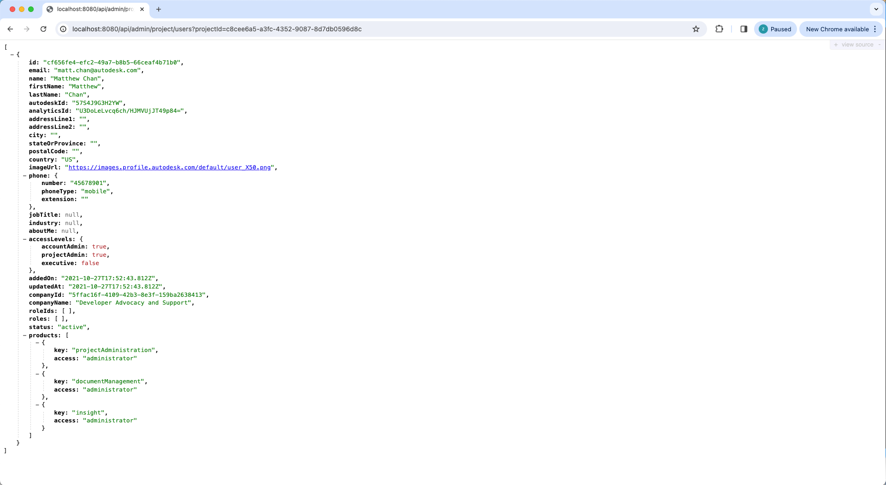

import NodeJsVsCodeHubs from './_shared/nodejs-vscode/admin/account-admin.mdx';
import NodeJsVsCodeEndpoints from './_shared/nodejs-vscode/admin/endpoints.mdx';

# Administrateur de compte

Maintenant, il est temps d’implémenter notre serveur pour prendre en charge l’accès administrateur de compte, dans cette étape, nous allons 
continuer à étendre notre serveur en fonction des [API d’administration de compte](https://aps.autodesk.com/en/docs/acc/v1/overview/field-guide/admin/)
pour RÉCUPÉRER et CRÉER les données des projets et des utilisateurs ACC :

## Projets et utilisateurs

First, let's add a couple of helper methods for getting and importing projects and users:

<NodeJsVsCodeHubs />

## Points de terminaison du serveur

Ensuite, exposons la nouvelle fonctionnalité au code côté client via un autre
ensemble de points de terminaison.

<NodeJsVsCodeEndpoints />

## Essayez-le

Et c’est tout pour le côté serveur. Il est temps de l’essayer !

Démarrez (ou redémarrez) l’application à partir de Visual Studio Code comme d’habitude, 
- Utilisez l’ID (en supprimant **b.**) d’un hub ACC comme vous l’avez obtenu à l’étape précédente dans l’adresse : http://localhost:8080/api/admin/projects?accountId={votre-id-compte}.
Dans ce cas, l’application serveur doit répondre avec une liste JSON de tous les projets
disponible sous le hub spécifié.
- Utilisez l’ID du projet comme vous l’avez fait à l’étape précédente, essayez d’appeler l’adresse : 
http://localhost:8080/api/admin/project/users?projectId={votre-id-projet}, l’application serveur doit
répondre avec une liste JSON de tous les utilisateurs de ce projet.

:::info

Vous pouvez obtenir une liste de projets différente par les 2 points de terminaison différents, voici l’explication :
- Avec l’API de gestion des données, il renverra tous les projets auxquels l’utilisateur actuel est impliqué.
- Avec l’API Account Admin, il renverra tous les projets du compte si l’utilisateur actuel est Account Admin.

:::

