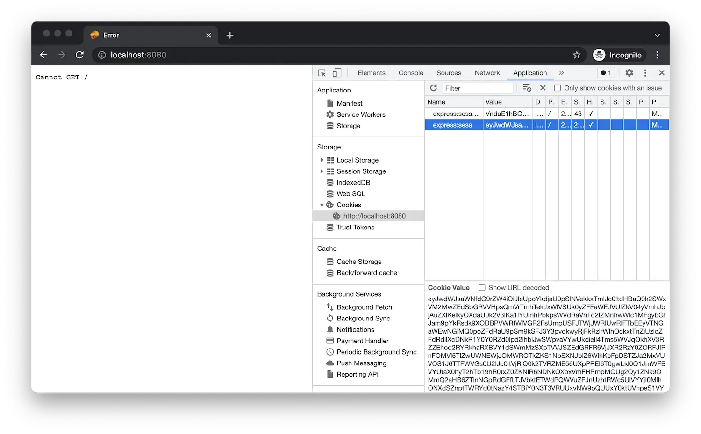

Si l’application est toujours en cours d’exécution, redémarrez-la (par exemple, à l’aide de _Run > Redémarrer Debugging_,
soit en cliquant sur l’icône verte de redémarrage), sinon redémarrez-le (en utilisant _Run > Démarrer Debugging_,
ou en appuyant sur 'F5').

Lorsque vous accédez à [http://localhost:8080/api/auth/login](http://localhost:8080/api/auth/login)
dans le navigateur, vous devriez être redirigé vers la page de connexion Autodesk, et après vous être connecté,
vous devriez être redirigé vers votre application, pour l’instant en affichant simplement 'Impossible d’obtenir /'.
C’est normal car nous n’avons pas encore implémenté le point de terminaison 'GET /'. Toutefois, si vous utilisez
les outils de développement du navigateur et explorer les cookies stockés par votre navigateur pour l’origine 'localhost',
Vous remarquerez que l’application y stocke déjà les données d’authentification.

:::info

Voici où vous pouvez trouver les cookies de votre site Web dans différents navigateurs :
- [Chrome](https://developer.chrome.com/docs/devtools/storage/sessionstorage/)
- [Firefox](https://developer.mozilla.org/en-US/docs/Tools/Storage_Inspector/Cookies)
- [Bord](https://docs.microsoft.com/en-us/microsoft-edge/devtools-guide-chromium/storage/cookies)
- [Safari](https://developer.apple.com/safari/tools/)

:::

