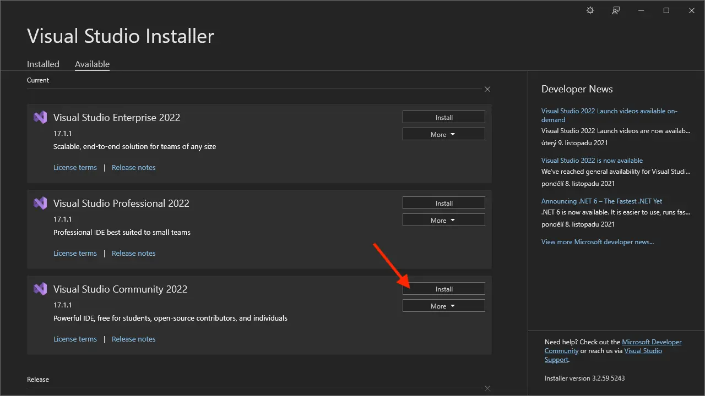

チュートリアルでは、Visual Studio Community 2022 を使用します。_Visual Studio Installer_をダウンロードできます
[ここ](https://visualstudio.microsoft.com/vs/community/)から、目的のバージョンとエディションをインストールします
インストーラーアプリケーションからVisual Studioの:

_ASP.NET と Web development_ コンポーネントを必ず含め、
_.NET デスクトップ development_ コンポーネント (デスクトップ アプリケーション用のプラグインを開発する場合)
RevitやInventorなど。

