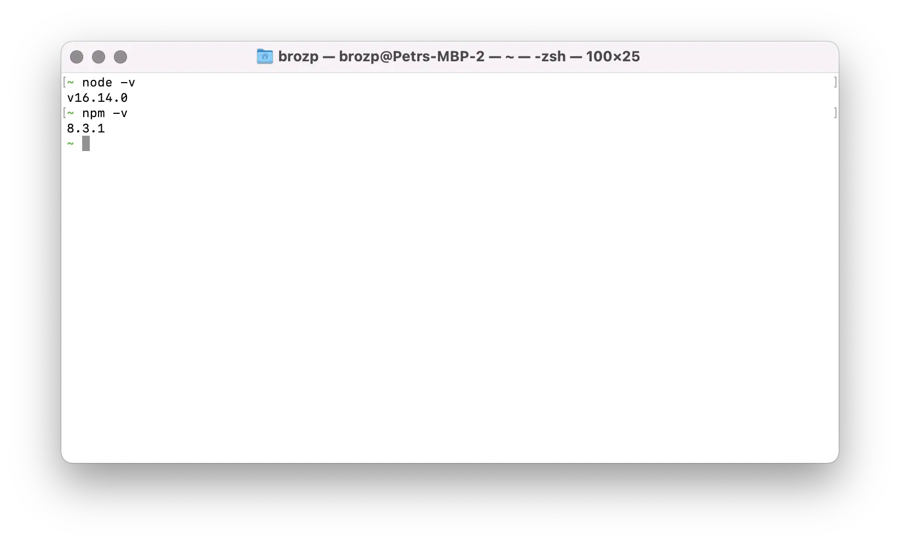

import CliSetup from '../cli.mdx';
import GitSetup from '../git.mdx';
import VSCodeSetup from '../vscode.mdx';

## コマンドラインインターフェイス

<CliSetup />

## ソースコード管理

<GitSetup />

## ランタイム

また、コードを実行するためのNode.js _runtime_ と、Node.jsパッケージマネージャー _NPM_
3rdパーティの依存関係を管理します。https://nodejs.org/en/download でプラットフォーム用のインストーラーを入手できます
両方がインストールされます。

ツールが使用可能であることを確認するには、'bash' で次の 2 つのコマンドを実行してみてください。

```bash
node -v
npm -v
```

次のように表示されます。



## エディタ

<VSCodeSetup />
