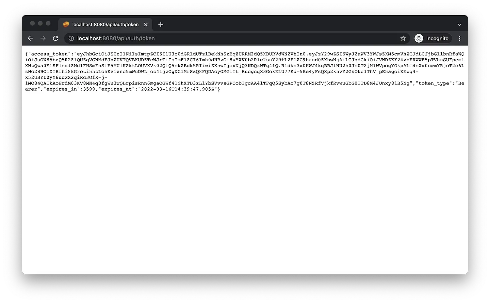

import EnvTabs from '@site/src/components/EnvTabs.js';

import NodeJsVsCodeTokens from './_shared/nodejs-vscode/auth/tokens.mdx';
import NodeJsVsCodeEndpoints from './_shared/nodejs-vscode/auth/endpoints.mdx';
import NodeJsVsCodeTest from './_shared/nodejs-vscode/auth/test.mdx';

import DotNetTokens from './_shared/dotnet/auth/tokens.mdx';
import DotNetEndpoints from './_shared/dotnet/auth/endpoints.mdx';
import DotNetVsCodeTest from './_shared/dotnet-vscode/auth/test.mdx';
import DotNetVs2022Test from './_shared/dotnet-vs2022/auth/test.mdx';

# 認証

このステップでは、サーバーの実装を拡張して、サーバー自体を認証できるようにします
を APS プラットフォームに追加し、さまざまなユースケースのアクセストークンを生成します。

:::tip

より多くの機能を持つ「内部」トークンを生成することをお勧めします(たとえば、
データ管理サービスでファイルを作成または削除できます)のみ使用されます
サーバーによって、安全に共有できる機能が少ない「パブリック」トークン
クライアント側のロジック。

:::

## アクセストークン

<EnvTabs NodeJsVsCode={NodeJsVsCodeTokens} DotNetVsCode={DotNetTokens} DotNetVs2022={DotNetTokens} />

## サーバーエンドポイント

これで、サーバーの最初のエンドポイントを介してこの機能を公開できます。

<EnvTabs NodeJsVsCode={NodeJsVsCodeEndpoints} DotNetVsCode={DotNetEndpoints} DotNetVs2022={DotNetEndpoints} />

## 試してみる

新しいサーバーエンドポイントが機能するかどうか見てみましょう。

<EnvTabs NodeJsVsCode={NodeJsVsCodeTest} DotNetVsCode={DotNetVsCodeTest} DotNetVs2022={DotNetVs2022Test} />

:::tip

Google Chromeをお使いの場合は、[JSON Formatter](https://chrome.google.com/webstore/detail/json-formatter/bcjindcccaagfpapjjmafapmmgkkhgoa?hl=en)のインストールをご検討ください
または同様の拡張機能を使用して、JSON 応答を自動的に書式設定します。

:::

