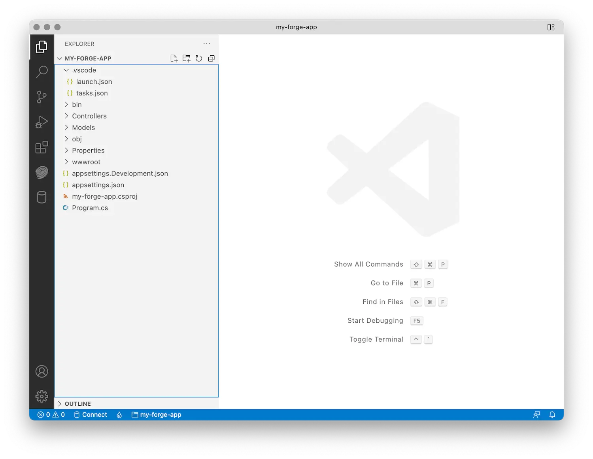

プロジェクト用の新しいフォルダーを作成し、コマンドラインでそのフォルダーに移動して、新しい
ASP.NET コアプロジェクト:

```bash
dotnet new web
```

次に、依存関係をインストールする必要があります。この場合、それはただのカップルになります
公式のパッケージ APS SDK:

```bash
dotnet add package Autodesk.SdkManager
dotnet add package Autodesk.Authentication
dotnet add package Autodesk.OSS
dotnet add package Autodesk.ModelDerivative
```

プロジェクト内の '*.csproj' ファイルは次のようになります (おそらく
わずかに異なるバージョン番号、および追加の .NET 設定):

```xml
<Project Sdk="Microsoft.NET.Sdk.Web">
  <PropertyGroup>
    <TargetFramework>net6.0</TargetFramework>
  </PropertyGroup>
  <ItemGroup>
    <PackageReference Include="Autodesk.Authentication" Version="1.0.0" />
    <PackageReference Include="Autodesk.ModelDerivative" Version="1.0.0" />
    <PackageReference Include="Autodesk.OSS" Version="1.0.0" />
    <PackageReference Include="Autodesk.SdkManager" Version="1.0.0" />
  </ItemGroup>
</Project>
```

最後に、後で必要になるサブフォルダーをプロジェクトフォルダーにさらにいくつか作成しましょう。

- 「コントローラ」 - ここで、すべてのサーバーエンドポイントを実装します。
- 「モデル」 - ここでは、異なるエンドポイントで共有できるすべてのサーバー側のロジックを保持します。
- 'wwwroot' - クライアント側のアセット(HTML、CSS、JavaScript、画像など)をすべて配置します。

これで、Visual Studio Code で初めてプロジェクト フォルダーを開くと、プロンプトが表示されます
をクリックして、プロジェクトを .NET 開発用にセットアップします。プロンプトを受け入れると、エディターは自動的に
既定の [起動構成](https://code.visualstudio.com/docs/editor/debugging#_launch-configurations) などの追加の .NET 固有の設定を含む '.vscode' サブフォルダー。
エディタのフォルダ構造は、次のようになります。




:::note

「.vscode」フォルダが自動的に作成されない場合は、[Run & Debug]サイドパネルから作成できます


:::


'.vscode' フォルダーを作成するには、左側のサイドパネルで *実行とデバッグ ツールをクリックし>launch.json ファイルを作成します > を選択します。NET5+ & .NET Core*です。