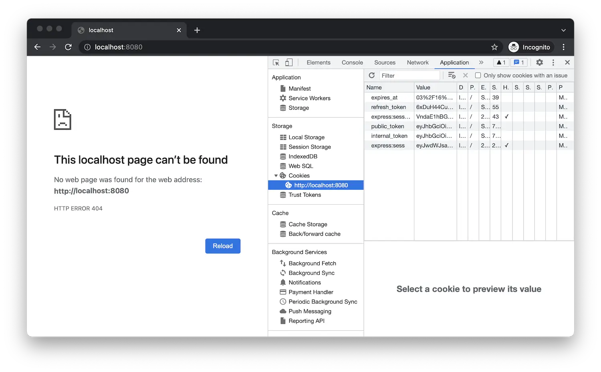

アプリケーションがまだ実行中の場合は、再起動します (たとえば、_Debug > Restart_
または「Ctrl」+「Shift」+「F5」を押す)、そうでない場合は(_Debug >スタートDebugging_を使用して)再起動します。
または「F5」を押す)。

[http://localhost:8080/api/auth/login](http://localhost:8080/api/auth/login)
ブラウザでは、オートデスクのログインページにリダイレクトされ、ログイン後、
アプリケーションにリダイレクトされ、今のところは単に404を返します。これは予想されたことですが、
'GET /' エンドポイントをまだ実装しています。ただし、ブラウザ開発ツールを使用してCookieを探索する場合
ブラウザによって 'localhost' オリジンに保存されている場合、アプリケーションがすでに
そこに認証データを格納します。

:::info

ここでは、さまざまなブラウザでWebサイトのCookieを見つけることができます。
- [クローム](https://developer.chrome.com/docs/devtools/storage/sessionstorage/)
- [Firefoxの](https://developer.mozilla.org/en-US/docs/Tools/Storage_Inspector/Cookies)
- [エッジ](https://docs.microsoft.com/en-us/microsoft-edge/devtools-guide-chromium/storage/cookies)
- [サファリ](https://developer.apple.com/safari/tools/)

:::

