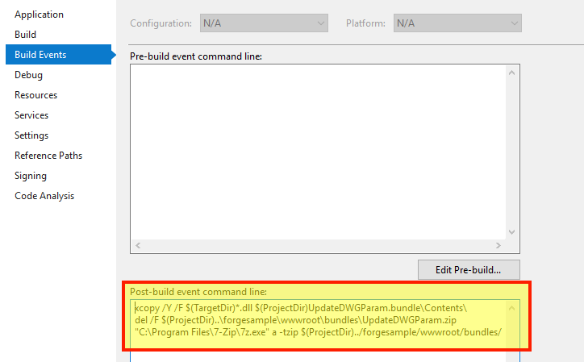

この手順は、Design Automation 用の基本的な AutoCAD プラグインを作成するのに役立ちます。詳細については、[My First AutoCAD Plugin](https://knowledge.autodesk.com/support/autocad/learn-explore/caas/simplecontent/content/my-first-autocad-plug-overview.html)チュートリアルを参照してください。

> バンドル ZIP](https://github.com/autodesk-platform-services/aps-design-automation-dotnet/blob/master/designAutomationSample/wwwroot/bundles/UpdateDWGParam.zip) を 'bundles/' (Node.js) または '/designAutomationSample/wwwroot/bundles' (.NET 6) フォルダーにダウンロードし、[**プラグイン バンドルのアップロード** セクションにスキップ](#upload-plugin-bundle) することができます。

### 新しいプロジェクトを作成

- ソリューションを右クリックし、**追加** >> **新しいプロジェクト** をクリックします。
- **Windows デスクトップ**、**クラス ライブラリ** の順に選択し、最後に「UpdateDWGParam」という名前を付けます。
- 次に、プロジェクトを右クリックし、**[NuGet パッケージの管理]に移動し、[**ブラウザ]で**AutoCAD.NET**を検索して、「AutoCAD.NET.Core」をインストールします(「AutoCAD.NET.Model」もインストールされます)。
- 次に、「Newtonsoft.Json」を検索してインストールします(JSON形式の入力データを解析するために使用されます)。

> .NET Framework 4.8 を選択してください。一覧にない場合は、[Dev Pack をインストールしてください](https://dotnet.microsoft.com/download/dotnet-framework/net48)。


その結果、**package.config** は次のようになります。このサンプルではバージョン 20 を使用しており、使用可能なすべてのバージョンで動作します。特定のバージョンに調整できます。

プロジェクトには「Class1.cs」クラスが含まれているはずですが、ファイルの名前を「Commands.cs」に変更しましょう(一貫性のため)。

```cs title=Commands.cs
using Autodesk.AutoCAD.ApplicationServices.Core;
using Autodesk.AutoCAD.DatabaseServices;
using Autodesk.AutoCAD.Runtime;
using Newtonsoft.Json;
using System.IO;
[assembly: CommandClass(typeof(UpdateDWGParam.Commands))]
[assembly: ExtensionApplication(null)]
namespace UpdateDWGParam
{
    public class Commands
    {
        [CommandMethod("UpdateParam", CommandFlags.Modal)]
        public static void UpdateParam()
        {
            //Get active document of drawing with Dynamic block
            var doc = Application.DocumentManager.MdiActiveDocument;
            var db = doc.Database;
            // read input parameters from JSON file
            InputParams inputParams = JsonConvert.DeserializeObject<InputParams>(File.ReadAllText("params.json"));
            using (Transaction t = db.TransactionManager.StartTransaction())
            {
                var bt = t.GetObject(db.BlockTableId, OpenMode.ForRead) as BlockTable;
                foreach (ObjectId btrId in bt)
                {
                    //get the blockDef and check if is anonymous
                    BlockTableRecord btr = (BlockTableRecord)t.GetObject(btrId, OpenMode.ForRead);
                    if (btr.IsDynamicBlock)
                    {
                        //get all anonymous blocks from this dynamic block
                        ObjectIdCollection anonymousIds = btr.GetAnonymousBlockIds();
                        ObjectIdCollection dynBlockRefs = new ObjectIdCollection();
                        foreach (ObjectId anonymousBtrId in anonymousIds)
                        {
                            //get the anonymous block
                            BlockTableRecord anonymousBtr = (BlockTableRecord)t.GetObject(anonymousBtrId, OpenMode.ForRead);
                            //and all references to this block
                            ObjectIdCollection blockRefIds = anonymousBtr.GetBlockReferenceIds(true, true);
                            foreach (ObjectId id in blockRefIds)
                            {
                                dynBlockRefs.Add(id);
                            }
                        }
                        if (dynBlockRefs.Count > 0)
                        {
                            //Get the first dynamic block reference, we have only one Dyanmic Block reference in Drawing
                            var dBref = t.GetObject(dynBlockRefs[0], OpenMode.ForWrite) as BlockReference;
                            UpdateDynamicProperties(dBref, inputParams);
                        }
                    }
                }
                t.Commit();
            }
            LogTrace("Saving file...");
            db.SaveAs("outputFile.dwg", DwgVersion.Current);
        }
        /// <summary>
        /// This updates the Dyanmic Blockreference with given Width and Height
        /// The initial parameters of Dynamic Blockrefence, Width =20.00 and Height =40.00
        /// </summary>
        /// <param Editor="ed"></param>
        /// <param BlockReference="br"></param>
        /// <param String="name"></param>
        private static void UpdateDynamicProperties(BlockReference br, InputParams inputParams)
        {
            // Only continue is we have a valid dynamic block
            if (br != null && br.IsDynamicBlock)
            {
                // Get the dynamic block's property collection
                DynamicBlockReferencePropertyCollection pc = br.DynamicBlockReferencePropertyCollection;
                foreach (DynamicBlockReferenceProperty prop in pc)
                {
                    switch (prop.PropertyName)
                    {
                        case "Width":
                            prop.Value = inputParams.Width;
                            break;
                        case "Height":
                            prop.Value = inputParams.Height;
                            break;
                        default:
                            break;
                    }
                }
            }
        }
        /// <summary>
        /// This will appear on the Design Automation output
        /// </summary>
        private static void LogTrace(string format, params object[] args) { Application.DocumentManager.MdiActiveDocument.Editor.WriteMessage(format, args); }
    }
    public class InputParams
    {
        public double Width { get; set; }
        public double Height { get; set; }
    }
}
```

これは、AutoCAD で実行されるメイン コードです。次の内容を「Commands.cs」にコピーします。このクラスには、同じ名前のメソッドとして定義された AutoCAD のカスタム コマンド「UpdateParam」が 1 つ含まれています。このコマンドは、**アクティビティ**(このチュートリアルの次のステップ)で指定されるように、Design Automationエンジンによって呼び出されます

```xml title=PackageContents.xml
<?xml version="1.0" encoding="utf-8" ?>
<ApplicationPackage SchemaVersion="1.0" Version="1.0" ProductCode="{F11EA57A-1E7E-4B6D-8E81-986B071E3E07}" Name="AutoCADDesignAutomation" Description="Sample Plugin for AutoCAD" Author="tutorials.autodesk.io>">
  <CompanyDetails Name="Autodesk, Inc" Url="http://tutorials.autodesk.io" Email="forge.help@autodesk.com"/>
  <Components>
    <RuntimeRequirements OS="Win64" Platform="AutoCAD"/>
    <ComponentEntry AppName="UpdateWindowParameters" ModuleName="./Contents/UpdateDWGParam.dll" AppDescription="AutoCAD .NET App to update parameters of Dynamic blockreference in AutoCAD Drawing" LoadOnCommandInvocation="True" LoadOnAutoCADStartup="True">
      <Commands GroupName="FPDCommands">
        <Command Global="UpdateParam" Local="UpdateParam"/>
      </Commands>
    </ComponentEntry>
  </Components>
</ApplicationPackage>
```

「UpdateDWGParam.bundle」という名前のフォルダを作成し、その中に「PackageContents.xml」という名前のファイルを作成し、次の内容をコピーします。詳細については、[PackageContents.xml Format Reference](https://help.autodesk.com/view/ACD/2023/ENU/?guid=GUID-BC76355D-682B-46ED-B9B7-66C95EEF2BD0)を参照してください。このファイルは、Design Automation の実行時に呼び出される新しい AutoCAD カスタム コマンド「UpdateParam」を定義します。

最後に、「Contents」という名前のサブフォルダーを作成し、空のままにします。この時点で、プロジェクトは次のようになります。

## ビルド後のイベント

> Node.jsの場合、AppBundleのZIP出力フォルダを調整する必要があります。

次に、.bundleフォルダーをZIP圧縮する必要があります。プロジェクトを右クリックし、**[プロパティ]** を選択し、**[ビルド イベント]** を開き、次の画像を [ビルド後のイベント コマンド ライン]** フィールドにコピーします (下の画像を参照)。

```bash
xcopy /Y /F "$(TargetDir)*.dll" "$(ProjectDir)UpdateDWGParam.bundle\Contents\"
del /F "$(ProjectDir)..\designAutomationSample\wwwroot\bundles\UpdateDWGParam.zip"
"C:\Program Files\7-Zip\7z.exe" a -tzip "$(ProjectDir)../designAutomationSample/wwwroot/bundles/UpdateDWGParam.zip" "$(ProjectDir)UpdateDWGParam.bundle\" -xr0!*.pdb
```

This will copy the DLL from `/bin/debug/` into `.bundle/Contents` folder, then use [7zip](https://www.7-zip.org/) to create a zip, then finally copy the ZIP into `/bundles` folders of the webapp.


> **ビルド後イベント** でプロジェクト名とフォルダー名がどのように使用されるかに注意してください。

ここで 'UpdateDWGParam' プロジェクトをビルドすると、**出力** ウィンドウに次のようなものが表示されます。2つのフォルダと3つのファイルが圧縮されていることに注意してください。zip ファイルは '/wwwroot/bundles' フォルダーに直接作成されます。これは、あなたがうまくやっていることを意味します!


