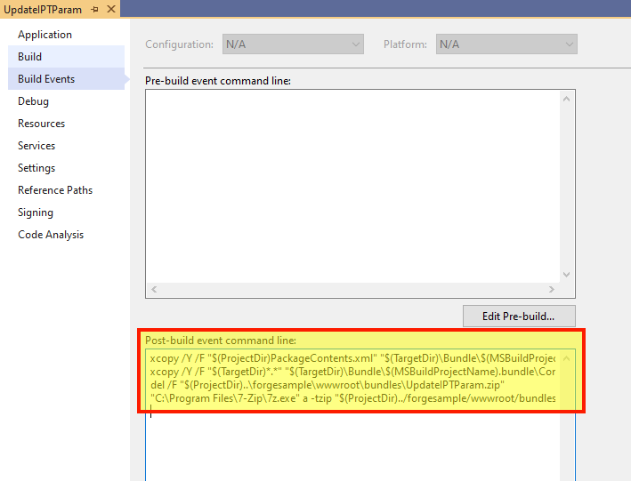

この手順は、基本的なInventorプラグインを作成するのに役立ちます。詳細については、[My First Inventor Plugin](https://knowledge.autodesk.com/support/inventor-products/learn-explore/caas/simplecontent/content/my-first-inventor-plug-overview.html)チュートリアルを参照してください。

> バンドル ZIP](https://github.com/autodesk-platform-services/aps-design-automation-nodejs/tree/nodejs/bundles/UpdateIPTParam.zip) を 'bundles/' (Node.js) または '/designAutomationSample/wwwroot/bundles' (.NET Core) フォルダーにダウンロードし、[**プラグイン バンドルのアップロード** セクションにスキップ](#upload-plugin-bundle) できます。

## 前提条件

- **Design Automation for Inventor** テンプレート: Visual Studio Market Place にアクセスし、[このリンク](https://marketplace.visualstudio.com/items?itemName=Autodesk.DesignAutomation) からダウンロードして開き、手順に従ってインストールします。


## 新しいプロジェクトを作成する

ソリューションを右クリックし、**追加** >> **新しいプロジェクト** をクリックします。**Inventor** テンプレートを検索し、次に **プラグイン プロジェクト** を検索し、最後に「UpdateIPTParam」という名前を付けます。プロジェクトを右クリックし、**[NuGet パッケージの管理...]に移動し、[**参照]** で 'Newtonsoft.Json' を選択して更新できます (このパッケージは既にソリューションに含まれていますが、そうでない場合はインストールします)

> .NET Framework 4.7 を選択してください。一覧にない場合は、[Dev Pack をインストールしてください](https://dotnet.microsoft.com/download/dotnet-framework/net47)。


## SampleAutomation.cs

「SampleAutomation.cs」ファイルを開き、次の内容をコピーします。これは、「Run」メソッドでパラメータが更新される場所です。

```dotnet title=SampleAutomation.cs
using Inventor;
using Newtonsoft.Json;
using System;
using System.Collections.Generic;
using System.Diagnostics;
using System.Runtime.InteropServices;
using System.Threading;
namespace UpdateIPTParam
{
    [ComVisible(true)]
    public class SampleAutomation
    {
        private InventorServer m_server;
        public SampleAutomation(InventorServer app) { m_server = app; }
        public void Run(Document doc)
        {
            try
            {
                // update parameters in the doc
                ChangeParameters(doc);
                // generate outputs
                var docDir = System.IO.Path.GetDirectoryName(doc.FullFileName);
                // save output file
                var documentType = doc.DocumentType;
                if (documentType == DocumentTypeEnum.kPartDocumentObject)
                {
                    // the name must be in sync with OutputIpt localName in Activity
                    var fileName = System.IO.Path.Combine(docDir, "outputFile.ipt");
                    // save file
                    doc.SaveAs(fileName, false);
                }
            }
            catch (Exception e) { LogTrace("Processing failed: {0}", e.ToString()); }
        }
        /// <summary>
        /// Change parameters in Inventor document.
        /// </summary>
        /// <param name="doc">The Inventor document.</param>
        /// <param name="json">JSON with changed parameters.</param>
        public void ChangeParameters(Document doc)
        {
            var theParams = GetParameters(doc);
            Dictionary<string, string> parameters = JsonConvert.DeserializeObject<Dictionary<string, string>>(System.IO.File.ReadAllText("params.json"));
            foreach (KeyValuePair<string, string> entry in parameters)
            {
                try
                {
                    Parameter param = theParams[entry.Key.ToLower()];
                    param.Expression = entry.Value;
                }
                catch (Exception e) { LogTrace("Cannot update {0}: {1}", entry.Key, e.Message); }
            }
            doc.Update();
        }
        /// <summary>
        /// Get parameters for the document.
        /// </summary>
        /// <returns>Parameters. Throws exception if parameters are not found.</returns>
        private static Parameters GetParameters(Document doc)
        {
            var docType = doc.DocumentType;
            switch (docType)
            {
                case DocumentTypeEnum.kAssemblyDocumentObject:
                    var asm = doc as AssemblyDocument;
                    return asm.ComponentDefinition.Parameters;
                case DocumentTypeEnum.kPartDocumentObject:
                    var ipt = doc as PartDocument;
                    return ipt.ComponentDefinition.Parameters;
                default:
                    throw new ApplicationException(string.Format("Unexpected document type ({0})", docType));
            }
        }
        /// <summary>
        /// This will appear on the Design Automation output
        /// </summary>
        private static void LogTrace(string format, params object[] args) { Trace.TraceInformation(format, args); }
    }
}
```

## ビルド後のイベント

> Node.jsの場合、AppBundleのZIP出力フォルダを調整する必要があります。

次に、「.bundle」フォルダをZIP圧縮する必要があります。プロジェクトを右クリックし、**[プロパティ]** を選択し、**[ビルド イベント]** を開き、次の画像を [ビルド後のイベント コマンド ライン]** フィールドにコピーします (下の画像を参照)。

```
xcopy /Y /F "$(ProjectDir)PackageContents.xml" "$(TargetDir)\Bundle\$(MSBuildProjectName).bundle\"
xcopy /Y /F "$(TargetDir)*.*" "$(TargetDir)\Bundle\$(MSBuildProjectName).bundle\Contents\"
del /F "$(ProjectDir)..\designAutomationSample\wwwroot\bundles\UpdateIPTParam.zip"
"C:\Program Files\7-Zip\7z.exe" a -tzip "$(ProjectDir)../designAutomationSample/wwwroot/bundles/UpdateIPTParam.zip" "$(TargetDir)\bundle\$(MSBuildProjectName).bundle\" -xr0!*.pdb
```

これにより、DLL が '/bin/debug/' から '.bundle/Contents' フォルダーにコピーされ、[7zip](https://www.7-zip.org/) を使用して zip が作成され、最後に ZIP が Web アプリの '/bundles' フォルダーにコピーされます。



ここで 'UpdateIPTParam' プロジェクトをビルドすると、**出力** ウィンドウに次のようなものが表示されます。2つのフォルダといくつかのファイルが圧縮されていることに注意してください。zip ファイルは '/wwwroot/bundles' フォルダーに直接作成されます。これは、あなたがうまくやっていることを意味します!


