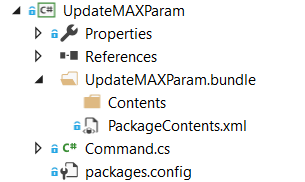
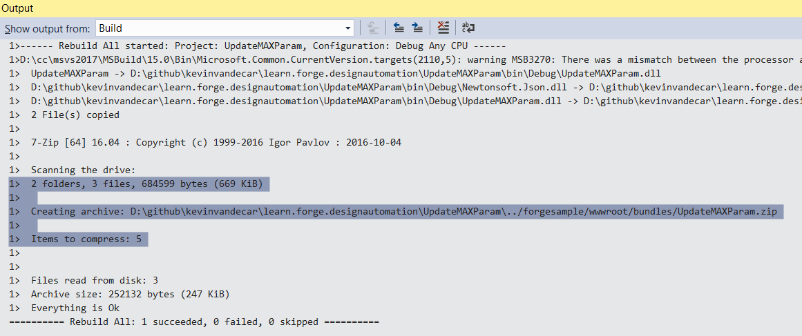

この手順は、Design Automation 用の基本的な 3ds Max プラグインを作成するのに役立ちます。チュートリアル全体では、3ds Max 用のプラグインを含む Microsoft .NET Framework を使用します。 3ds Max は、MAXScript、Python、NET API、C++ で自動化できます。3ds Max .NET API は、プラグインではおそらく最もよく使用されませんが、他の Design Automatiuon 製品では一般的な API です。.NET API の 3ds Max リソースは、次の場所にあります(2019 のリンクですが、.NET API は 3ds Max Design Automation エンジンの使用可能なすべてのバージョンでサポートされています)。

- [3ds Max .NET プラグインの作成](http://help.autodesk.com/view/3DSMAX/2019/ENU/?guid=__developer_3ds_max_sdk___the_learning_path_lesson_7_writing__net_plug_ins_html)
- [3ds Max .NET SDK](http://help.autodesk.com/view/3DSMAX/2019/ENU/?guid=__developer_3ds_max__net_sdk_html)
- [GetCOREInterface Blog .NET サンプル](https://getcoreinterface.typepad.com/blog/2017/10/updated-net-api-samples-for-3ds-max-2018.html)

Design Automation では、自動化できない UI やプロンプトがあってはなりません。3ds Max DA エンジンを自動化するには、MAXScript を用意する必要があります。ほとんどのカスタマイズは MAXScript にすばやく公開できるため、通常は非常に簡単です(「C++ の関数パブリッシュ」(http://help.autodesk.com/view/3DSMAX/2019/ENU/?guid=__developer_3ds_max_sdk_features_function_publishing_html)および「MAXScript .NET 処理」(http://help.autodesk.com/view/3DSMAX/2019/ENU/?guid=GUID-779FD7AC-953D-4567-B2A8-60B1D8695B95)を参照)

> バンドル ZIP](https://github.com/autodesk-platform-services/aps-design-automation-nodejs/tree/nodejs/bundles/UpdateMAXParam.zip) を 'bundles/' (Node.js) または '/designAutomationSample/wwwroot/bundles' (.NET 6) フォルダーにダウンロードし、[**プラグイン バンドルのアップロード** セクションにスキップ](#upload-plugin-bundle) できます。

### 新しい .NET プロジェクトを作成する

ソリューションを右クリックし、**追加** >> **新しいプロジェクト** をクリックします。**Windows デスクトップ**、**クラス ライブラリ** の順に選択し、最後に「UpdateMAXParam」という名前を付けます。次に、「Autodesk.Max.Dll」マネージ アセンブリ(3ds Max .NET API コア モジュール)を参照する必要があります。このモジュールは「3dsmax.exe」フォルダにあり、参照するときは必ず「ローカルコピー」フラグをオフにしてください。.NET API のサポートに使用されるモジュールは他にもいくつかありますが(「3ds Max .NET SDK」(http://help.autodesk.com/view/3DSMAX/2019/ENU/?guid=__developer_3ds_max__net_sdk_html)を参照)、このチュートリアルでは Autodesk.Max.dll のみを使用します。次に、「Newtonsoft.Json」(JSON形式の入力データを解析するために使用されます)を検索してインストールします。

> .NET Framework 4.8 を選択してください。一覧にない場合は、[Dev Pack をインストールしてください](https://dotnet.microsoft.com/download/dotnet-framework/net48)。


その結果、**package.config** は Newtonsoft.Json モジュールのようになります。

```xml title=package.config
<?xml version="1.0" encoding="utf-8"?>
<packages>
    <package id="Newtonsoft.Json" version="12.0.1" targetFramework="net47" />
</packages>
```

これは、3ds Maxで実行されるメインコードです。 次の内容を「Command.cs」にコピーします。Design Automation のポーセシングを処理するクラスは 3 つあります。1 つ目は、JSON 入力データとのインターフェイスに使用される 'InputParams' です。次は、シーンを反復処理し、すべての開き窓を見つけるために使用される「ParameterChanger」クラスです(ただし、クラスIDで識別される任意のオブジェクトタイプにすることができます)。最後に、「RuntimeExecute」を使用して入力を受け取り、自動化を駆動します。また、Design Automation コンソールに情報を出力する特殊なログ記録があることにも注意してください。LogTrace 関数を参照してください。これには 3ds Max の 3ds Max マネージ クラス「ILogSys」が使用され、指定された「LogEntry」API で使用されるフラグは、出力を Design Automation コンソールに表示するために必要です。

```cs title=Commands.cs
using System;
using System.Collections.Generic;
using System.Linq;
using System.IO;
using Newtonsoft.Json;
using Autodesk.Max;
namespace Autodesk.Forge.Sample.DesignAutomation.Max
{
    /// <summary>
    /// Used to hold the parameters to change
    /// </summary>
    public class InputParams
    {
        public float Width { get; set; }
        public float Height { get; set; }
    }
    /// <summary>
    /// Changes parameters in automated way.
    /// Iterate entire scene to get all nodes
    /// In this example we specifically find Casement Windows by object class ID
    /// Then modify the width and height based on inputs.
    ///
    /// Could be expanded to find other window types, other objects, etc.
    /// </summary>
    static public class ParameterChanger
    {
        static List<IINode> m_sceneNodes = new List<IINode> { };
        /// <summary>
        /// Recursively go through the scene and get all nodes
        /// Use the Autodesk.Max APIs to get the children nodes
        /// </summary>
        static private void GetSceneNodes(IINode node)
        {
            m_sceneNodes.Add(node);
            for (int i = 0; i < node.NumberOfChildren; i++)
                GetSceneNodes(node.GetChildNode(i));
        }
        /// <summary>
        /// Function to specifically update Case Windows with input wedth and height parameters
        /// </summary>
        /// <param name="width">The new Width to set the Window</param>
        /// <param name="height">The new Height to set the Window</param>
        /// <returns>window count</returns>
        static public int UpdateWindowNodes(float width, float height)
        {
            IGlobal globalInterface = Autodesk.Max.GlobalInterface.Instance;
            IInterface14 coreInterface = globalInterface.COREInterface14;
            IINode nodeRoot = coreInterface.RootNode;
            m_sceneNodes.Clear();
            GetSceneNodes(nodeRoot);
            // 3ds Max uses a class ID for all object types. This is easiest way to find specific type.
            // ClassID (1902665597L, 1593788199L) == 0x71685F7D, 0x5EFF4727 for casement window
            IClass_ID cidCasementWindow = globalInterface.Class_ID.Create(0x71685F7D, 0x5EFF4727);
            // Use LINQ to filter for windows only - in case scene has more than one,
            // but this should still give us at least one for single window scene!
            var sceneWindows = from node in m_sceneNodes
                               where ((node.ObjectRef != null) && // In some cases the ObjectRef can be null for certain node types.
                                      (node.ObjectRef.ClassID.PartA == cidCasementWindow.PartA) &&
                                      (node.ObjectRef.ClassID.PartB == cidCasementWindow.PartB))
                               select node;
            // Iterate the casement windws and update the hight and width parameters.
            foreach (IINode item in sceneWindows)
            {
                // window is using old-style ParamArray rather than newer ParamBlk2
                IIParamArray pb = item.ObjectRef.ParamBlock;
                pb.SetValue(0, coreInterface.Time, height); // window height is at index zero.
                pb.SetValue(1, coreInterface.Time, width); // window width is at index one.
            }
            // If there are windows, save the window updates
            int status;
            if (sceneWindows.Count() > 0)
            {
                // The output file name must match what the Design Automation work item is specifying as output file.
                string full_filename = coreInterface.CurFilePath;
                string filename = coreInterface.CurFileName;
                string new_filename = full_filename.Replace(filename, "outputFile.max");
                status = coreInterface.SaveToFile(new_filename, true, false);
                if (status == 0) //error
                    return -1;
            }
            // return how many windows were modified.
            return sceneWindows.Count();
        }
    }
    /// <summary>
    /// This class is used to execute the automation. Above class could be connected to UI elements, or run by scripts directly.
    /// This class takes the input from JSON input and uses those values. This way it is more cohesive to web development.
    /// </summary>
    static public class RuntimeExecute
    {
        static public int ModifyWindowWidthHeight()
        {
            int count = 0;
            // Run entire code block with try/catch to help determine errors
            try
            {
                // read input parameters from JSON file
                InputParams inputParams = JsonConvert.DeserializeObject<InputParams>(File.ReadAllText("params.json"));
                count = ParameterChanger.UpdateWindowNodes(inputParams.Width, inputParams.Height);
            }
            catch (Exception e)
            {
                LogTrace("Exception Error: " + e.Message);
                return -1; //fail
            }
            LogTrace("Changed {0} Window objects.", count);
            return count; // 0+ means success, and how many objects were changed.
        }
        /// <summary>
        /// Information sent to this LogTrace will appear on the Design Automation output
        /// </summary>
        private static void LogTrace(string format, params object[] args)
        {
            System.Reflection.Assembly a = System.Reflection.Assembly.GetExecutingAssembly();
            string output_msg = string.Format("DLL {0} compiled on {1}; {2}",
                System.IO.Path.GetFileName(a.Location),
                File.GetLastWriteTime(a.Location),
                string.Format(format, args));
            IGlobal globalInterface = Autodesk.Max.GlobalInterface.Instance;
            IInterface14 coreInterface = globalInterface.COREInterface14;
            ILogSys log = coreInterface.Log;
            // Note flags are necessary to produce Design Automation output. This is same as C++:
            // SYSLOG_INFO | SYSLOG_IGNORE_VERBOSITY | SYSLOG_BROADCAST
            log.LogEntry(0x00000004 | 0x00040000 | 0x00010000, false, "", output_msg);
        }
    }
}
```

「UpdateMAXParam.bundle」という名前のフォルダを作成し、このフォルダ内に「PackageContents.xml」という名前のファイルを追加します。以下の XML セクションの内容を PackageContents.xml ファイルにコピーします。詳細については、[PackageContents.xml Format Reference](https://help.autodesk.com/view/ACD/2023/ENU/?guid=GUID-BC76355D-682B-46ED-B9B7-66C95EEF2BD0)を参照してください。3ds Max プラグインのパッケージ化に関する 3ds Max 固有の情報については、「プラグインのパッケージ化」(http://help.autodesk.com/view/3DSMAX/2019/ENU/?guid=__developer_writing_plug_ins_packaging_plugins_html)を参照してください。

このファイルは、ロードするモジュール(この場合は作成中の .NET API プラグイン アセンブリですが、MAXScript、Python、C++ プラグインを含めることもできます)を 3ds Max に指示します。プラグインはこの機能を介して読み込まれるため、自動化ジョブをトリガーする手順についてのみ心配する必要があります。3ds Max でコードを正しくロードするには、ProductCode と UpgradeCode の両方に一意の ID が必要であることに注意してください。詳細については、上記のドキュメントを参照してください。

```xml tilte=PackageContents.xml
<?xml version="1.0" encoding="utf-8"?>
<ApplicationPackage
    SchemaVersion="1.0"
    AutodeskProduct="3ds Max"
    Name="Sample Design Automation Plugin for 3ds Max"
    Description="A sample package to update parameters of a 3ds Max scene file containing a casement window"
    AppVersion="2019.0.0"
    FriendlyVersion="2019.0.0"
    ProductType="Application"
    SupportedLocales="Enu"
    AppNameSpace="apps.autodesk.com"
    Author="Autodesk Forge"
    ProductCode="{6A8D06F4-C3DD-42DD-A69E-9B9617A7ABC0}"
    UpgradeCode="{CE88CEA5-47F6-423E-B9EC-E9FA683B5228}"
    >
    <CompanyDetails Name="Autodesk"
        Phone=" "
        Url="http://forge.autodesk.com"
        Email="noreply@autodesk.com" />
    <RuntimeRequirements OS="Win64" Platform="3ds Max" SeriesMin="2019" SeriesMax="2021" />
    <Components Description="assemblies parts">
        <RuntimeRequirements OS="Win64" Platform="3ds Max" SeriesMin="2019" SeriesMax="2021" />
        <ComponentEntry AppName="UpdateMAXParam" Version="2019.0.0" ModuleName="./Contents/UpdateMAXParam.dll" AppDescription="The Sample Design Automation Plugin managed assembly module" />
    </Components>
</ApplicationPackage>
```

Finally, create a subfolder named `Contents` and leave it empty. At this point, the project should look like.


## ビルド後のイベント

> Node.jsの場合、AppBundleのZIP出力フォルダを調整する必要があります。

次に、「.bundle」フォルダをZIP圧縮する必要があります。プロジェクトを右クリックし、**[プロパティ]** を選択し、**[ビルド イベント]** を開き、次の画像を [ビルド後のイベント コマンド ライン]** フィールドにコピーします (下の画像を参照)。

```
xcopy /Y /F "$(TargetDir)*.dll" "$(ProjectDir)UpdateMAXParam.bundle\Contents\"
del /F "$(ProjectDir)..\designAutomationSample\wwwroot\bundles\UpdateMAXParam.zip"
"C:\Program Files\7-Zip\7z.exe" a -tzip "$(ProjectDir)../designAutomationSample/wwwroot/bundles/UpdateMAXParam.zip" "$(ProjectDir)UpdateMAXParam.bundle\" -xr0!*.pdb
```

これにより、DLL が '/bin/debug/' から '.bundle/Contents' フォルダーにコピーされ、[7zip](https://www.7-zip.org/) を使用して zip が作成され、最後に ZIP が Web アプリの /bundles フォルダーにコピーされます。


> **ビルド後イベント** でプロジェクト名とフォルダー名がどのように使用されるかに注意するため、これらの名前を使用していることを確認してください。

ここで 'UpdateMAXParam' プロジェクトをビルドすると、**出力** ウィンドウに次のようなものが表示されます。2つのフォルダと3つのファイルが圧縮されていることに注意してください。zip ファイルは、/wwwroot/bundles フォルダーに直接作成されます。これは、あなたがうまくやっていることを意味します!



この時点で、3ds Max バッチ ツールを使用して機能をテストできます。これは 3ds Max Design Automation エンジンと同様に機能し、ジョブを Forge DA クラウド サービスに送信する前に、すべてのオートメーションをローカルでテストするのに適した方法です。MAXScript 環境で .NET クラスをインスタンス化するには、MAXScript 関数「dotNetClass」を使用します。このサンプル プロジェクトでは、MAXScript コードは次のようになります。

```ms title=MAXScript
fn UpdateParam =
(
	da = dotNetClass("Autodesk.Forge.Sample.DesignAutomation.Max.RuntimeExecute")
	da.ModifyWindowWidthHeight()
)
UpdateParam()
```

これをローカルで実行するには、次のようなコマンドラインプロンプトをテストできます。

```CommandLine
"%ADSK_3DSMAX_x64_2019%\3dsmaxbatch.exe" -sceneFile <myTestScene>.max da_script.ms
```

このチュートリアルの後半では、同じ手順が 3ds Max Design Automation エンジンに送信されます。