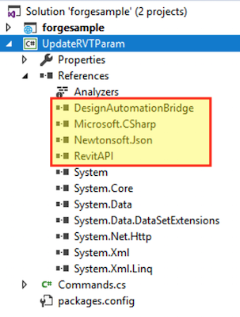
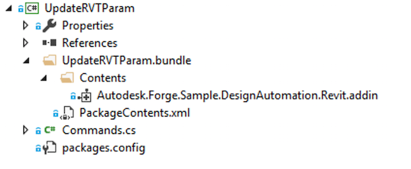

この手順は、Design Automation 用の基本的な Revit プラグインを作成するのに役立ちます。詳細については、[My First Revit Plugin](https://knowledge.autodesk.com/support/revit-products/learn-explore/caas/simplecontent/content/my-first-revit-plug-overview.html)チュートリアルを参照してください。

> バンドル ZIP](https://github.com/autodesk-platform-services/aps-design-automation-nodejs/tree/nodejs/bundles/UpdateRVTParam.zip) を 'bundles/' (Node.js) または '/designAutomationSample/wwwroot/bundles' (.NET 6) フォルダーにダウンロードし、[**プラグイン バンドルのアップロード** セクションにスキップ](#upload-plugin-bundle) できます。

### 新しいプロジェクトを作成

ソリューションの [追加] >> [新しいプロジェクト] をクリックします。**Windows デスクトップ**、**クラス ライブラリ** の順に選択し、最後に "UpdateRVTParam" という名前を付けます。

> .NET Framework 4.8 を選択してください。一覧にない場合は、[Dev Pack をインストールしてください](https://dotnet.microsoft.com/download/dotnet-framework/net48)。

**[参照]**を右クリックし、[参照の追加]** と[参照]** の [RevitAPI.dll](既定では [C:\Program Files\Autodesk\Revit 201x] フォルダの下)をクリックします。次に、この **RevitAPI** リファレンスを右クリックし、**[プロパティ]** に移動して、[ローカルをコピー]** を **False** に設定します。

次に、プロジェクトを右クリックし、**[NuGet パッケージの管理]に移動し、[ブラウザ]で **DesignAutomation.Revit** を検索して [Autodesk.Forge.DesignAutomation.Revit]をインストールします(必要な適切なRevitバージョンを選択します)。次に、「Newtonsoft.Json」(JSON形式の入力データを解析するために使用されます)を検索してインストールします。


```xml title=package.config
<?xml version="1.0" encoding="utf-8"?>
<packages>
  <package id="Autodesk.Forge.DesignAutomation.Revit" version="2021.0.0" targetFramework="net48" />
  <package id="Microsoft.CSharp" version="4.5.0" targetFramework="net48" />
  <package id="Newtonsoft.Json" version="12.0.1" targetFramework="net48" />
</packages>
```

プロジェクトには「Class1.cs」クラスが含まれているはずなので、ファイル名をCommands.csに変更しましょう(一貫性を保つため)。

この時点で、プロジェクトは次のようになります



```cs title=Commands.cs
using Autodesk.Revit.ApplicationServices;
using Autodesk.Revit.Attributes;
using Autodesk.Revit.DB;
using DesignAutomationFramework;
using Newtonsoft.Json;
using System.Collections.Generic;
using System.IO;
namespace Autodesk.Forge.Sample.DesignAutomation.Revit
{
    [Transaction(TransactionMode.Manual)]
    [Regeneration(RegenerationOption.Manual)]
    public class Commands : IExternalDBApplication
    {
        //Path of the project(i.e)project where your Window family files are present
        string OUTPUT_FILE = "OutputFile.rvt";
        public ExternalDBApplicationResult OnStartup(ControlledApplication application)
        {
            DesignAutomationBridge.DesignAutomationReadyEvent += HandleDesignAutomationReadyEvent;
            return ExternalDBApplicationResult.Succeeded;
        }
        private void HandleDesignAutomationReadyEvent(object sender, DesignAutomationReadyEventArgs e)
        {
            LogTrace("Design Automation Ready event triggered...");
            e.Succeeded = true;
            EditWindowParametersMethod(e.DesignAutomationData.RevitDoc);
        }
        private void EditWindowParametersMethod(Document doc)
        {
            InputParams inputParameters = JsonConvert.DeserializeObject<InputParams>(File.ReadAllText("params.json"));
            //Modifying the window parameters
            //Open transaction
            using (Transaction trans = new Transaction(doc))
            {
                trans.Start("Update window parameters");
                //Filter for windows
                FilteredElementCollector WindowCollector = new FilteredElementCollector(doc).OfCategory(BuiltInCategory.OST_Windows).WhereElementIsNotElementType();
                IList<ElementId> windowIds = WindowCollector.ToElementIds() as IList<ElementId>;
                foreach (ElementId windowId in windowIds)
                {
                    Element Window = doc.GetElement(windowId);
                    FamilyInstance FamInst = Window as FamilyInstance;
                    FamilySymbol FamSym = FamInst.Symbol;
                    SetElementParameter(FamSym, BuiltInParameter.WINDOW_HEIGHT, inputParameters.Height);
                    SetElementParameter(FamSym, BuiltInParameter.WINDOW_WIDTH, inputParameters.Width);
                }
                //To save all the changes commit the transaction
                trans.Commit();
            }
            //Save the updated file by overwriting the existing file
            ModelPath ProjectModelPath = ModelPathUtils.ConvertUserVisiblePathToModelPath(OUTPUT_FILE);
            SaveAsOptions SAO = new SaveAsOptions();
            SAO.OverwriteExistingFile = true;
            //Save the project file with updated window's parameters
            LogTrace("Saving file...");
            doc.SaveAs(ProjectModelPath, SAO);
        }
        public ExternalDBApplicationResult OnShutdown(ControlledApplication application)
        {
            return ExternalDBApplicationResult.Succeeded;
        }
        private void SetElementParameter(FamilySymbol FamSym, BuiltInParameter paraMeter, double parameterValue)
        {
            FamSym.get_Parameter(paraMeter).Set(parameterValue);
        }
        public class InputParams
        {
            public double Width { get; set; }
            public double Height { get; set; }
        }
        /// <summary>
        /// This will appear on the Design Automation output
        /// </summary>
        private static void LogTrace(string format, params object[] args) { System.Console.WriteLine(format, args); }
    }
}
```

UpdateRVTParam.bundleという名前のフォルダを作成し、その中にPackageContents.xmlという名前のファイルを作成して、次のコンテンツをコピーします。詳細については、PackageContents.xml フォーマット リファレンスを参照してください。このファイルは、Revit に .addin プラグインをロードするように指示します。

```xml title=PackageContents.xml
<?xml version="1.0" encoding="utf-8" ?>
<ApplicationPackage Name="RevitDesignAutomation" Description="Sample Plugin for Revit" Author="tutorials.autodesk.io">
  <CompanyDetails Name="Autodesk, Inc" Url="http://tutorials.autodesk.io" Email="forge.help@autodesk.com"/>
  <Components Description="Modify window parameters">
    <RuntimeRequirements SeriesMax="R2021" SeriesMin="R2019" Platform="Revit" OS="Win64"/>
    <ComponentEntry LoadOnRevitStartup="True" LoadOnCommandInvocation="False" AppDescription="Modify Window Parameters" ModuleName="./Contents/Autodesk.Forge.Sample.DesignAutomation.Revit.addin" Version="1.0.0" AppName="Modify Window Parameters"/>
  </Components>
</ApplicationPackage>
```

#### Autodesk.Forge.Sample.DesignAutomation.Revit.addin

「UpdateRVTParam.bundle」フォルダの下に「Contents」という名前のサブフォルダを作成し、このフォルダ内に「Autodesk.Forge.Sample.DesignAutomation.Revit.addin」という名前の新しいファイルを作成します。これにより、Revit にプラグインのロード方法が指示されます。

```xml
<?xml version="1.0" encoding="utf-8" standalone="no"?>
<RevitAddIns>
  <AddIn Type="DBApplication">
    <Name>Modify Window Parameters</Name>
    <FullClassName>Autodesk.Forge.Sample.DesignAutomation.Revit.Commands</FullClassName>
    <Text>Revit for Design Automation</Text>
    <Description>Revit for Design Automation</Description>
    <VisibilityMode>AlwaysVisible</VisibilityMode>
    <Assembly>.\UpdateRVTParam.dll</Assembly>
    <AddInId>000BD853-36E4-461f-9171-C5ACEDA4E723</AddInId>
    <VendorId>ADSK</VendorId>
    <VendorDescription>Autodesk, Inc, www.autodesk.com</VendorDescription>
  </AddIn>
</RevitAddIns>
```



#### ビルド後のイベント

> Node.jsの場合、AppBundleのZIP出力フォルダを調整する必要があります。

次に、.bundleフォルダーをZIP圧縮する必要があります。プロジェクトを右クリックし、**[プロパティ]** を選択し、**[ビルド イベント]** を開き、次の画像を [ビルド後のイベント コマンド ライン]** フィールドにコピーします (下の画像を参照)。

```
xcopy /Y /F "$(TargetDir)*.dll" "$(ProjectDir)UpdateRVTParam.bundle\Contents\"
del /F "$(ProjectDir)..\designAutomationSample\wwwroot\bundles\UpdateRVTParam.zip"
"C:\Program Files\7-Zip\7z.exe" a -tzip "$(ProjectDir)../designAutomationSample/wwwroot/bundles/UpdateRVTParam.zip" "$(ProjectDir)UpdateRVTParam.bundle\" -xr0!*.pdb
```

これにより、DLL が '/bin/debug/' から '.bundle/Contents' フォルダーにコピーされ、[7zip](https://www.7-zip.org/) を使用して zip が作成され、最後に ZIP が Web アプリの '/bundles' フォルダーにコピーされます。


> **ビルド後イベント** でプロジェクト名とフォルダー名がどのように使用されるかに注意してください。

ここで「UpdateRVTParam」プロジェクトをビルドすると、**出力**ウィンドウに次のようなものが表示されるはずです。2つのフォルダと3つのファイルが圧縮されていることに注意してください。zip ファイルは、/wwwroot/bundles フォルダーに直接作成されます。これは、あなたがうまくやっていることを意味します!


> ビルド出力に **2 つのフォルダ、5 つ以上のファイル** がコピーされたと表示される場合は、戻って **RevitAPI** 参照が **ローカルのコピー**:**False** に設定されていることを確認してください。「UpdateRVTParam.bundle/Contents/」フォルダからすべてのDLLを削除する必要がある場合があります