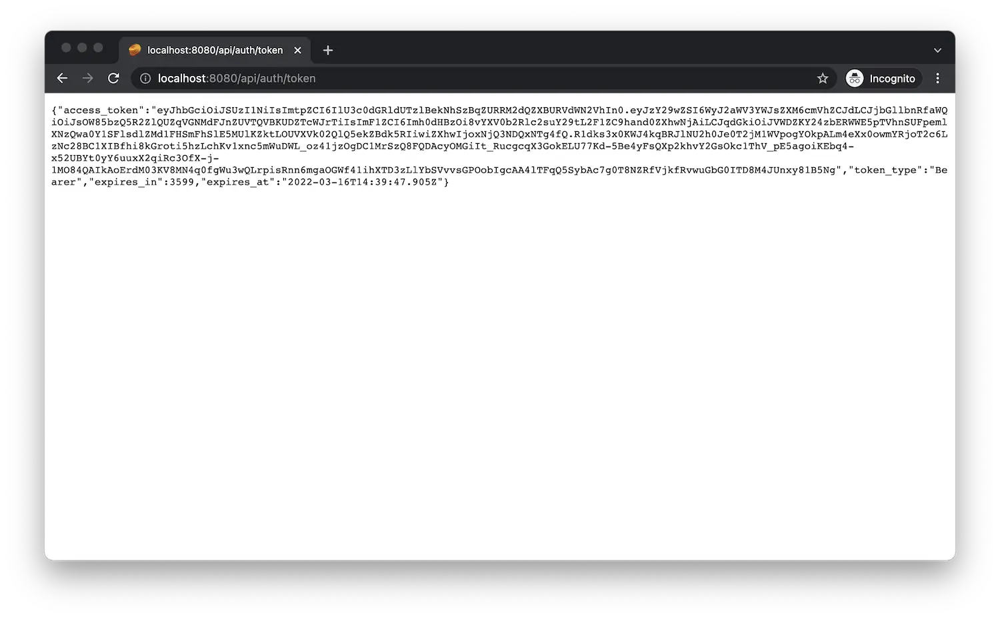

import EnvTabs from '@site/src/components/EnvTabs.js';

import NodeJsVsCodeTokens from './_shared/nodejs-vscode/auth/tokens.mdx';
import NodeJsVsCodeEndpoints from './_shared/nodejs-vscode/auth/endpoints.mdx';
import NodeJsVsCodeTest from './_shared/nodejs-vscode/auth/test.mdx';

import DotNetTokens from './_shared/dotnet/auth/tokens.mdx';
import DotNetEndpoints from './_shared/dotnet/auth/endpoints.mdx';
import DotNetVsCodeTest from './_shared/dotnet-vscode/auth/test.mdx';
import DotNetVs2022Test from './_shared/dotnet-vs2022/auth/test.mdx';

# 인증

이 단계에서는 자체 인증할 수 있도록 서버 구현을 확장합니다
APS 플랫폼에 연결하고 다양한 사용 사례에 대한 액세스 토큰을 생성합니다.

:::tip

더 많은 기능을 가진 "내부" 토큰을 생성하는 것이 좋습니다(예:
데이터 관리 서비스에서 파일을 만들거나 삭제할 수 있음)
서버에 의해, 그리고 안전하게 공유할 수 있는 기능이 더 적은 "공개" 토큰
클라이언트 쪽 논리입니다.

:::

## 액세스 토큰

<EnvTabs NodeJsVsCode={NodeJsVsCodeTokens} DotNetVsCode={DotNetTokens} DotNetVs2022={DotNetTokens} />

## 서버 엔드포인트

이제 서버의 첫 번째 엔드포인트를 통해 이 기능을 노출할 수 있습니다.

<EnvTabs NodeJsVsCode={NodeJsVsCodeEndpoints} DotNetVsCode={DotNetEndpoints} DotNetVs2022={DotNetEndpoints} />

## 사용해 보기

새 서버 엔드포인트가 작동하는지 살펴보겠습니다.

<EnvTabs NodeJsVsCode={NodeJsVsCodeTest} DotNetVsCode={DotNetVsCodeTest} DotNetVs2022={DotNetVs2022Test} />

:::tip

Google Chrome을 사용하는 경우 [JSON 포맷터](https://chrome.google.com/webstore/detail/json-formatter/bcjindcccaagfpapjjmafapmmgkkhgoa?hl=en)를 설치하는 것이 좋습니다.
또는 JSON 응답의 형식을 자동으로 지정하는 유사한 확장입니다.

:::

