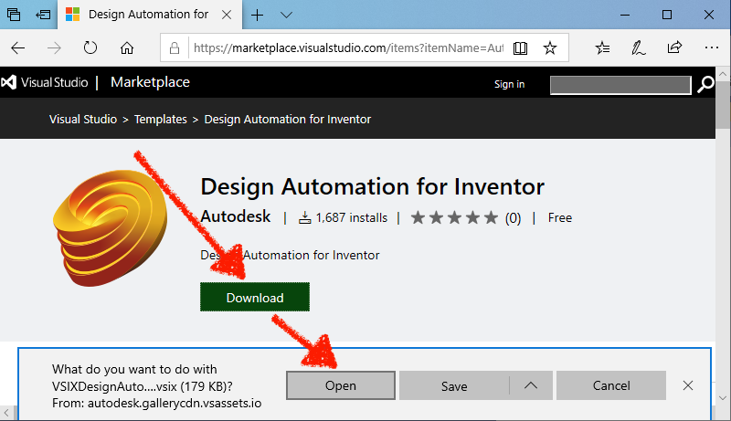
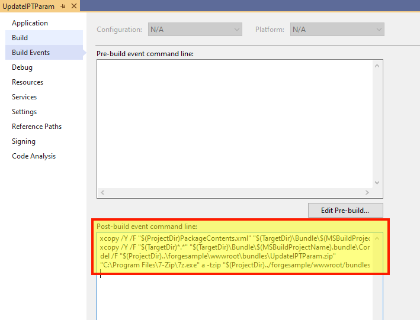

이 단계는 기본 Inventor 플러그인을 작성하는 데 도움이 됩니다. 자세한 내용은 [My First Inventor 플러그인](https://knowledge.autodesk.com/support/inventor-products/learn-explore/caas/simplecontent/content/my-first-inventor-plug-overview.html) 튜토리얼을 참조하십시오.

> 'bundles/'(Node.js) 또는 '/designAutomationSample/wwwroot/bundles'(.NET Core) 폴더에 [번들 ZIP](https://github.com/autodesk-platform-services/aps-design-automation-nodejs/tree/nodejs/bundles/UpdateIPTParam.zip)을 다운로드하고 [**플러그인 번들 업로드** 섹션으로 건너뛰기](#upload-plugin-bundle)할 수 있습니다.

## 전제 조건

- **Design Automation for Inventor** 템플릿: Visual Studio 마켓플레이스로 이동하여 [이 링크](https://marketplace.visualstudio.com/items?itemName=Autodesk.DesignAutomation)에서 다운로드하여 연 다음 단계에 따라 설치합니다.



## 새 프로젝트 만들기

솔루션 **추가** >> **새 프로젝트**를 마우스 오른쪽 단추로 클릭합니다. **Inventor** 템플릿을 검색한 다음 **플러그인 프로젝트**를 검색하고 마지막으로 이름을 'UpdateIPTParam'으로 지정합니다. 프로젝트를 마우스 오른쪽 단추로 클릭하고, **NuGet 패키지 관리...**로 이동하고, **찾아보기**에서 'Newtonsoft.Json'을 선택하고 업데이트할 수 있습니다(이 패키지는 이미 솔루션에 있습니다. 그렇지 않은 경우 설치).

> .NET Framework 4.7을 선택하십시오. 목록에 없으면 [개발자 팩을 설치하세요](https://dotnet.microsoft.com/download/dotnet-framework/net47).


## SampleAutomation.cs

'SampleAutomation.cs' 파일을 열고 다음 내용을 복사합니다. 여기에서 매개 변수가 'Run' 메서드로 업데이트됩니다.

```dotnet title=SampleAutomation.cs
using Inventor;
using Newtonsoft.Json;
using System;
using System.Collections.Generic;
using System.Diagnostics;
using System.Runtime.InteropServices;
using System.Threading;
namespace UpdateIPTParam
{
    [ComVisible(true)]
    public class SampleAutomation
    {
        private InventorServer m_server;
        public SampleAutomation(InventorServer app) { m_server = app; }
        public void Run(Document doc)
        {
            try
            {
                // update parameters in the doc
                ChangeParameters(doc);
                // generate outputs
                var docDir = System.IO.Path.GetDirectoryName(doc.FullFileName);
                // save output file
                var documentType = doc.DocumentType;
                if (documentType == DocumentTypeEnum.kPartDocumentObject)
                {
                    // the name must be in sync with OutputIpt localName in Activity
                    var fileName = System.IO.Path.Combine(docDir, "outputFile.ipt");
                    // save file
                    doc.SaveAs(fileName, false);
                }
            }
            catch (Exception e) { LogTrace("Processing failed: {0}", e.ToString()); }
        }
        /// <summary>
        /// Change parameters in Inventor document.
        /// </summary>
        /// <param name="doc">The Inventor document.</param>
        /// <param name="json">JSON with changed parameters.</param>
        public void ChangeParameters(Document doc)
        {
            var theParams = GetParameters(doc);
            Dictionary<string, string> parameters = JsonConvert.DeserializeObject<Dictionary<string, string>>(System.IO.File.ReadAllText("params.json"));
            foreach (KeyValuePair<string, string> entry in parameters)
            {
                try
                {
                    Parameter param = theParams[entry.Key.ToLower()];
                    param.Expression = entry.Value;
                }
                catch (Exception e) { LogTrace("Cannot update {0}: {1}", entry.Key, e.Message); }
            }
            doc.Update();
        }
        /// <summary>
        /// Get parameters for the document.
        /// </summary>
        /// <returns>Parameters. Throws exception if parameters are not found.</returns>
        private static Parameters GetParameters(Document doc)
        {
            var docType = doc.DocumentType;
            switch (docType)
            {
                case DocumentTypeEnum.kAssemblyDocumentObject:
                    var asm = doc as AssemblyDocument;
                    return asm.ComponentDefinition.Parameters;
                case DocumentTypeEnum.kPartDocumentObject:
                    var ipt = doc as PartDocument;
                    return ipt.ComponentDefinition.Parameters;
                default:
                    throw new ApplicationException(string.Format("Unexpected document type ({0})", docType));
            }
        }
        /// <summary>
        /// This will appear on the Design Automation output
        /// </summary>
        private static void LogTrace(string format, params object[] args) { Trace.TraceInformation(format, args); }
    }
}
```

## 빌드 후 이벤트

> Node.js 경우 AppBundle ZIP 출력 폴더를 조정해야 합니다.

이제 '.bundle' 폴더를 압축해야 합니다. 프로젝트를 마우스 오른쪽 단추로 클릭하고, **속성**을 선택한 다음, **빌드 이벤트**를 열고, 아래 이미지와 같이 **빌드 후 이벤트 명령줄** 필드에 다음을 복사합니다.

```
xcopy /Y /F "$(ProjectDir)PackageContents.xml" "$(TargetDir)\Bundle\$(MSBuildProjectName).bundle\"
xcopy /Y /F "$(TargetDir)*.*" "$(TargetDir)\Bundle\$(MSBuildProjectName).bundle\Contents\"
del /F "$(ProjectDir)..\designAutomationSample\wwwroot\bundles\UpdateIPTParam.zip"
"C:\Program Files\7-Zip\7z.exe" a -tzip "$(ProjectDir)../designAutomationSample/wwwroot/bundles/UpdateIPTParam.zip" "$(TargetDir)\bundle\$(MSBuildProjectName).bundle\" -xr0!*.pdb
```

그러면 DLL이 '/bin/debug/'에서 '.bundle/Contents' 폴더로 복사된 다음 [7zip](https://www.7-zip.org/)을 사용하여 zip을 만든 다음 마지막으로 ZIP을 웹앱의 '/bundles' 폴더에 복사합니다.



이제 'UpdateIPTParam' 프로젝트를 빌드하면 **출력** 창에 다음과 같은 내용이 표시됩니다. 압축된 2개의 폴더와 여러 파일을 확인합니다. zip 파일은 '/wwwroot/bundles' 폴더에 직접 생성됩니다. 이것은 당신이 잘하고 있다는 것을 의미합니다!


