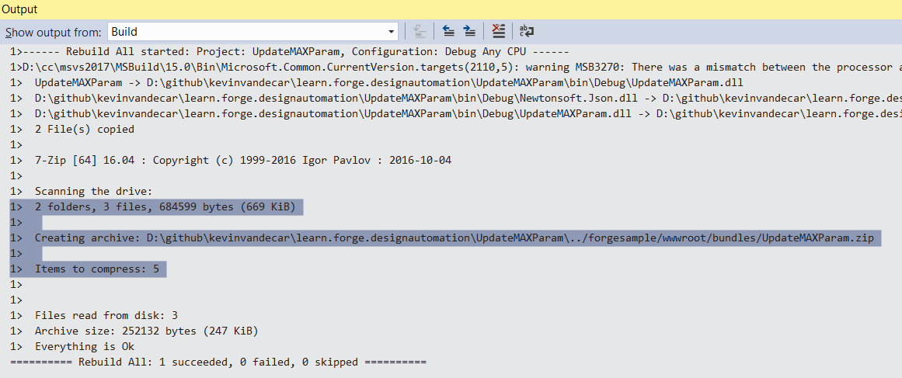

이 단계는 디자인 자동화를 위한 기본 3ds Max 플러그인을 만드는 데 도움이 됩니다. 전체 자습서에서는 3ds Max용 플러그인을 포함하여 Microsoft .NET 프레임워크를 사용합니다. 3ds Max는 MAXScript, Python, NET API 및 C++로 자동화할 수 있습니다. 3ds Max .NET API는 플러그인에 가장 많이 사용되지 않지만 다른 Design Automatiuon 제품의 경우 일반적인 API입니다. .NET API에 대한 3ds Max 리소스는 여기에서 찾을 수 있습니다(2019 링크이지만 .NET API는 사용 가능한 모든 버전의 3ds Max Design Automation 엔진에서 지원됨).

- [3ds Max .NET 플러그인 작성](http://help.autodesk.com/view/3DSMAX/2019/ENU/?guid=__developer_3ds_max_sdk___the_learning_path_lesson_7_writing__net_plug_ins_html)
- [3ds Max .NET SDK](http://help.autodesk.com/view/3DSMAX/2019/ENU/?guid=__developer_3ds_max__net_sdk_html)
- [GetCOREInface Blog .NET 샘플](https://getcoreinterface.typepad.com/blog/2017/10/updated-net-api-samples-for-3ds-max-2018.html)

Design Automation의 경우 자동화할 수 없는 UI나 프롬프트가 없어야 합니다. 3ds Max DA 엔진을 자동화하려면 일부 MAXScript를 제공해야 합니다. 대부분의 사용자화가 MAXScript에 빠르게 노출될 수 있으므로 일반적으로 매우 쉽습니다([C++용 함수 게시](http://help.autodesk.com/view/3DSMAX/2019/ENU/?guid=__developer_3ds_max_sdk_features_function_publishing_html) 및 [MAXScript .NET 처리](http://help.autodesk.com/view/3DSMAX/2019/ENU/?guid=GUID-779FD7AC-953D-4567-B2A8-60B1D8695B95) 참조)

> 'bundles/'(Node.js) 또는 '/designAutomationSample/wwwroot/bundles'(.NET 6) 폴더에 [번들 ZIP](https://github.com/autodesk-platform-services/aps-design-automation-nodejs/tree/nodejs/bundles/UpdateMAXParam.zip)을 다운로드하고 [**플러그인 번들 업로드** 섹션으로 건너뛰기](#upload-plugin-bundle)를 실행할 수 있습니다.

### 새 .NET 프로젝트 만들기

솔루션 **추가** >> **새 프로젝트**를 마우스 오른쪽 단추로 클릭합니다. **Windows 바탕 화면**을 선택한 다음 **클래스 라이브러리**를 선택하고 마지막으로 이름을 'UpdateMAXParam'으로 지정합니다. 그런 다음 'Autodesk.Max.Dll' 관리되는 어셈블리(3ds Max .NET API 코어 모듈)를 참조해야 합니다. 이 모듈은 '3dsmax.exe' 폴더에 있으며 참조할 때 "로컬 복사" 플래그를 꺼야 합니다. .NET API 지원에 사용되는 몇 가지 다른 모듈이 있지만([3ds Max .NET SDK](http://help.autodesk.com/view/3DSMAX/2019/ENU/?guid=__developer_3ds_max__net_sdk_html) 참조) 이 자습서에서는 Autodesk.Max.dll만 사용합니다. 그런 다음, 'Newtonsoft.Json'(JSON 형식의 입력 데이터를 구문 분석하는 데 사용됨)을 검색하여 설치합니다.

> .NET Framework 4.8을 선택하십시오. 목록에 없으면 [개발 팩을 설치하세요](https://dotnet.microsoft.com/download/dotnet-framework/net48).


따라서 **package.config**는 Newtonsoft.Json 모듈에 대해 다음과 같이 표시됩니다.

```xml title=package.config
<?xml version="1.0" encoding="utf-8"?>
<packages>
    <package id="Newtonsoft.Json" version="12.0.1" targetFramework="net47" />
</packages>
```

이것은 3ds Max와 함께 실행되는 기본 코드입니다. 다음 내용을 'Command.cs'에 복사합니다. 설계 자동화 처리를 처리하는 세 가지 클래스가 있습니다. 첫 번째는 JSON 입력 데이터와 인터페이스하는 데 사용되는 'InputParams'입니다. 다음은 씬을 반복하고 모든 여닫이 창을 찾는 데 사용되는 'ParameterChanger' 클래스입니다(그러나 클래스 ID로 식별되는 모든 오브젝트 유형이 될 수 있음). 마지막으로 'RuntimeExecute'를 사용하여 입력을 받아 자동화를 구동합니다. 또한 Design Automation 콘솔에 정보를 출력하는 특수 로깅이 있습니다. LogTrace 함수를 참조하십시오. 이를 위해 'ILogSys' 3ds Max 관리 클래스가 사용되며, 표시된 'LogEntry' API와 함께 사용되는 플래그는 Design Automation 콘솔에 출력을 표시하는 데 필요합니다.

```cs title=Commands.cs
using System;
using System.Collections.Generic;
using System.Linq;
using System.IO;
using Newtonsoft.Json;
using Autodesk.Max;
namespace Autodesk.Forge.Sample.DesignAutomation.Max
{
    /// <summary>
    /// Used to hold the parameters to change
    /// </summary>
    public class InputParams
    {
        public float Width { get; set; }
        public float Height { get; set; }
    }
    /// <summary>
    /// Changes parameters in automated way.
    /// Iterate entire scene to get all nodes
    /// In this example we specifically find Casement Windows by object class ID
    /// Then modify the width and height based on inputs.
    ///
    /// Could be expanded to find other window types, other objects, etc.
    /// </summary>
    static public class ParameterChanger
    {
        static List<IINode> m_sceneNodes = new List<IINode> { };
        /// <summary>
        /// Recursively go through the scene and get all nodes
        /// Use the Autodesk.Max APIs to get the children nodes
        /// </summary>
        static private void GetSceneNodes(IINode node)
        {
            m_sceneNodes.Add(node);
            for (int i = 0; i < node.NumberOfChildren; i++)
                GetSceneNodes(node.GetChildNode(i));
        }
        /// <summary>
        /// Function to specifically update Case Windows with input wedth and height parameters
        /// </summary>
        /// <param name="width">The new Width to set the Window</param>
        /// <param name="height">The new Height to set the Window</param>
        /// <returns>window count</returns>
        static public int UpdateWindowNodes(float width, float height)
        {
            IGlobal globalInterface = Autodesk.Max.GlobalInterface.Instance;
            IInterface14 coreInterface = globalInterface.COREInterface14;
            IINode nodeRoot = coreInterface.RootNode;
            m_sceneNodes.Clear();
            GetSceneNodes(nodeRoot);
            // 3ds Max uses a class ID for all object types. This is easiest way to find specific type.
            // ClassID (1902665597L, 1593788199L) == 0x71685F7D, 0x5EFF4727 for casement window
            IClass_ID cidCasementWindow = globalInterface.Class_ID.Create(0x71685F7D, 0x5EFF4727);
            // Use LINQ to filter for windows only - in case scene has more than one,
            // but this should still give us at least one for single window scene!
            var sceneWindows = from node in m_sceneNodes
                               where ((node.ObjectRef != null) && // In some cases the ObjectRef can be null for certain node types.
                                      (node.ObjectRef.ClassID.PartA == cidCasementWindow.PartA) &&
                                      (node.ObjectRef.ClassID.PartB == cidCasementWindow.PartB))
                               select node;
            // Iterate the casement windws and update the hight and width parameters.
            foreach (IINode item in sceneWindows)
            {
                // window is using old-style ParamArray rather than newer ParamBlk2
                IIParamArray pb = item.ObjectRef.ParamBlock;
                pb.SetValue(0, coreInterface.Time, height); // window height is at index zero.
                pb.SetValue(1, coreInterface.Time, width); // window width is at index one.
            }
            // If there are windows, save the window updates
            int status;
            if (sceneWindows.Count() > 0)
            {
                // The output file name must match what the Design Automation work item is specifying as output file.
                string full_filename = coreInterface.CurFilePath;
                string filename = coreInterface.CurFileName;
                string new_filename = full_filename.Replace(filename, "outputFile.max");
                status = coreInterface.SaveToFile(new_filename, true, false);
                if (status == 0) //error
                    return -1;
            }
            // return how many windows were modified.
            return sceneWindows.Count();
        }
    }
    /// <summary>
    /// This class is used to execute the automation. Above class could be connected to UI elements, or run by scripts directly.
    /// This class takes the input from JSON input and uses those values. This way it is more cohesive to web development.
    /// </summary>
    static public class RuntimeExecute
    {
        static public int ModifyWindowWidthHeight()
        {
            int count = 0;
            // Run entire code block with try/catch to help determine errors
            try
            {
                // read input parameters from JSON file
                InputParams inputParams = JsonConvert.DeserializeObject<InputParams>(File.ReadAllText("params.json"));
                count = ParameterChanger.UpdateWindowNodes(inputParams.Width, inputParams.Height);
            }
            catch (Exception e)
            {
                LogTrace("Exception Error: " + e.Message);
                return -1; //fail
            }
            LogTrace("Changed {0} Window objects.", count);
            return count; // 0+ means success, and how many objects were changed.
        }
        /// <summary>
        /// Information sent to this LogTrace will appear on the Design Automation output
        /// </summary>
        private static void LogTrace(string format, params object[] args)
        {
            System.Reflection.Assembly a = System.Reflection.Assembly.GetExecutingAssembly();
            string output_msg = string.Format("DLL {0} compiled on {1}; {2}",
                System.IO.Path.GetFileName(a.Location),
                File.GetLastWriteTime(a.Location),
                string.Format(format, args));
            IGlobal globalInterface = Autodesk.Max.GlobalInterface.Instance;
            IInterface14 coreInterface = globalInterface.COREInterface14;
            ILogSys log = coreInterface.Log;
            // Note flags are necessary to produce Design Automation output. This is same as C++:
            // SYSLOG_INFO | SYSLOG_IGNORE_VERBOSITY | SYSLOG_BROADCAST
            log.LogEntry(0x00000004 | 0x00040000 | 0x00010000, false, "", output_msg);
        }
    }
}
```

'UpdateMAXParam.bundle'이라는 폴더를 만들고 이 폴더 안에 'PackageContents.xml'라는 파일을 추가합니다. 아래 XML 섹션에 나열된 내용을 PackageContents.xml 파일에 복사합니다. 자세한 내용은 [PackageContents.xml 형식 참조](https://help.autodesk.com/view/ACD/2023/ENU/?guid=GUID-BC76355D-682B-46ED-B9B7-66C95EEF2BD0)를 참조하세요. 3ds Max 플러그인 패키징에 대한 3ds Max 관련 정보는 여기 [플러그인 패키징](http://help.autodesk.com/view/3DSMAX/2019/ENU/?guid=__developer_writing_plug_ins_packaging_plugins_html)을 참조하십시오.

이 파일은 3ds Max에 로드할 모듈(이 경우 만들고 있는 .NET API 플러그인 어셈블리이지만 MAXScripts, Python 및/또는 C++ 플러그인도 포함할 수 있음)을 알려줍니다. 플러그인은 이 기능을 통해 로드되기 때문에 자동화 작업을 트리거하는 지침만 신경 쓰면 됩니다. 3ds Max에서 코드를 올바르게 로드하려면 ProductCode 및 UpgradeCode 모두에 대한 고유 ID가 필요합니다. 자세한 내용은 위에서 언급한 문서를 참조하십시오.

```xml tilte=PackageContents.xml
<?xml version="1.0" encoding="utf-8"?>
<ApplicationPackage
    SchemaVersion="1.0"
    AutodeskProduct="3ds Max"
    Name="Sample Design Automation Plugin for 3ds Max"
    Description="A sample package to update parameters of a 3ds Max scene file containing a casement window"
    AppVersion="2019.0.0"
    FriendlyVersion="2019.0.0"
    ProductType="Application"
    SupportedLocales="Enu"
    AppNameSpace="apps.autodesk.com"
    Author="Autodesk Forge"
    ProductCode="{6A8D06F4-C3DD-42DD-A69E-9B9617A7ABC0}"
    UpgradeCode="{CE88CEA5-47F6-423E-B9EC-E9FA683B5228}"
    >
    <CompanyDetails Name="Autodesk"
        Phone=" "
        Url="http://forge.autodesk.com"
        Email="noreply@autodesk.com" />
    <RuntimeRequirements OS="Win64" Platform="3ds Max" SeriesMin="2019" SeriesMax="2021" />
    <Components Description="assemblies parts">
        <RuntimeRequirements OS="Win64" Platform="3ds Max" SeriesMin="2019" SeriesMax="2021" />
        <ComponentEntry AppName="UpdateMAXParam" Version="2019.0.0" ModuleName="./Contents/UpdateMAXParam.dll" AppDescription="The Sample Design Automation Plugin managed assembly module" />
    </Components>
</ApplicationPackage>
```

Finally, create a subfolder named `Contents` and leave it empty. At this point, the project should look like.


## 빌드 후 이벤트

> Node.js 경우 AppBundle ZIP 출력 폴더를 조정해야 합니다.

이제 '.bundle' 폴더를 압축해야 합니다. 프로젝트를 마우스 오른쪽 단추로 클릭하고, **속성**을 선택한 다음, **빌드 이벤트**를 열고, 아래 이미지와 같이 **빌드 후 이벤트 명령줄** 필드에 다음을 복사합니다.

```
xcopy /Y /F "$(TargetDir)*.dll" "$(ProjectDir)UpdateMAXParam.bundle\Contents\"
del /F "$(ProjectDir)..\designAutomationSample\wwwroot\bundles\UpdateMAXParam.zip"
"C:\Program Files\7-Zip\7z.exe" a -tzip "$(ProjectDir)../designAutomationSample/wwwroot/bundles/UpdateMAXParam.zip" "$(ProjectDir)UpdateMAXParam.bundle\" -xr0!*.pdb
```

이렇게하면 DLL이 '/ bin / debug /'에서 '.bundle / Contents'폴더로 복사 된 다음 [7zip](https://www.7-zip.org/)을 사용하여 zip을 만든 다음 마지막으로 ZIP을 웹 앱의 / bundles 폴더에 복사합니다.


> **빌드 후 이벤트**에서 프로젝트 및 폴더 이름을 사용하는 방법을 확인하므로 이러한 이름을 사용하고 있는지 확인합니다.

이제 'UpdateMAXParam' 프로젝트를 빌드하면 **출력** 창에 아래와 같은 내용이 보일 것입니다. 2개의 폴더와 3개의 파일이 압축되었습니다. zip 파일은 /wwwroot/bundles 폴더에 직접 생성됩니다. 이것은 당신이 잘하고 있다는 것을 의미합니다!



이 시점에서 3ds Max 배치 도구를 사용하여 기능을 테스트할 수 있습니다. 이 엔진은 3ds Max Design Automation 엔진과 유사하게 작동하며, 작업을 Forge DA 클라우드 서비스로 보내기 전에 모든 자동화를 로컬에서 테스트할 수 있는 좋은 방법입니다. .NET 클래스를 MAXScript 환경에서 인스턴스화하려면 'dotNetClass' MAXScript 함수를 사용할 수 있습니다. 이 샘플 프로젝트의 경우 MAXScript 코드는 다음과 같습니다.

```ms title=MAXScript
fn UpdateParam =
(
	da = dotNetClass("Autodesk.Forge.Sample.DesignAutomation.Max.RuntimeExecute")
	da.ModifyWindowWidthHeight()
)
UpdateParam()
```

이것을 로컬에서 실행하려면 다음과 같이 명령줄 프롬프트를 테스트할 수 있습니다.

```CommandLine
"%ADSK_3DSMAX_x64_2019%\3dsmaxbatch.exe" -sceneFile <myTestScene>.max da_script.ms
```

이 자습서의 뒷부분에서는 동일한 지침이 3ds Max Design 자동화 엔진으로 전송되는 것을 볼 수 있습니다.