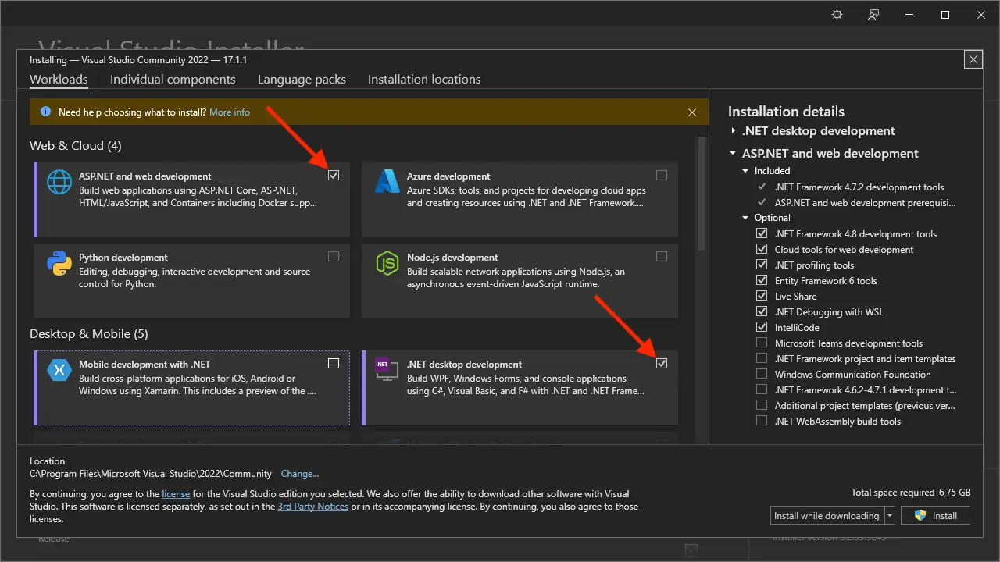

Em nossos tutoriais, usaremos o Visual Studio Community 2022. Você pode baixar _Visual Studio Installer_
de [aqui](https://visualstudio.microsoft.com/vs/community/) e, em seguida, instale a versão e edição desejadas
do Visual Studio do aplicativo instalador:

Certifique-se de incluir o componente _ASP.NET e development_ da Web e considere incluir
o componente de development_ da área de trabalho _.NET também se você planeja desenvolver plug-ins para aplicativos de área de trabalho
como Revit ou Inventor.

