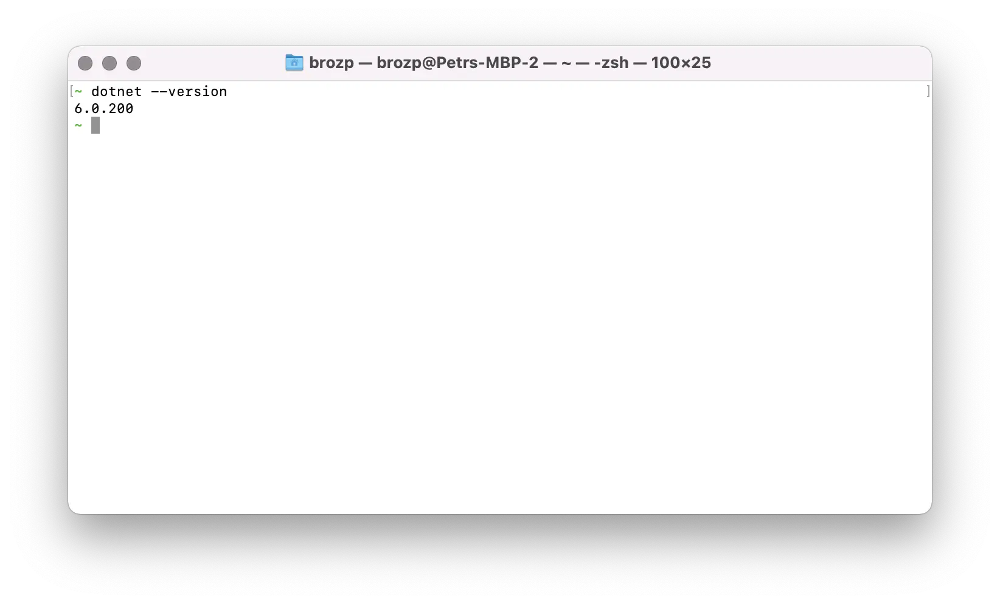

import CliSetup from '../cli.mdx';
import GitSetup from '../git.mdx';
import VSCodeSetup from '../vscode.mdx';

## Interface de linha de comando

<CliSetup />

## Gerenciamento de código-fonte

<GitSetup />

## Tempo de execução

Também precisaremos do .NET 6 _runtime_ para executar nosso código e gerenciar dependências de terceiros 3rd.
Você pode obter um instalador para sua plataforma em https://dotnet.microsoft.com/download/dotnet/6.0.


:::info

Nossos aplicativos de exemplo foram desenvolvidos e testados com o .NET 6.0.


:::


Para se certificar de que a ferramenta está disponível, tente executar o seguinte comando em 'bash':

```bash
dotnet --version
```

Você deve ver algo assim:



## Editora

<VSCodeSetup />
