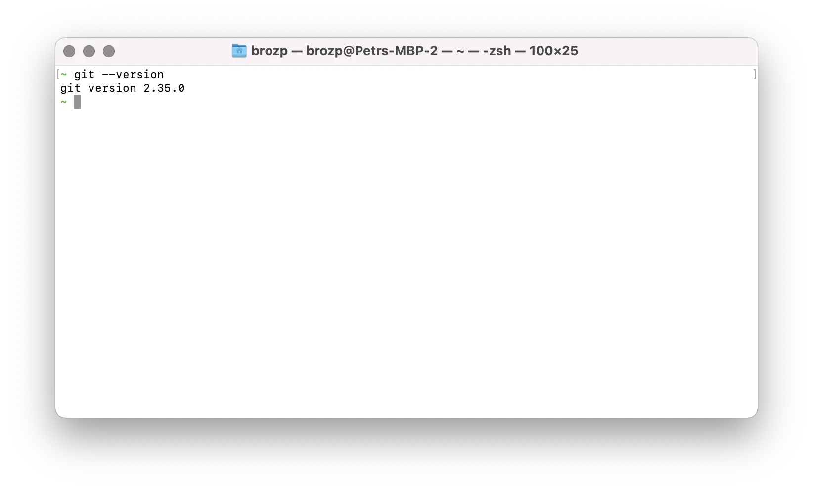

Outra parte essencial do desenvolvimento de software moderno, especialmente para web, é o código fonte
Ferramenta de Gestão [Git](https://git-scm.com). Vá para o [Downloads](https://git-scm.com/downloads)
e instale a versão mais recente para sua plataforma. Como mencionado na seção anterior,
o instalador do Windows também vem com a CLI 'bash'.

Para verificar se o 'git' está instalado e disponível, tente executar o seguinte comando em 'bash':

```bash
git --version
```

Você deve ver algo assim:


