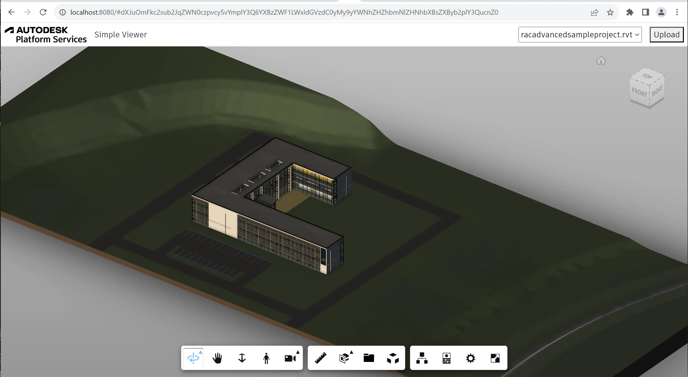

import EnvTabs from '@site/src/components/EnvTabs.js';

import NodeJsVsCodeStructure from './_shared/nodejs-vscode/final-folder-structure.mdx';
import DotNetVsCodeStructure from './_shared/dotnet-vscode/final-folder-structure.mdx';
import DotNetVs2022Structure from './_shared/dotnet-vs2022/final-folder-structure.mdx';

# Visualizador & UI

Finalmente, estamos prontos para construir a parte do lado do cliente do nosso aplicativo.


:::tip

 
If you're developing with Node.js, you can use TypeScript definitions for the Viewer API.
Run
```bash
npm install --dev @types/forge-viewer
``` 
in your terminal to add the TypeScript definition file to your project.


:::


## Lógica do visualizador

Vamos começar implementando a funcionalidade Viewer para o nosso aplicativo.
Crie um arquivo 'viewer.js' na subpasta 'wwwroot' com o seguinte código:

```js title="wwwroot/viewer.js"
/// import * as Autodesk from "@types/forge-viewer";
async function getAccessToken(callback) {
    try {
        const resp = await fetch('/api/auth/token');
        if (!resp.ok) {
            throw new Error(await resp.text());
        }
        const { access_token, expires_in } = await resp.json();
        callback(access_token, expires_in);
    } catch (err) {
        alert('Could not obtain access token. See the console for more details.');
        console.error(err);
    }
}
export function initViewer(container) {
    return new Promise(function (resolve, reject) {
        Autodesk.Viewing.Initializer({ env: 'AutodeskProduction', getAccessToken }, function () {
            const config = {
                extensions: ['Autodesk.DocumentBrowser']
            };
            const viewer = new Autodesk.Viewing.GuiViewer3D(container, config);
            viewer.start();
            viewer.setTheme('light-theme');
            resolve(viewer);
        });
    });
}
export function loadModel(viewer, urn) {
    return new Promise(function (resolve, reject) {
        function onDocumentLoadSuccess(doc) {
            resolve(viewer.loadDocumentNode(doc, doc.getRoot().getDefaultGeometry()));
        }
        function onDocumentLoadFailure(code, message, errors) {
            reject({ code, message, errors });
        }
        viewer.setLightPreset(0);
        Autodesk.Viewing.Document.load('urn:' + urn, onDocumentLoadSuccess, onDocumentLoadFailure);
    });
}
```

O script é um [módulo ES6](https://developer.mozilla.org/en-US/docs/Web/JavaScript/Guide/Modules)
que exporta duas funções, 'initViewer' que criará uma nova instância do Viewer
no contêiner DOM especificado e 'loadModel' que carregará um modelo específico para o visualizador.
Ao inicializar o visualizador, incluímos uma pequena função auxiliar ('getAccessToken') que
recupera um token público de nosso aplicativo de servidor. O visualizador pode então usar esse token
para começar a carregar ativos do serviço Derivativo de Modelo.

## Lógica de aplicação

Em seguida, vamos definir a lógica da própria aplicação Web. Vamos precisar povoar
a interface do usuário com todos os modelos disponíveis para visualização, bem como adicionar a interface do usuário para upload e
traduzindo novos modelos. Crie um arquivo 'main.js' na subpasta 'wwwroot' com o seguinte código:

```js title="wwwroot/main.js"
import { initViewer, loadModel } from './viewer.js';
initViewer(document.getElementById('preview')).then(viewer => {
    const urn = window.location.hash?.substring(1);
    setupModelSelection(viewer, urn);
    setupModelUpload(viewer);
});
async function setupModelSelection(viewer, selectedUrn) {
    const dropdown = document.getElementById('models');
    dropdown.innerHTML = '';
    try {
        const resp = await fetch('/api/models');
        if (!resp.ok) {
            throw new Error(await resp.text());
        }
        const models = await resp.json();
        dropdown.innerHTML = models.map(model => `<option value=${model.urn} ${model.urn === selectedUrn ? 'selected' : ''}>${model.name}</option>`).join('\n');
        dropdown.onchange = () => onModelSelected(viewer, dropdown.value);
        if (dropdown.value) {
            onModelSelected(viewer, dropdown.value);
        }
    } catch (err) {
        alert('Could not list models. See the console for more details.');
        console.error(err);
    }
}
async function setupModelUpload(viewer) {
    const upload = document.getElementById('upload');
    const input = document.getElementById('input');
    const models = document.getElementById('models');
    upload.onclick = () => input.click();
    input.onchange = async () => {
        const file = input.files[0];
        let data = new FormData();
        data.append('model-file', file);
        if (file.name.endsWith('.zip')) { // When uploading a zip file, ask for the main design file in the archive
            const entrypoint = window.prompt('Please enter the filename of the main design inside the archive.');
            data.append('model-zip-entrypoint', entrypoint);
        }
        upload.setAttribute('disabled', 'true');
        models.setAttribute('disabled', 'true');
        showNotification(`Uploading model <em>${file.name}</em>. Do not reload the page.`);
        try {
            const resp = await fetch('/api/models', { method: 'POST', body: data });
            if (!resp.ok) {
                throw new Error(await resp.text());
            }
            const model = await resp.json();
            setupModelSelection(viewer, model.urn);
        } catch (err) {
            alert(`Could not upload model ${file.name}. See the console for more details.`);
            console.error(err);
        } finally {
            clearNotification();
            upload.removeAttribute('disabled');
            models.removeAttribute('disabled');
            input.value = '';
        }
    };
}
async function onModelSelected(viewer, urn) {
    if (window.onModelSelectedTimeout) {
        clearTimeout(window.onModelSelectedTimeout);
        delete window.onModelSelectedTimeout;
    }
    window.location.hash = urn;
    try {
        const resp = await fetch(`/api/models/${urn}/status`);
        if (!resp.ok) {
            throw new Error(await resp.text());
        }
        const status = await resp.json();
        switch (status.status) {
            case 'n/a':
                showNotification(`Model has not been translated.`);
                break;
            case 'inprogress':
                showNotification(`Model is being translated (${status.progress})...`);
                window.onModelSelectedTimeout = setTimeout(onModelSelected, 5000, viewer, urn);
                break;
            case 'failed':
                showNotification(`Translation failed. <ul>${status.messages.map(msg => `<li>${JSON.stringify(msg)}</li>`).join('')}</ul>`);
                break;
            default:
                clearNotification();
                loadModel(viewer, urn);
                break; 
        }
    } catch (err) {
        alert('Could not load model. See the console for more details.');
        console.error(err);
    }
}
function showNotification(message) {
    const overlay = document.getElementById('overlay');
    overlay.innerHTML = `<div class="notification">${message}</div>`;
    overlay.style.display = 'flex';
}
function clearNotification() {
    const overlay = document.getElementById('overlay');
    overlay.innerHTML = '';
    overlay.style.display = 'none';
}
```

Os scripts inicializarão o visualizador, preencherão um elemento suspenso na interface do usuário com modelos
recuperado do ponto de extremidade '/api/models' e configure o upload do arquivo. E quando um dos modelos
na lista suspensa está selecionada, a lógica do aplicativo verificará o status do modelo no APS (por exemplo,
se ainda está sendo traduzido ou se a tradução falhou) e carregue o modelo quando
está disponível.

## Interface do usuário

Finalmente, vamos definir a interface do usuário do nosso aplicativo com uma marcação HTML simples e CSS.

Crie um arquivo 'index.html' na subpasta 'wwwroot' com o seguinte conteúdo:

```html title="wwwroot/index.html"
<!DOCTYPE html>
<html lang="en">
<head>
    <meta charset="UTF-8">
    <meta name="viewport" content="width=device-width, initial-scale=1.0">
    <meta http-equiv="X-UA-Compatible" content="ie=edge">
    <link rel="icon" type="image/x-icon" href="https://cdn.autodesk.io/favicon.ico">
    <link rel="stylesheet" href="https://developer.api.autodesk.com/modelderivative/v2/viewers/7.*/style.css">
    <link rel="stylesheet" href="/main.css">
    <title>Autodesk Platform Services: Simple Viewer</title>
</head>
<body>
    <div id="header">
        
        <span class="title">Simple Viewer</span>
        <select name="models" id="models"></select>
        <button id="upload" title="Upload New Model">Upload</button>
        <input style="display: none" type="file" id="input">
    </div>
    <div id="preview"></div>
    <div id="overlay"></div>
    <script src="https://developer.api.autodesk.com/modelderivative/v2/viewers/7.*/viewer3D.js"></script>
    <script src="/main.js" type="module"></script>
</body>
</html>
```

The HTML markup simply uses a `<select>` element as the dropdown for listing the viewable models,
and an `<input type="file">` element with a `<button>` to handle the uploading of a new model.

Crie um arquivo 'main.css', também na subpasta 'wwwroot', e preencha-o com estas regras CSS:

```css title="wwwroot/main.css"
body, html {
    margin: 0;
    padding: 0;
    height: 100vh;
    font-family: ArtifaktElement;
}
#header, #preview, #overlay {
    position: absolute;
    width: 100%;
}
#header {
    height: 3em;
    display: flex;
    flex-flow: row nowrap;
    justify-content: space-between;
    align-items: center;
}
#preview, #overlay {
    top: 3em;
    bottom: 0;
}
#overlay {
    z-index: 1;
    background-color: rgba(0, 0, 0, 0.5);
    padding: 1em;
    display: none;
}
#overlay > .notification {
    margin: auto;
    padding: 1em;
    max-width: 50%;
    background: white;
}
#header > * {
    height: 2em;
    margin: 0 0.5em;
    font-size: 1em;
    font-family: ArtifaktElement;
}
#header .title {
    flex: 1 0 auto;
    height: auto;
}
#models {
    flex: 0 1 auto;
    min-width: 2em;
}
```

A estrutura de pastas final do código-fonte do seu aplicativo agora deve ter a seguinte aparência:

<EnvTabs NodeJsVsCode={NodeJsVsCodeStructure} DotNetVsCode={DotNetVsCodeStructure} DotNetVs2022={DotNetVs2022Structure} />

## Experimente

E é isso! Sua inscrição está concluída. Inicie (ou reinicie) o aplicativo como de costume e navegue
para [http://localhost:8080](http://localhost:8080) no seu navegador. Você deve ser apresentado com
uma interface do usuário simples, com uma lista suspensa no canto superior direito que eventualmente será preenchida com todos os modelos
disponível no bucket do seu aplicativo e com um botão para carregar novos modelos. Assim que você
Selecione um dos nomes na lista suspensa, o modelo correspondente será carregado no visualizador ocupando
o resto da página.


:::tip

Se você não tiver nenhum arquivo de design de teste prontamente disponível, você pode tentar alguns deles publicamente
disponíveis:

- [Arquivos de projeto de exemplo do Revit 2022](https://knowledge.autodesk.com/support/revit/getting-started/caas/CloudHelp/cloudhelp/2022/ENU/Revit-GetStarted/files/GUID-61EF2F22-3A1F-4317-B925-1E85F138BE88-htm.html)
- [Arquivos de exemplo do AutoCAD Mechanical 2022](https://knowledge.autodesk.com/support/autocad-mechanical/downloads/caas/downloads/content/autocad-mechanical-2022-sample-files.html)


:::



