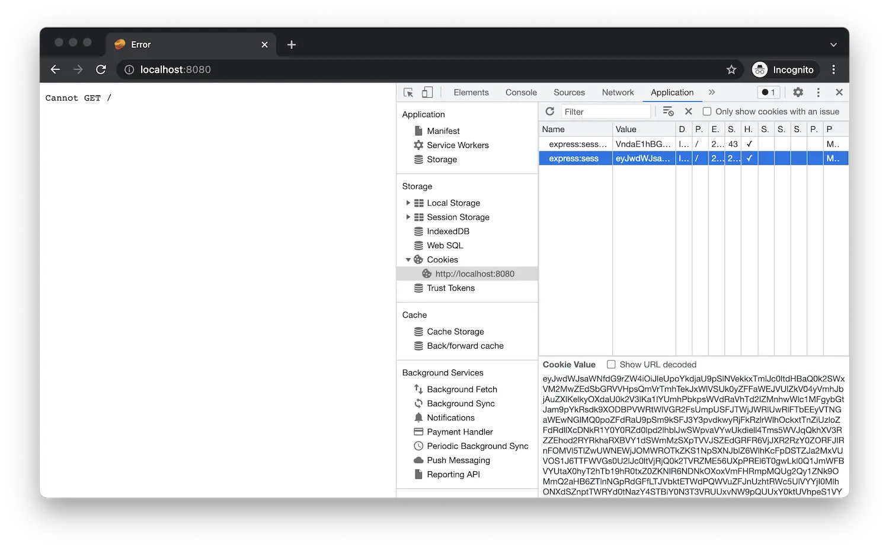

Se o aplicativo ainda estiver em execução, reinicie-o (por exemplo, usando _Run > Debugging_ Restart ,
ou clicando no ícone verde de reinicialização), caso contrário, inicie-o novamente (usando _Run > Debugging_ Iniciar,
ou pressionando 'F5').

Quando você navega até [http://localhost:8080/api/auth/login](http://localhost:8080/api/auth/login)
no navegador, você deve ser redirecionado para a página de login da Autodesk e, depois de fazer login,
você deve ser redirecionado de volta para o seu aplicativo, por enquanto simplesmente mostrando 'Não é possível GET /'.
Isso é esperado, pois ainda não implementamos o endpoint 'GET /'. No entanto, se você usar
ferramentas de desenvolvimento do navegador e explorar os cookies armazenados pelo seu navegador para a origem 'localhost',
Você notará que o aplicativo já está armazenando os dados de autenticação lá.

:::info

Aqui é onde você pode encontrar os cookies do seu site em diferentes navegadores:
- [Chrome](https://developer.chrome.com/docs/devtools/storage/sessionstorage/)
- [Firefox](https://developer.mozilla.org/en-US/docs/Tools/Storage_Inspector/Cookies)
- [Borda](https://docs.microsoft.com/en-us/microsoft-edge/devtools-guide-chromium/storage/cookies)
- [Safari](https://developer.apple.com/safari/tools/)

:::

