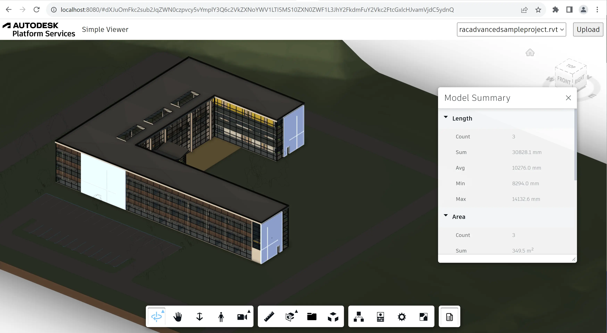

# Resumo do Modelo

Nesta etapa, criaremos outra extensão de visualizador, desta vez introduzindo elementos de interface do usuário personalizados
também. Vamos adicionar um botão personalizado para a barra de ferramentas do visualizador, e quando o botão é clicado,
Exibimos um painel de encaixe com o resumo dos valores de propriedade em diferentes elementos de design.

## Esqueleto de extensão

Assim como com a extensão anterior, crie um novo arquivo na subpasta 'extensions',
chame-o de 'SummaryExtension.js' e preencha-o com o seguinte código:

```js title="wwwroot/extensions/SummaryExtension.js"
import { BaseExtension } from './BaseExtension.js';
class SummaryExtension extends BaseExtension {
    constructor(viewer, options) {
        super(viewer, options);
    }
    load() {
        super.load();
        console.log('SummaryExtension loaded.');
        return true;
    }
    unload() {
        super.unload();
        console.log('SummaryExtension unloaded.');
        return true;
    }
    onModelLoaded(model) {
        super.onModelLoaded(model);
        this.update();
    }
    onSelectionChanged(model, dbids) {
        super.onSelectionChanged(model, dbids);
        this.update();
    }
    onIsolationChanged(model, dbids) {
        super.onIsolationChanged(model, dbids);
        this.update();
    }
    async update() {
        // TODO
    }
}
Autodesk.Viewing.theExtensionManager.registerExtension('SummaryExtension', SummaryExtension);
```

Next, in `wwwroot/viewer.js`, import the extension code to our application, and pass the extension ID
to the viewer constructor:

```js
import './extensions/LoggerExtension.js';
// highlight-start
import './extensions/SummaryExtension.js';
// highlight-end
```

```js
const config = {
    extensions: [
        'LoggerExtension',
        // highlight-start
        'SummaryExtension',
        // highlight-end
    ]
};
const viewer = new Autodesk.Viewing.GuiViewer3D(container, config);
```

## Botão da barra de ferramentas

Agora vamos criar um novo botão na barra de ferramentas do visualizador. Já que outras extensões precisarão
esta funcionalidade também, vamos atualizar nossa classe 'BaseExtension' (no arquivo 'BaseExtension.js')
com os seguintes métodos auxiliares:

```js title="wwwroot/extensions/BaseExtension.js"
export class BaseExtension extends Autodesk.Viewing.Extension {
    constructor(viewer, options) {
        super(viewer, options);
        this._onObjectTreeCreated = (ev) => this.onModelLoaded(ev.model);
        this._onSelectionChanged = (ev) => this.onSelectionChanged(ev.model, ev.dbIdArray);
        this._onIsolationChanged = (ev) => this.onIsolationChanged(ev.model, ev.nodeIdArray);
    }
    load() {
        this.viewer.addEventListener(Autodesk.Viewing.OBJECT_TREE_CREATED_EVENT, this._onObjectTreeCreated);
        this.viewer.addEventListener(Autodesk.Viewing.SELECTION_CHANGED_EVENT, this._onSelectionChanged);
        this.viewer.addEventListener(Autodesk.Viewing.ISOLATE_EVENT, this._onIsolationChanged);
        return true;
    }
    unload() {
        this.viewer.removeEventListener(Autodesk.Viewing.OBJECT_TREE_CREATED_EVENT, this._onObjectTreeCreated);
        this.viewer.removeEventListener(Autodesk.Viewing.SELECTION_CHANGED_EVENT, this._onSelectionChanged);
        this.viewer.removeEventListener(Autodesk.Viewing.ISOLATE_EVENT, this._onIsolationChanged);
        return true;
    }
    onToolbarCreated() {}
    onModelLoaded(model) {}
    onSelectionChanged(model, dbids) {}
    onIsolationChanged(model, dbids) {}
    findLeafNodes(model) {
        return new Promise(function (resolve, reject) {
            model.getObjectTree(function (tree) {
                let leaves = [];
                tree.enumNodeChildren(tree.getRootId(), function (dbid) {
                    if (tree.getChildCount(dbid) === 0) {
                        leaves.push(dbid);
                    }
                }, true);
                resolve(leaves);
            }, reject);
        });
    }
    async findPropertyNames(model) {
        const dbids = await this.findLeafNodes(model);
        return new Promise(function (resolve, reject) {
            model.getBulkProperties(dbids, {}, function (results) {
                let propNames = new Set();
                for (const result of results) {
                    for (const prop of result.properties) {
                        propNames.add(prop.displayName);
                    }
                }
                resolve(Array.from(propNames.values()));
            }, reject);
        });
    }
    // highlight-start
    createToolbarButton(buttonId, buttonIconUrl, buttonTooltip) {
        let group = this.viewer.toolbar.getControl('dashboard-toolbar-group');
        if (!group) {
            group = new Autodesk.Viewing.UI.ControlGroup('dashboard-toolbar-group');
            this.viewer.toolbar.addControl(group);
        }
        const button = new Autodesk.Viewing.UI.Button(buttonId);
        button.setToolTip(buttonTooltip);
        group.addControl(button);
        const icon = button.container.querySelector('.adsk-button-icon');
        if (icon) {
            icon.style.backgroundImage = `url(${buttonIconUrl})`; 
            icon.style.backgroundSize = `24px`; 
            icon.style.backgroundRepeat = `no-repeat`; 
            icon.style.backgroundPosition = `center`; 
        }
        return button;
    }
    // highlight-end
    // highlight-start
    removeToolbarButton(button) {
        const group = this.viewer.toolbar.getControl('dashboard-toolbar-group');
        group.removeControl(button);
    }
    // highlight-end
}
```

O novo código está usando classes do namespace 'Autodesk.Viewing.UI' para criar
um novo grupo de botões da barra de ferramentas e um novo botão da barra de ferramentas com ID específico, URL do ícone,
e mensagem de dica de ferramenta.

Agora vamos usar esses métodos auxiliares na classe 'SummaryExtension':

```js title="wwwroot/extensions/SummaryExtension.js"
import { BaseExtension } from './BaseExtension.js';
class SummaryExtension extends BaseExtension {
    constructor(viewer, options) {
        super(viewer, options);
        // highlight-start
        this._button = null;
        // highlight-end
    }
    load() {
        super.load();
        console.log('SummaryExtension loaded.');
        return true;
    }
    unload() {
        super.unload();
        // highlight-start
        if (this._button) {
            this.removeToolbarButton(this._button);
            this._button = null;
        }
        // highlight-end
        console.log('SummaryExtension unloaded.');
        return true;
    }
    onToolbarCreated() {
        // highlight-start
        this._button = this.createToolbarButton('summary-button', 'https://img.icons8.com/small/32/brief.png', 'Show Model Summary');
        this._button.onClick = () => {
            // TODO
        };
        // highlight-end
    }
    onModelLoaded(model) {
        super.onModelLoaded(model);
        this.update();
    }
    onSelectionChanged(model, dbids) {
        super.onSelectionChanged(model, dbids);
        this.update();
    }
    onIsolationChanged(model, dbids) {
        super.onIsolationChanged(model, dbids);
        this.update();
    }
    async update() {
        // TODO
    }
}
Autodesk.Viewing.theExtensionManager.registerExtension('SummaryExtension', SummaryExtension);
```

O método 'onToolbarCreated' será chamado automaticamente pelo visualizador quando (e se)
A barra de ferramentas está pronta. Observe que o visualizador pode ser ativado em um modo "sem cabeça",
nesse caso, nenhuma interface do usuário será criada e o método 'onToolbarCreated' não será chamado.

## Painel personalizado

E, finalmente, atualizamos a extensão 'SummaryExtension' para que quando o usuário clicar em
o botão da barra de ferramentas, exibimos um painel visualizador personalizado com dados agregados de properites
do projeto atualmente carregado.

Comece criando um arquivo 'SummaryPanel.js' na mesma pasta onde 'SummaryExtension.js'
está localizado e adicione o seguinte código a ele:

```js title="wwwroot/extensions/SummaryPanel.js"
export class SummaryPanel extends Autodesk.Viewing.UI.PropertyPanel {
    constructor(extension, id, title) {
        super(extension.viewer.container, id, title);
        this.extension = extension;
    }
    async update(model, dbids, propNames) {
        this.removeAllProperties();
        for (const propName of propNames) {
            const initialValue = { sum: 0, count: 0, min: Infinity, max: -Infinity };
            const aggregateFunc = (aggregate, value, property) => {
                return {
                    count: aggregate.count + 1,
                    sum: aggregate.sum + value,
                    min: Math.min(aggregate.min, value),
                    max: Math.max(aggregate.max, value),
                    units: property.units,
                    precision: property.precision
                };
            };
            const { sum, count, min, max, units, precision } = await this.aggregatePropertyValues(model, dbids, propName, aggregateFunc, initialValue);
            if (count > 0) {
                const category = propName;
                this.addProperty('Count', count, category);
                this.addProperty('Sum', this.toDisplayUnits(sum, units, precision), category);
                this.addProperty('Avg', this.toDisplayUnits((sum / count), units, precision), category);
                this.addProperty('Min', this.toDisplayUnits(min, units, precision), category);
                this.addProperty('Max', this.toDisplayUnits(max, units, precision), category);
            }
        }
    }
    async aggregatePropertyValues(model, dbids, propertyName, aggregateFunc, initialValue = 0) {
        return new Promise(function (resolve, reject) {
            let aggregatedValue = initialValue;
            model.getBulkProperties(dbids, { propFilter: [propertyName] }, function (results) {
                for (const result of results) {
                    if (result.properties.length > 0) {
                        const prop = result.properties[0];
                        aggregatedValue = aggregateFunc(aggregatedValue, prop.displayValue, prop);
                    }
                }
                resolve(aggregatedValue);
            }, reject);
        });
    }
    toDisplayUnits(value, units, precision) {
        return Autodesk.Viewing.Private.formatValueWithUnits(value, units, 3, precision);
    }
}
```

A nova classe é derivada de [Autodesk.Viewing.UI.PropertyPanel](https://aps.autodesk.com/en/docs/viewer/v7/reference/UI/PropertyPanel/)
que é a interface do usuário do painel padrão usada para exibir propriedades de elementos de design selecionados.
Neste caso, usamos os métodos 'removeAllProperties' e 'addProperty' para exibir diferentes
tipo de dados. Dado um conjunto específico de IDs de objeto e nomes de propriedade, o 'SummaryPanel'
Exibir valores agregados (contagem, soma, média, mínimo e máximo) dessas propriedades
em todos os objetos.

Finalmente, vamos adicionar o painel à nossa extensão:

```js title="wwwroot/extensions/SummaryExtension.js"
import { BaseExtension } from './BaseExtension.js';
// highlight-start
import { SummaryPanel } from './SummaryPanel.js';
// highlight-end
// highlight-start
const SUMMARY_PROPS = ['Length', 'Area', 'Volume', 'Density', 'Mass', 'Price'];
// highlight-end
class SummaryExtension extends BaseExtension {
    constructor(viewer, options) {
        super(viewer, options);
        this._button = null;
        // highlight-start
        this._panel = null;
        // highlight-end
    }
    load() {
        super.load();
        console.log('SummaryExtension loaded.');
        return true;
    }
    unload() {
        super.unload();
        if (this._button) {
            this.removeToolbarButton(this._button);
            this._button = null;
        }
        // highlight-start
        if (this._panel) {
            this._panel.setVisible(false);
            this._panel.uninitialize();
            this._panel = null;
        }
        // highlight-end
        console.log('SummaryExtension unloaded.');
        return true;
    }
    onToolbarCreated() {
        // highlight-start
        this._panel = new SummaryPanel(this, 'model-summary-panel', 'Model Summary');
        // highlight-end
        this._button = this.createToolbarButton('summary-button', 'https://img.icons8.com/small/32/brief.png', 'Show Model Summary');
        this._button.onClick = () => {
            // highlight-start
            this._panel.setVisible(!this._panel.isVisible());
            this._button.setState(this._panel.isVisible() ? Autodesk.Viewing.UI.Button.State.ACTIVE : Autodesk.Viewing.UI.Button.State.INACTIVE);
            if (this._panel.isVisible()) {
                this.update();
            }
            // highlight-end
        };
    }
    onModelLoaded(model) {
        super.onModelLoaded(model);
        this.update();
    }
    onSelectionChanged(model, dbids) {
        super.onSelectionChanged(model, dbids);
        this.update();
    }
    onIsolationChanged(model, dbids) {
        super.onIsolationChanged(model, dbids);
        this.update();
    }
    async update() {
        // highlight-start
        if (this._panel) {
            const selectedIds = this.viewer.getSelection();
            const isolatedIds = this.viewer.getIsolatedNodes();
            if (selectedIds.length > 0) { // If any nodes are selected, compute the aggregates for them
                this._panel.update(this.viewer.model, selectedIds, SUMMARY_PROPS);
            } else if (isolatedIds.length > 0) { // Or, if any nodes are isolated, compute the aggregates for those
                this._panel.update(this.viewer.model, isolatedIds, SUMMARY_PROPS);
            } else { // Otherwise compute the aggregates for all nodes
                const dbids = await this.findLeafNodes(this.viewer.model);
                this._panel.update(this.viewer.model, dbids, SUMMARY_PROPS);
            }
        }
        // highlight-end
    }
}
Autodesk.Viewing.theExtensionManager.registerExtension('SummaryExtension', SummaryExtension);
```

## Experimente

Desta vez, podemos testar nossa nova extensão diretamente no visualizador. Tente clicar na nova barra de ferramentas
para abrir nosso painel de resumo. O painel mostra vários agregados de propriedades
codificamos a constante 'SUMMARY_PROPS' (_Length_, _Area_, _Volume_, _Density_,
_Mass_, e _Price_) para todos os objetos. E quando isolamos ou selecionamos parte do design
elementos à mão, os valores agregados também devem refletir isso.


