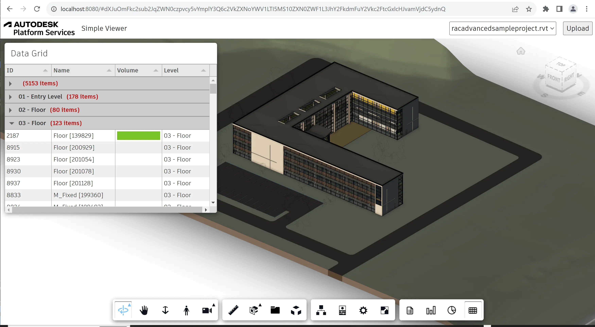

# Grade de Dados

Nesta etapa final, criaremos uma extensão de visualizador que fornecerá uma exibição de grade de dados
de nossas propriedades de elemento de design usando a biblioteca de código aberto [Tabulator](http://tabulator.info).

## Esqueleto de extensão

Como de costume, vamos criar um novo arquivo na subpasta 'extensões', chamá-lo de 'DataGridExtension.js',
e preencha-o com o seguinte código:

```js title="wwwroot/extensions/DataGridExtension.js"
import { BaseExtension } from './BaseExtension.js';
class DataGridExtension extends BaseExtension {
    constructor(viewer, options) {
        super(viewer, options);
    }
    async load() {
        super.load();
        await Promise.all([
            this.loadScript('https://unpkg.com/tabulator-tables@4.9.3/dist/js/tabulator.min.js', 'Tabulator'),
            this.loadStylesheet('https://unpkg.com/tabulator-tables@4.9.3/dist/css/tabulator.min.css')
        ]);
        console.log('DataGridExtension loaded.');
        return true;
    }
    unload() {
        super.unload();
        console.log('DataGridExtension unloaded.');
        return true;
    }
}
Autodesk.Viewing.theExtensionManager.registerExtension('DataGridExtension', DataGridExtension);
```

Desta vez, também estamos carregando várias dependências que são exigidas pela biblioteca do Tabulator.

Now let's import the JavaScript file to our application, and pass the extension ID to the viewer
constructor:

```js
import './extensions/LoggerExtension.js';
import './extensions/SummaryExtension.js';
import './extensions/HistogramExtension.js';
// highlight-start
import './extensions/DataGridExtension.js';
// highlight-end
```

```js
const config = {
    extensions: [
        'LoggerExtension',
        'SummaryExtension',
        'HistogramExtension',
        // highlight-start
        'DataGridExtension',
        // highlight-end
    ]
};
const viewer = new Autodesk.Viewing.GuiViewer3D(container, config);
```

## Barra de ferramentas

Em seguida, vamos atualizar a classe 'DataGridExtension' para que ela adicione um novo botão ao visualizador
barra de ferramentas quando a extensão é carregada:

```js title="wwwroot/extensions/DataGridExtension.js"
import { BaseExtension } from './BaseExtension.js';
class DataGridExtension extends BaseExtension {
    constructor(viewer, options) {
        super(viewer, options);
        // highlight-start
        this._button = null;
        // highlight-end
    }
    async load() {
        super.load();
        await Promise.all([
            this.loadScript('https://unpkg.com/tabulator-tables@4.9.3/dist/js/tabulator.min.js', 'Tabulator'),
            this.loadStylesheet('https://unpkg.com/tabulator-tables@4.9.3/dist/css/tabulator.min.css')
        ]);
        console.log('DataGridExtension loaded.');
        return true;
    }
    unload() {
        super.unload();
        // highlight-start
        if (this._button) {
            this.removeToolbarButton(this._button);
            this._button = null;
        }
        // highlight-end
        console.log('DataGridExtension unloaded.');
        return true;
    }
    // highlight-start
    onToolbarCreated() {
        this._button = this.createToolbarButton('dashboard-datagrid-button', 'https://img.icons8.com/small/32/activity-grid.png', 'Show Data Grid');
        this._button.onClick = () => {
            // TODO
        };
    }
    // highlight-end
}
Autodesk.Viewing.theExtensionManager.registerExtension('DataGridExtension', DataGridExtension);
```

## Grade de dados

Agora vamos criar um painel de encaixe personalizado que hospedará a grade real do Tabulador. Criar
um arquivo 'DataGridPanel.js' na mesma pasta onde 'DataGridExtension.js' está localizado, e
Adicione o seguinte código a ele:

```js title="wwwroot/extensions/DataGridPanel.js"
const DATAGRID_CONFIG = {
    requiredProps: ['name', 'Volume', 'Level'], // Which properties should be requested for each object
    columns: [ // Definition of individual grid columns (see http://tabulator.info for more details)
        { title: 'ID', field: 'dbid' },
        { title: 'Name', field: 'name', width: 150 },
        { title: 'Volume', field: 'volume', hozAlign: 'left', formatter: 'progress' },
        { title: 'Level', field: 'level' }
    ],
    groupBy: 'level', // Optional column to group by
    createRow: (dbid, name, props) => { // Function generating grid rows based on recieved object properties
        const volume = props.find(p => p.displayName === 'Volume')?.displayValue;
        const level = props.find(p => p.displayName === 'Level' && p.displayCategory === 'Constraints')?.displayValue;
        return { dbid, name, volume, level };
    },
    onRowClick: (row, viewer) => {
        viewer.isolate([row.dbid]);
        viewer.fitToView([row.dbid]);
    }
};
export class DataGridPanel extends Autodesk.Viewing.UI.DockingPanel {
    constructor(extension, id, title, options) {
        super(extension.viewer.container, id, title, options);
        this.extension = extension;
        this.container.style.left = (options.x || 0) + 'px';
        this.container.style.top = (options.y || 0) + 'px';
        this.container.style.width = (options.width || 500) + 'px';
        this.container.style.height = (options.height || 400) + 'px';
        this.container.style.resize = 'none';
    }
    initialize() {
        this.title = this.createTitleBar(this.titleLabel || this.container.id);
        this.initializeMoveHandlers(this.title);
        this.container.appendChild(this.title);
        this.content = document.createElement('div');
        this.content.style.height = '350px';
        this.content.style.backgroundColor = 'white';
        this.content.innerHTML = `<div class="datagrid-container" style="position: relative; height: 350px;"></div>`;
        this.container.appendChild(this.content);
        // See http://tabulator.info
        this.table = new Tabulator('.datagrid-container', {
            height: '100%',
            layout: 'fitColumns',
            columns: DATAGRID_CONFIG.columns,
            groupBy: DATAGRID_CONFIG.groupBy,
            rowClick: (e, row) => DATAGRID_CONFIG.onRowClick(row.getData(), this.extension.viewer)
        });
    }
    update(model, dbids) {
        model.getBulkProperties(dbids, { propFilter: DATAGRID_CONFIG.requiredProps }, (results) => {
            this.table.replaceData(results.map((result) => DATAGRID_CONFIG.createRow(result.dbId, result.name, result.properties)));
        }, (err) => {
            console.error(err);
        });
    }
}
```


:::info

Para manter as coisas simples, a classe 'DataGridPanel' está atualmente codificando as colunas de grade
para mostrar apenas algumas propriedades específicas de nossos metadados de design (especificamente o ID do objeto,
nome do objeto e propriedades 'Volume' e 'Level'). Dependendo do tipo de design que você será
carregando em seu aplicativo, você pode querer alterá-los.


:::


Por fim, adicione o novo painel à nossa extensão:

```js title="wwwroot/extensions/DataGridExtension.js"
import { BaseExtension } from './BaseExtension.js';
// highlight-start
import { DataGridPanel } from './DataGridPanel.js';
// highlight-end
class DataGridExtension extends BaseExtension {
    constructor(viewer, options) {
        super(viewer, options);
        this._button = null;
        // highlight-start
        this._panel = null;
        // highlight-end
    }
    async load() {
        super.load();
        await Promise.all([
            this.loadScript('https://unpkg.com/tabulator-tables@4.9.3/dist/js/tabulator.min.js', 'Tabulator'),
            this.loadStylesheet('https://unpkg.com/tabulator-tables@4.9.3/dist/css/tabulator.min.css')
        ]);
        console.log('DataGridExtension loaded.');
        return true;
    }
    unload() {
        super.unload();
        if (this._button) {
            this.removeToolbarButton(this._button);
            this._button = null;
        }
        // highlight-start
        if (this._panel) {
            this._panel.setVisible(false);
            this._panel.uninitialize();
            this._panel = null;
        }
        // highlight-end
        console.log('DataGridExtension unloaded.');
        return true;
    }
    onToolbarCreated() {
        // highlight-start
        this._panel = new DataGridPanel(this, 'dashboard-datagrid-panel', 'Data Grid', { x: 10, y: 10 });
        // highlight-end
        this._button = this.createToolbarButton('dashboard-datagrid-button', 'https://img.icons8.com/small/32/activity-grid.png', 'Show Data Grid');
        this._button.onClick = () => {
            // highlight-start
            this._panel.setVisible(!this._panel.isVisible());
            this._button.setState(this._panel.isVisible() ? Autodesk.Viewing.UI.Button.State.ACTIVE : Autodesk.Viewing.UI.Button.State.INACTIVE);
            if (this._panel.isVisible() && this.viewer.model) {
                this.update();
            }
            // highlight-end
        };
    }
    // highlight-start
    onModelLoaded(model) {
        super.onModelLoaded(model);
        if (this._panel && this._panel.isVisible()) {
            this.update();
        }
    }
    // highlight-end
    // highlight-start
    async update() {
        const dbids = await this.findLeafNodes(this.viewer.model);
        this._panel.update(this.viewer.model, dbids);
    }
    // highlight-end
}
Autodesk.Viewing.theExtensionManager.registerExtension('DataGridExtension', DataGridExtension);
```

## Experimente

Clique no novo botão da barra de ferramentas para abrir o painel datagrid. A grade deve listar selecionados
propriedades de todos os elementos de design e clicar em qualquer linha na grade deve isolar o específico
elemento de design no visualizador.


