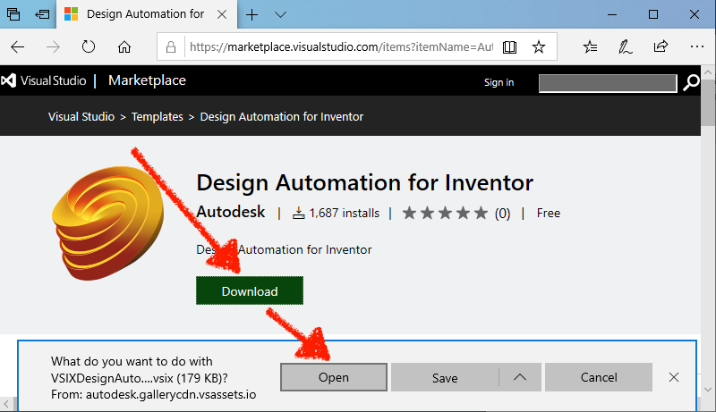

Esta etapa ajudará você a criar um plug-in básico do Inventor. Para obter mais informações, visite o tutorial [My First Inventor Plugin](https://knowledge.autodesk.com/support/inventor-products/learn-explore/caas/simplecontent/content/my-first-inventor-plug-overview.html).

> Você pode [baixar o Bundle ZIP](https://github.com/autodesk-platform-services/aps-design-automation-nodejs/tree/nodejs/bundles/UpdateIPTParam.zip) na pasta 'bundles/' (Node.js) ou '/designAutomationSample/wwwroot/bundles' (.NET Core) e [pular para a seção **Upload Plugin Bundle**](#upload-plugin-bundle).

## Pré-requisitos

- **Design Automation for Inventor** template: vá para o Visual Studio Market Place, baixe e abra-o em [this link](https://marketplace.visualstudio.com/items?itemName=Autodesk.DesignAutomation), em seguida, siga os passos para instalar.



## Criar um novo projeto

Clique com o botão direito do mouse na solução, em **Adicionar** >> em **Novo Projeto**. Procure por modelos **Inventor**, depois **Projeto de plugin** e, finalmente, nomeie-o como 'UpdateIPTParam'. Clique com o botão direito do mouse no projeto, vá para **Gerenciar pacotes NuGet...**, em **Procurar** você pode selecionar 'Newtonsoft.Json' e atualizar (este pacote já está na solução, se não, instalar)

> Selecione .NET Framework 4.7. Se não estiver listado, [instale o Dev Pack](https://dotnet.microsoft.com/download/dotnet-framework/net47).


## SampleAutomation.cs

Abra o arquivo 'SampleAutomation.cs' e copie o seguinte conteúdo para ele. É aqui que os parâmetros são atualizados sob o método 'Run'.

```dotnet title=SampleAutomation.cs
using Inventor;
using Newtonsoft.Json;
using System;
using System.Collections.Generic;
using System.Diagnostics;
using System.Runtime.InteropServices;
using System.Threading;
namespace UpdateIPTParam
{
    [ComVisible(true)]
    public class SampleAutomation
    {
        private InventorServer m_server;
        public SampleAutomation(InventorServer app) { m_server = app; }
        public void Run(Document doc)
        {
            try
            {
                // update parameters in the doc
                ChangeParameters(doc);
                // generate outputs
                var docDir = System.IO.Path.GetDirectoryName(doc.FullFileName);
                // save output file
                var documentType = doc.DocumentType;
                if (documentType == DocumentTypeEnum.kPartDocumentObject)
                {
                    // the name must be in sync with OutputIpt localName in Activity
                    var fileName = System.IO.Path.Combine(docDir, "outputFile.ipt");
                    // save file
                    doc.SaveAs(fileName, false);
                }
            }
            catch (Exception e) { LogTrace("Processing failed: {0}", e.ToString()); }
        }
        /// <summary>
        /// Change parameters in Inventor document.
        /// </summary>
        /// <param name="doc">The Inventor document.</param>
        /// <param name="json">JSON with changed parameters.</param>
        public void ChangeParameters(Document doc)
        {
            var theParams = GetParameters(doc);
            Dictionary<string, string> parameters = JsonConvert.DeserializeObject<Dictionary<string, string>>(System.IO.File.ReadAllText("params.json"));
            foreach (KeyValuePair<string, string> entry in parameters)
            {
                try
                {
                    Parameter param = theParams[entry.Key.ToLower()];
                    param.Expression = entry.Value;
                }
                catch (Exception e) { LogTrace("Cannot update {0}: {1}", entry.Key, e.Message); }
            }
            doc.Update();
        }
        /// <summary>
        /// Get parameters for the document.
        /// </summary>
        /// <returns>Parameters. Throws exception if parameters are not found.</returns>
        private static Parameters GetParameters(Document doc)
        {
            var docType = doc.DocumentType;
            switch (docType)
            {
                case DocumentTypeEnum.kAssemblyDocumentObject:
                    var asm = doc as AssemblyDocument;
                    return asm.ComponentDefinition.Parameters;
                case DocumentTypeEnum.kPartDocumentObject:
                    var ipt = doc as PartDocument;
                    return ipt.ComponentDefinition.Parameters;
                default:
                    throw new ApplicationException(string.Format("Unexpected document type ({0})", docType));
            }
        }
        /// <summary>
        /// This will appear on the Design Automation output
        /// </summary>
        private static void LogTrace(string format, params object[] args) { Trace.TraceInformation(format, args); }
    }
}
```

## Evento pós-compilação

> Para Node.js é necessário ajustar a pasta de saída ZIP do AppBundle.

Agora precisamos ZIP a pasta '.bundle'. Clique com o botão direito do mouse no projeto, selecione **Propriedades**, abra **Eventos de compilação** e copie o seguinte para o campo **Linha de comando de evento pós-compilação**, conforme mostrado na imagem abaixo.

```
xcopy /Y /F "$(ProjectDir)PackageContents.xml" "$(TargetDir)\Bundle\$(MSBuildProjectName).bundle\"
xcopy /Y /F "$(TargetDir)*.*" "$(TargetDir)\Bundle\$(MSBuildProjectName).bundle\Contents\"
del /F "$(ProjectDir)..\designAutomationSample\wwwroot\bundles\UpdateIPTParam.zip"
"C:\Program Files\7-Zip\7z.exe" a -tzip "$(ProjectDir)../designAutomationSample/wwwroot/bundles/UpdateIPTParam.zip" "$(TargetDir)\bundle\$(MSBuildProjectName).bundle\" -xr0!*.pdb
```

Isso copiará a DLL de '/bin/debug/' para a pasta '.bundle/Contents', depois usará [7zip](https://www.7-zip.org/) para criar um zip e, finalmente, copiará o ZIP para as pastas '/bundles' do webapp.


Se você criar o projeto 'UpdateIPTParam' agora, você deve ver algo assim na janela **Output**. Observe as 2 pastas e vários arquivos zipados. O arquivo zip é criado diretamente na pasta '/wwwroot/bundles'. Isso significa que você está indo muito bem!


