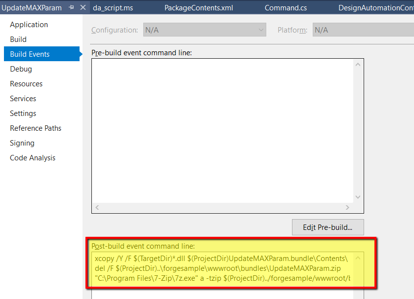

Esta etapa irá ajudá-lo a criar um plugin básico do 3ds Max para Design Automation. Todo o tutorial usa o Microsoft .NET Framework, incluindo o plug-in para o 3ds Max. Observe que o 3ds Max pode ser automatizado pelo MAXScript, Python, NET API e C++. A API .NET do 3ds Max provavelmente não é a mais usada para plugins, no entanto, para outros produtos Design Automatiuon é a API típica. Os recursos do 3ds Max para a API do .NET podem ser encontrados aqui (links do 2019, mas a API do .NET tem suporte para todas as versões disponíveis dos mecanismos do 3ds Max Design Automation):

- [Escrevendo plugins 3ds Max .NET](http://help.autodesk.com/view/3DSMAX/2019/ENU/?guid=__developer_3ds_max_sdk___the_learning_path_lesson_7_writing__net_plug_ins_html)
- [O SDK do .NET do 3ds Max](http://help.autodesk.com/view/3DSMAX/2019/ENU/?guid=__developer_3ds_max__net_sdk_html)
- [GetCOREInterface Blog .NET Exemplos](https://getcoreinterface.typepad.com/blog/2017/10/updated-net-api-samples-for-3ds-max-2018.html)

Lembre-se de que, para a Automação de Design, não deve haver interface do usuário ou prompts que não possam ser automatizados. Para automatizar o mecanismo 3ds Max DA, você deve fornecer alguns MAXScript. Isso geralmente é muito fácil, pois a maioria das personalizações pode ser exposta rapidamente ao MAXScript (consulte [publicação de função para C++](http://help.autodesk.com/view/3DSMAX/2019/ENU/?guid=__developer_3ds_max_sdk_features_function_publishing_html) e [manipulação do MAXScript .NET](http://help.autodesk.com/view/3DSMAX/2019/ENU/?guid=GUID-779FD7AC-953D-4567-B2A8-60B1D8695B95))

> Você pode [baixar o Bundle ZIP](https://github.com/autodesk-platform-services/aps-design-automation-nodejs/tree/nodejs/bundles/UpdateMAXParam.zip) na pasta 'bundles/' (Node.js) ou '/designAutomationSample/wwwroot/bundles' (.NET 6) e [pular para a seção **Upload Plugin Bundle**](#upload-plugin-bundle).

### Criar um novo projeto .NET

Clique com o botão direito do mouse na solução, em **Adicionar** >> em **Novo Projeto**. Selecione **Windows Desktop**, depois **Class Library** e, finalmente, nomeie-o como 'UpdateMAXParam'. Em seguida, você precisará fazer referência ao assembly gerenciado 'Autodesk.Max.Dll' (módulo principal da API do 3ds Max .NET). Este módulo é encontrado na pasta '3dsmax.exe' e, ao referenciar, certifique-se de desativar o sinalizador "Copy Local". Há alguns outros módulos usados para suporte à API do .NET (consulte [The 3ds Max .NET SDK](http://help.autodesk.com/view/3DSMAX/2019/ENU/?guid=__developer_3ds_max__net_sdk_html)), mas para este tutorial usaremos apenas Autodesk.Max.dll. Em seguida, pesquise e instale 'Newtonsoft.Json' (que é usado para analisar dados de entrada no formato JSON).

> Selecione .NET Framework 4.8. Se não estiver listado, [instale o Dev Pack](https://dotnet.microsoft.com/download/dotnet-framework/net48).


Como resultado, o **package.config** deve se parecer com o seguinte para o módulo Newtonsoft.Json.

```xml title=package.config
<?xml version="1.0" encoding="utf-8"?>
<packages>
    <package id="Newtonsoft.Json" version="12.0.1" targetFramework="net47" />
</packages>
```

Este é o código principal que será executado com o 3ds Max. Copie o seguinte conteúdo para 'Command.cs'. Há três classes para lidar com o porcessing de Automação de Projeto. O primeiro é o 'InputParams' que será usado para fazer a interface com os dados de entrada JSON. O próximo é a classe 'ParameterChanger' que é usada para iterar a cena e localizar todas as janelas de casement (mas pode ser qualquer tipo de objeto identificado pelos ids de classe). Finalmente, o 'RuntimeExecute' é usado para receber a entrada e conduzir a automação. Observe também que há um log especializado que enviará informações para o console do Design Automation. Consulte a função LogTrace. Observe que a classe gerenciada 'ILogSys' 3ds Max é usada para isso, e os sinalizadores usados com a API 'LogEntry' indicada são necessários para que a saída seja exibida no console do Design Automation.

```cs title=Commands.cs
using System;
using System.Collections.Generic;
using System.Linq;
using System.IO;
using Newtonsoft.Json;
using Autodesk.Max;
namespace Autodesk.Forge.Sample.DesignAutomation.Max
{
    /// <summary>
    /// Used to hold the parameters to change
    /// </summary>
    public class InputParams
    {
        public float Width { get; set; }
        public float Height { get; set; }
    }
    /// <summary>
    /// Changes parameters in automated way.
    /// Iterate entire scene to get all nodes
    /// In this example we specifically find Casement Windows by object class ID
    /// Then modify the width and height based on inputs.
    ///
    /// Could be expanded to find other window types, other objects, etc.
    /// </summary>
    static public class ParameterChanger
    {
        static List<IINode> m_sceneNodes = new List<IINode> { };
        /// <summary>
        /// Recursively go through the scene and get all nodes
        /// Use the Autodesk.Max APIs to get the children nodes
        /// </summary>
        static private void GetSceneNodes(IINode node)
        {
            m_sceneNodes.Add(node);
            for (int i = 0; i < node.NumberOfChildren; i++)
                GetSceneNodes(node.GetChildNode(i));
        }
        /// <summary>
        /// Function to specifically update Case Windows with input wedth and height parameters
        /// </summary>
        /// <param name="width">The new Width to set the Window</param>
        /// <param name="height">The new Height to set the Window</param>
        /// <returns>window count</returns>
        static public int UpdateWindowNodes(float width, float height)
        {
            IGlobal globalInterface = Autodesk.Max.GlobalInterface.Instance;
            IInterface14 coreInterface = globalInterface.COREInterface14;
            IINode nodeRoot = coreInterface.RootNode;
            m_sceneNodes.Clear();
            GetSceneNodes(nodeRoot);
            // 3ds Max uses a class ID for all object types. This is easiest way to find specific type.
            // ClassID (1902665597L, 1593788199L) == 0x71685F7D, 0x5EFF4727 for casement window
            IClass_ID cidCasementWindow = globalInterface.Class_ID.Create(0x71685F7D, 0x5EFF4727);
            // Use LINQ to filter for windows only - in case scene has more than one,
            // but this should still give us at least one for single window scene!
            var sceneWindows = from node in m_sceneNodes
                               where ((node.ObjectRef != null) && // In some cases the ObjectRef can be null for certain node types.
                                      (node.ObjectRef.ClassID.PartA == cidCasementWindow.PartA) &&
                                      (node.ObjectRef.ClassID.PartB == cidCasementWindow.PartB))
                               select node;
            // Iterate the casement windws and update the hight and width parameters.
            foreach (IINode item in sceneWindows)
            {
                // window is using old-style ParamArray rather than newer ParamBlk2
                IIParamArray pb = item.ObjectRef.ParamBlock;
                pb.SetValue(0, coreInterface.Time, height); // window height is at index zero.
                pb.SetValue(1, coreInterface.Time, width); // window width is at index one.
            }
            // If there are windows, save the window updates
            int status;
            if (sceneWindows.Count() > 0)
            {
                // The output file name must match what the Design Automation work item is specifying as output file.
                string full_filename = coreInterface.CurFilePath;
                string filename = coreInterface.CurFileName;
                string new_filename = full_filename.Replace(filename, "outputFile.max");
                status = coreInterface.SaveToFile(new_filename, true, false);
                if (status == 0) //error
                    return -1;
            }
            // return how many windows were modified.
            return sceneWindows.Count();
        }
    }
    /// <summary>
    /// This class is used to execute the automation. Above class could be connected to UI elements, or run by scripts directly.
    /// This class takes the input from JSON input and uses those values. This way it is more cohesive to web development.
    /// </summary>
    static public class RuntimeExecute
    {
        static public int ModifyWindowWidthHeight()
        {
            int count = 0;
            // Run entire code block with try/catch to help determine errors
            try
            {
                // read input parameters from JSON file
                InputParams inputParams = JsonConvert.DeserializeObject<InputParams>(File.ReadAllText("params.json"));
                count = ParameterChanger.UpdateWindowNodes(inputParams.Width, inputParams.Height);
            }
            catch (Exception e)
            {
                LogTrace("Exception Error: " + e.Message);
                return -1; //fail
            }
            LogTrace("Changed {0} Window objects.", count);
            return count; // 0+ means success, and how many objects were changed.
        }
        /// <summary>
        /// Information sent to this LogTrace will appear on the Design Automation output
        /// </summary>
        private static void LogTrace(string format, params object[] args)
        {
            System.Reflection.Assembly a = System.Reflection.Assembly.GetExecutingAssembly();
            string output_msg = string.Format("DLL {0} compiled on {1}; {2}",
                System.IO.Path.GetFileName(a.Location),
                File.GetLastWriteTime(a.Location),
                string.Format(format, args));
            IGlobal globalInterface = Autodesk.Max.GlobalInterface.Instance;
            IInterface14 coreInterface = globalInterface.COREInterface14;
            ILogSys log = coreInterface.Log;
            // Note flags are necessary to produce Design Automation output. This is same as C++:
            // SYSLOG_INFO | SYSLOG_IGNORE_VERBOSITY | SYSLOG_BROADCAST
            log.LogEntry(0x00000004 | 0x00040000 | 0x00010000, false, "", output_msg);
        }
    }
}
```

Crie uma pasta chamada 'UpdateMAXParam.bundle' e dentro desta pasta adicione um arquivo chamado 'PackageContents.xml'. Copie o conteúdo listado abaixo na seção XML para o arquivo PackageContents.xml. Saiba mais em [PackageContents.xml Format Reference](https://help.autodesk.com/view/ACD/2023/ENU/?guid=GUID-BC76355D-682B-46ED-B9B7-66C95EEF2BD0). Para obter mais informações específicas do 3ds Max para empacotar seus plug-ins do 3ds Max, consulte aqui [Plug-ins de empacotamento](http://help.autodesk.com/view/3DSMAX/2019/ENU/?guid=__developer_writing_plug_ins_packaging_plugins_html)

Esse arquivo informará ao 3ds Max os módulos a serem carregados (neste caso, o assembly de plug-in da API .NET que estamos criando, mas também pode incluir plug-ins MAXScripts, Python e/ou C++.) Como o plugin está sendo carregado através desse recurso, você só precisa se preocupar com as instruções para acionar seu trabalho de automação. Observe que um ID exclusivo para ProductCode e UpgradeCode é necessário para que o 3ds Max carregue corretamente seu código. Consulte a documentação acima mencionada para obter detalhes.

```xml tilte=PackageContents.xml
<?xml version="1.0" encoding="utf-8"?>
<ApplicationPackage
    SchemaVersion="1.0"
    AutodeskProduct="3ds Max"
    Name="Sample Design Automation Plugin for 3ds Max"
    Description="A sample package to update parameters of a 3ds Max scene file containing a casement window"
    AppVersion="2019.0.0"
    FriendlyVersion="2019.0.0"
    ProductType="Application"
    SupportedLocales="Enu"
    AppNameSpace="apps.autodesk.com"
    Author="Autodesk Forge"
    ProductCode="{6A8D06F4-C3DD-42DD-A69E-9B9617A7ABC0}"
    UpgradeCode="{CE88CEA5-47F6-423E-B9EC-E9FA683B5228}"
    >
    <CompanyDetails Name="Autodesk"
        Phone=" "
        Url="http://forge.autodesk.com"
        Email="noreply@autodesk.com" />
    <RuntimeRequirements OS="Win64" Platform="3ds Max" SeriesMin="2019" SeriesMax="2021" />
    <Components Description="assemblies parts">
        <RuntimeRequirements OS="Win64" Platform="3ds Max" SeriesMin="2019" SeriesMax="2021" />
        <ComponentEntry AppName="UpdateMAXParam" Version="2019.0.0" ModuleName="./Contents/UpdateMAXParam.dll" AppDescription="The Sample Design Automation Plugin managed assembly module" />
    </Components>
</ApplicationPackage>
```

Finally, create a subfolder named `Contents` and leave it empty. At this point, the project should look like.


## Evento pós-compilação

> Para Node.js é necessário ajustar a pasta de saída ZIP do AppBundle.

Agora precisamos ZIP a pasta '.bundle'. Clique com o botão direito do mouse no projeto, selecione **Propriedades**, abra **Eventos de compilação** e copie o seguinte para o campo **Linha de comando de evento pós-compilação**, conforme mostrado na imagem abaixo.

```
xcopy /Y /F "$(TargetDir)*.dll" "$(ProjectDir)UpdateMAXParam.bundle\Contents\"
del /F "$(ProjectDir)..\designAutomationSample\wwwroot\bundles\UpdateMAXParam.zip"
"C:\Program Files\7-Zip\7z.exe" a -tzip "$(ProjectDir)../designAutomationSample/wwwroot/bundles/UpdateMAXParam.zip" "$(ProjectDir)UpdateMAXParam.bundle\" -xr0!*.pdb
```

Isso copiará a DLL de '/bin/debug/' para a pasta '.bundle/Contents', depois usará [7zip](https://www.7-zip.org/) para criar um zip e, finalmente, copiará o ZIP para as pastas /bundles do webapp.



> Observe como o evento **Post-build** usa os nomes de projeto e pasta, portanto, verifique se você está usando esses nomes.

Se você criar o projeto 'UpdateMAXParam' agora, você deve ver algo como abaixo na janela **Output**. Note que 2 pastas e 3 arquivos zipados. O arquivo zip é criado diretamente na pasta /wwwroot/bundles. Isso significa que você está indo muito bem!


Neste ponto, você pode testar a funcionalidade usando a ferramenta de lote 3ds Max. Ele funciona de forma semelhante ao mecanismo 3ds Max Design Automation e é uma boa maneira de testar toda a sua automação localmente antes de enviar o trabalho para os serviços de nuvem do Forge DA. Para que as classes .NET sejam instanciadas no ambiente MAXScript, podemos usar a função MAXScript 'dotNetClass'. Para este projeto de exemplo, o código MAXScript teria a seguinte aparência:

```ms title=MAXScript
fn UpdateParam =
(
	da = dotNetClass("Autodesk.Forge.Sample.DesignAutomation.Max.RuntimeExecute")
	da.ModifyWindowWidthHeight()
)
UpdateParam()
```

Para executar isso localmente, poderíamos testar um prompt de linha de comando com algo assim:

```CommandLine
"%ADSK_3DSMAX_x64_2019%\3dsmaxbatch.exe" -sceneFile <myTestScene>.max da_script.ms
```

Mais adiante neste tutorial, você verá essas mesmas instruções sendo enviadas para o mecanismo 3ds Max Design Automation.