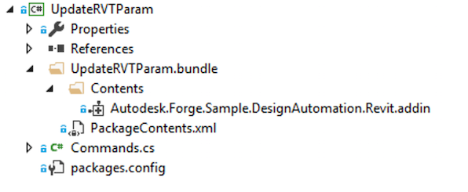
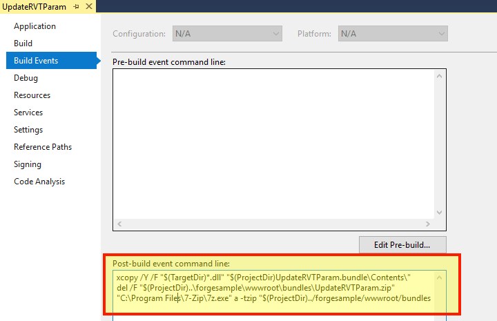

Esta etapa irá ajudá-lo a criar um plugin básico do Revit para Design Automation. Para obter mais informações, visite o tutorial [My First Revit Plugin](https://knowledge.autodesk.com/support/revit-products/learn-explore/caas/simplecontent/content/my-first-revit-plug-overview.html).

> Você pode [baixar o Bundle ZIP](https://github.com/autodesk-platform-services/aps-design-automation-nodejs/tree/nodejs/bundles/UpdateRVTParam.zip) na pasta 'bundles/' (Node.js) ou '/designAutomationSample/wwwroot/bundles' (.NET 6) e [pular para a seção **Upload Plugin Bundle**](#upload-plugin-bundle).

### Criar um novo projeto

ight-clique na solução, o **Add** >> **Novo projeto**. Selecione **Windows Desktop**, depois **Class Library** e, finalmente, nomeie-o 'UpdateRVTParam'.

> Selecione .NET Framework 4.8. Se não estiver listado, [instale o Dev Pack](https://dotnet.microsoft.com/download/dotnet-framework/net48).

Clique com o botão direito do mouse em **Referências**, depois em **Adicionar Referência** e **Procurar** para 'RevitAPI.dll' (por padrão na pasta 'C:\Arquivos de Programas\Autodesk\Revit 201x'). Em seguida, clique com o botão direito do mouse nesta referência **RevitAPI**, vá para **Propriedades**, em seguida, defina **Copiar Local** como **False**.

Em seguida, clique com o botão direito do mouse no projeto, vá para **Gerenciar pacotes NuGet...**, em **Navegador** você pode procurar por **DesignAutomation.Revit** e instalar 'Autodesk.Forge.DesignAutomation.Revit' (escolha a versão apropriada do Revit que você precisa). Em seguida, pesquise e instale 'Newtonsoft.Json' (que é usado para analisar dados de entrada no formato JSON).


```xml title=package.config
<?xml version="1.0" encoding="utf-8"?>
<packages>
  <package id="Autodesk.Forge.DesignAutomation.Revit" version="2021.0.0" targetFramework="net48" />
  <package id="Microsoft.CSharp" version="4.5.0" targetFramework="net48" />
  <package id="Newtonsoft.Json" version="12.0.1" targetFramework="net48" />
</packages>
```

O projeto deve conter uma classe 'Class1.cs', vamos renomear o arquivo para Commands.cs (para consistência).

Neste ponto, o projeto deve ter a seguinte aparência


```cs title=Commands.cs
using Autodesk.Revit.ApplicationServices;
using Autodesk.Revit.Attributes;
using Autodesk.Revit.DB;
using DesignAutomationFramework;
using Newtonsoft.Json;
using System.Collections.Generic;
using System.IO;
namespace Autodesk.Forge.Sample.DesignAutomation.Revit
{
    [Transaction(TransactionMode.Manual)]
    [Regeneration(RegenerationOption.Manual)]
    public class Commands : IExternalDBApplication
    {
        //Path of the project(i.e)project where your Window family files are present
        string OUTPUT_FILE = "OutputFile.rvt";
        public ExternalDBApplicationResult OnStartup(ControlledApplication application)
        {
            DesignAutomationBridge.DesignAutomationReadyEvent += HandleDesignAutomationReadyEvent;
            return ExternalDBApplicationResult.Succeeded;
        }
        private void HandleDesignAutomationReadyEvent(object sender, DesignAutomationReadyEventArgs e)
        {
            LogTrace("Design Automation Ready event triggered...");
            e.Succeeded = true;
            EditWindowParametersMethod(e.DesignAutomationData.RevitDoc);
        }
        private void EditWindowParametersMethod(Document doc)
        {
            InputParams inputParameters = JsonConvert.DeserializeObject<InputParams>(File.ReadAllText("params.json"));
            //Modifying the window parameters
            //Open transaction
            using (Transaction trans = new Transaction(doc))
            {
                trans.Start("Update window parameters");
                //Filter for windows
                FilteredElementCollector WindowCollector = new FilteredElementCollector(doc).OfCategory(BuiltInCategory.OST_Windows).WhereElementIsNotElementType();
                IList<ElementId> windowIds = WindowCollector.ToElementIds() as IList<ElementId>;
                foreach (ElementId windowId in windowIds)
                {
                    Element Window = doc.GetElement(windowId);
                    FamilyInstance FamInst = Window as FamilyInstance;
                    FamilySymbol FamSym = FamInst.Symbol;
                    SetElementParameter(FamSym, BuiltInParameter.WINDOW_HEIGHT, inputParameters.Height);
                    SetElementParameter(FamSym, BuiltInParameter.WINDOW_WIDTH, inputParameters.Width);
                }
                //To save all the changes commit the transaction
                trans.Commit();
            }
            //Save the updated file by overwriting the existing file
            ModelPath ProjectModelPath = ModelPathUtils.ConvertUserVisiblePathToModelPath(OUTPUT_FILE);
            SaveAsOptions SAO = new SaveAsOptions();
            SAO.OverwriteExistingFile = true;
            //Save the project file with updated window's parameters
            LogTrace("Saving file...");
            doc.SaveAs(ProjectModelPath, SAO);
        }
        public ExternalDBApplicationResult OnShutdown(ControlledApplication application)
        {
            return ExternalDBApplicationResult.Succeeded;
        }
        private void SetElementParameter(FamilySymbol FamSym, BuiltInParameter paraMeter, double parameterValue)
        {
            FamSym.get_Parameter(paraMeter).Set(parameterValue);
        }
        public class InputParams
        {
            public double Width { get; set; }
            public double Height { get; set; }
        }
        /// <summary>
        /// This will appear on the Design Automation output
        /// </summary>
        private static void LogTrace(string format, params object[] args) { System.Console.WriteLine(format, args); }
    }
}
```

Crie uma pasta chamada UpdateRVTParam.bundle e, dentro, um arquivo chamado PackageContents.xml e, em seguida, copie o seguinte conteúdo para ele. Saiba mais em PackageContents.xml Referência de formato. Este arquivo diz ao Revit para carregar nosso plugin .addin.

```xml title=PackageContents.xml
<?xml version="1.0" encoding="utf-8" ?>
<ApplicationPackage Name="RevitDesignAutomation" Description="Sample Plugin for Revit" Author="tutorials.autodesk.io">
  <CompanyDetails Name="Autodesk, Inc" Url="http://tutorials.autodesk.io" Email="forge.help@autodesk.com"/>
  <Components Description="Modify window parameters">
    <RuntimeRequirements SeriesMax="R2021" SeriesMin="R2019" Platform="Revit" OS="Win64"/>
    <ComponentEntry LoadOnRevitStartup="True" LoadOnCommandInvocation="False" AppDescription="Modify Window Parameters" ModuleName="./Contents/Autodesk.Forge.Sample.DesignAutomation.Revit.addin" Version="1.0.0" AppName="Modify Window Parameters"/>
  </Components>
</ApplicationPackage>
```

#### Autodesk.Forge.Sample.DesignAutomation.Revit.addin

Na pasta 'UpdateRVTParam.bundle', crie uma subpasta chamada 'Contents' e, dentro dessa pasta, um novo arquivo chamado 'Autodesk.Forge.Sample.DesignAutomation.Revit.addin'. Isso informa ao Revit como carregar o plugin.

```xml
<?xml version="1.0" encoding="utf-8" standalone="no"?>
<RevitAddIns>
  <AddIn Type="DBApplication">
    <Name>Modify Window Parameters</Name>
    <FullClassName>Autodesk.Forge.Sample.DesignAutomation.Revit.Commands</FullClassName>
    <Text>Revit for Design Automation</Text>
    <Description>Revit for Design Automation</Description>
    <VisibilityMode>AlwaysVisible</VisibilityMode>
    <Assembly>.\UpdateRVTParam.dll</Assembly>
    <AddInId>000BD853-36E4-461f-9171-C5ACEDA4E723</AddInId>
    <VendorId>ADSK</VendorId>
    <VendorDescription>Autodesk, Inc, www.autodesk.com</VendorDescription>
  </AddIn>
</RevitAddIns>
```



#### Evento pós-compilação

> Para Node.js é necessário ajustar a pasta de saída ZIP do AppBundle.

Agora precisamos ZIP a pasta .bundle. Clique com o botão direito do mouse no projeto, selecione **Propriedades**, abra **Eventos de compilação** e copie o seguinte para o campo **Linha de comando de evento pós-compilação**, conforme mostrado na imagem abaixo.

```
xcopy /Y /F "$(TargetDir)*.dll" "$(ProjectDir)UpdateRVTParam.bundle\Contents\"
del /F "$(ProjectDir)..\designAutomationSample\wwwroot\bundles\UpdateRVTParam.zip"
"C:\Program Files\7-Zip\7z.exe" a -tzip "$(ProjectDir)../designAutomationSample/wwwroot/bundles/UpdateRVTParam.zip" "$(ProjectDir)UpdateRVTParam.bundle\" -xr0!*.pdb
```

Isso copiará a DLL de '/bin/debug/' para a pasta '.bundle/Contents', depois usará [7zip](https://www.7-zip.org/) para criar um zip e, finalmente, copiará o ZIP para as pastas '/bundles' do webapp.



> Observe como o evento **Post-build** usa os nomes de projeto e pasta, portanto, verifique se você está usando esses nomes.

Se você construir o projeto 'UpdateRVTParam' agora você deve ver algo assim na janela **Output**. Observe as 2 pastas e 3 arquivos zipados. O arquivo zip é criado diretamente na pasta /wwwroot/bundles. Isso significa que você está indo muito bem!


> Se a saída da compilação mostrar mais de **2 pastas, 5 arquivos** copiados, volte e verifique se a referência **RevitAPI** está definida como **Copy Local**:**False**. Talvez seja necessário remover todas as DLLs da pasta 'UpdateRVTParam.bundle/Contents/'