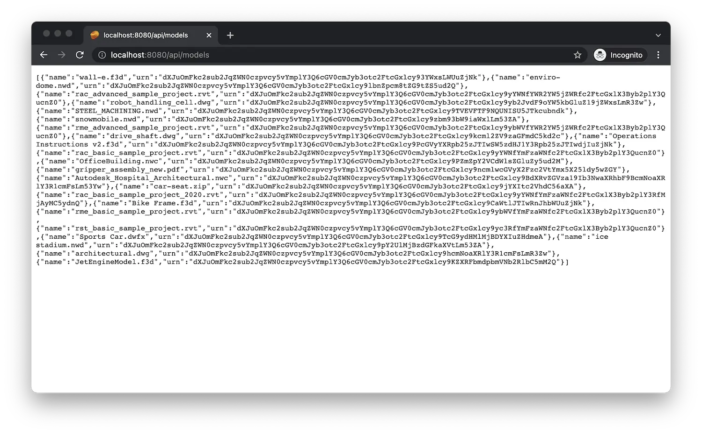

import EnvTabs from '@site/src/components/EnvTabs.js';

import NodeJsVsCodeData from './_shared/nodejs-vscode/data/data.mdx';
import NodeJsVsCodeDerivatives from './_shared/nodejs-vscode/data/derivatives.mdx';
import NodeJsVsCodeEndpoints from './_shared/nodejs-vscode/data/endpoints.mdx';

import DotNetData from './_shared/dotnet/data/data.mdx';
import DotNetDerivatives from './_shared/dotnet/data/derivatives.mdx';
import DotNetEndpoints from './_shared/dotnet/data/endpoints.mdx';

# 数据与衍生品

在此步骤中，我们将扩展我们的服务器，以便我们可以列出模型，上传它们，
并准备查看它们。

## 数据管理

首先，让我们确保应用程序在数据管理服务中有一个存储桶
以存储其文件。通常，存储桶在预置过程中仅创建一次
步骤，但在我们的示例中，我们将实现一个帮助程序函数，该函数将确保存储桶
可用，并在服务器应用的其他部分使用它。

创建存储桶时，需要应用为存储桶中的对象设置保留策略。以后无法更改此设置。存储桶上的保留策略适用于存储在其中的所有对象。创建存储桶时，请明确将 **policyKey** 设置为 **暂时性**、**临时** 或 **持久**。

:::info

**数据保留政策**

**瞬态** - 超过 24 小时的对象将自动删除。

**临时** - 当对象达到 30 天大时，将将其删除。

**持久** - 在用户删除对象之前可用。

:::

<EnvTabs NodeJsVsCode={NodeJsVsCodeData} DotNetVsCode={DotNetData} DotNetVs2022={DotNetData} />

:::caution

请注意，Data Management 服务要求存储桶名称是全局唯一的，
尝试使用已使用的名称创建存储桶将失败，并显示“409 冲突”。
请参阅 [文档](https://aps.autodesk.com/en/docs/data/v2/reference/http/buckets-POST）
了解更多详情。

:::

## 衍生品

接下来，我们将实现几个辅助函数，这些函数将派生/提取各种类型的信息
从上传的文件（例如，2D 图纸、3D 几何图形和元数据）中，我们稍后可以加载
进入我们网页中的查看器。为此，我们需要开始一个新的转换作业
在 [模型导数](https://aps.autodesk.com/en/docs/model-derivative/v2/developers_guide/overview） 中
服务，并检查转换状态。

模型派生服务要求我们在 API 调用中使用的所有 ID 都是 [base64](https://wikipedia.org/wiki/Base64） 编码的，
因此，我们包含一个小的实用程序函数，这将有助于实现这一目标。

:::info

Base64 编码的 ID 称为 _URN。

:::

<EnvTabs NodeJsVsCode={NodeJsVsCodeDerivatives} DotNetVsCode={DotNetDerivatives} DotNetVs2022={DotNetDerivatives} />

## 服务器端点

现在，让我们通过另一个功能向客户端提供新功能
终结点集。

<EnvTabs NodeJsVsCode={NodeJsVsCodeEndpoints} DotNetVsCode={DotNetEndpoints} DotNetVs2022={DotNetEndpoints} />

## 试一试

像往常一样启动（或重新启动）应用程序，然后导航到 [http://localhost:8080/api/models](http://localhost:8080/api/models）
在浏览器中。服务器应使用包含所有对象的名称和 URN 的 JSON 列表进行响应
在您配置的存储桶中可用。

:::info

如果这是您第一次使用 APS，您可能会收到 JSON 响应
使用预期的空数组 （'[]'）。在下面的屏幕截图中，我们可以
已经看到了过去上传到我们存储桶的几个文件。

:::

:::tip

如果您使用的是 Google Chrome，请考虑安装 [JSON 格式化程序](https://chrome.google.com/webstore/detail/json-formatter/bcjindcccaagfpapjjmafapmmgkkhgoa?hl=en）
或类似的扩展程序来自动格式化 JSON 响应。

:::

