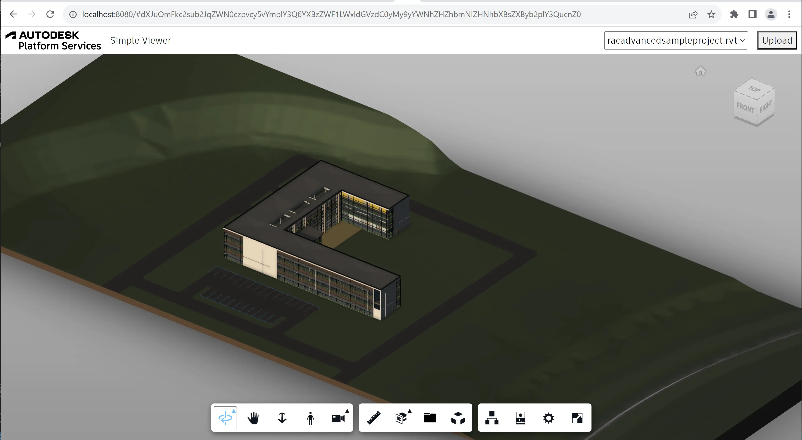

import EnvTabs from '@site/src/components/EnvTabs.js';

import NodeJsVsCodeStructure from './_shared/nodejs-vscode/final-folder-structure.mdx';
import DotNetVsCodeStructure from './_shared/dotnet-vscode/final-folder-structure.mdx';
import DotNetVs2022Structure from './_shared/dotnet-vs2022/final-folder-structure.mdx';

# 查看器 & UI

最后，我们准备构建应用程序的客户端部分。


:::tip

 
If you're developing with Node.js, you can use TypeScript definitions for the Viewer API.
Run
```bash
npm install --dev @types/forge-viewer
``` 
in your terminal to add the TypeScript definition file to your project.


:::


## 查看器逻辑

让我们从为应用程序实现 Viewer 功能开始。
使用以下代码在“wwwroot”子文件夹下创建一个“viewer.js”文件：

```js title="wwwroot/viewer.js"
/// import * as Autodesk from "@types/forge-viewer";
async function getAccessToken(callback) {
    try {
        const resp = await fetch('/api/auth/token');
        if (!resp.ok) {
            throw new Error(await resp.text());
        }
        const { access_token, expires_in } = await resp.json();
        callback(access_token, expires_in);
    } catch (err) {
        alert('Could not obtain access token. See the console for more details.');
        console.error(err);
    }
}
export function initViewer(container) {
    return new Promise(function (resolve, reject) {
        Autodesk.Viewing.Initializer({ env: 'AutodeskProduction', getAccessToken }, function () {
            const config = {
                extensions: ['Autodesk.DocumentBrowser']
            };
            const viewer = new Autodesk.Viewing.GuiViewer3D(container, config);
            viewer.start();
            viewer.setTheme('light-theme');
            resolve(viewer);
        });
    });
}
export function loadModel(viewer, urn) {
    return new Promise(function (resolve, reject) {
        function onDocumentLoadSuccess(doc) {
            resolve(viewer.loadDocumentNode(doc, doc.getRoot().getDefaultGeometry()));
        }
        function onDocumentLoadFailure(code, message, errors) {
            reject({ code, message, errors });
        }
        viewer.setLightPreset(0);
        Autodesk.Viewing.Document.load('urn:' + urn, onDocumentLoadSuccess, onDocumentLoadFailure);
    });
}
```

脚本是 [ES6 模块](https://developer.mozilla.org/en-US/docs/Web/JavaScript/Guide/Modules）
导出两个函数，'initViewer'，它将创建一个查看器的新实例
在指定的 DOM 容器中，以及将特定模型加载到查看器的“loadModel”中。
初始化查看器时，我们包含一个小的帮助程序函数（'getAccessToken'），该函数
从我们的服务器应用程序中检索公共令牌。然后，查看者可以使用此令牌
开始从模型衍生服务加载资产。

## 应用逻辑

接下来，让我们定义 Web 应用程序本身的逻辑。我们将需要填充
包含所有可供查看的模型的 UI，以及用于上传和
翻译新模型。使用以下代码在“wwwroot”子文件夹下创建一个“main.js”文件：

```js title="wwwroot/main.js"
import { initViewer, loadModel } from './viewer.js';
initViewer(document.getElementById('preview')).then(viewer => {
    const urn = window.location.hash?.substring(1);
    setupModelSelection(viewer, urn);
    setupModelUpload(viewer);
});
async function setupModelSelection(viewer, selectedUrn) {
    const dropdown = document.getElementById('models');
    dropdown.innerHTML = '';
    try {
        const resp = await fetch('/api/models');
        if (!resp.ok) {
            throw new Error(await resp.text());
        }
        const models = await resp.json();
        dropdown.innerHTML = models.map(model => `<option value=${model.urn} ${model.urn === selectedUrn ? 'selected' : ''}>${model.name}</option>`).join('\n');
        dropdown.onchange = () => onModelSelected(viewer, dropdown.value);
        if (dropdown.value) {
            onModelSelected(viewer, dropdown.value);
        }
    } catch (err) {
        alert('Could not list models. See the console for more details.');
        console.error(err);
    }
}
async function setupModelUpload(viewer) {
    const upload = document.getElementById('upload');
    const input = document.getElementById('input');
    const models = document.getElementById('models');
    upload.onclick = () => input.click();
    input.onchange = async () => {
        const file = input.files[0];
        let data = new FormData();
        data.append('model-file', file);
        if (file.name.endsWith('.zip')) { // When uploading a zip file, ask for the main design file in the archive
            const entrypoint = window.prompt('Please enter the filename of the main design inside the archive.');
            data.append('model-zip-entrypoint', entrypoint);
        }
        upload.setAttribute('disabled', 'true');
        models.setAttribute('disabled', 'true');
        showNotification(`Uploading model <em>${file.name}</em>. Do not reload the page.`);
        try {
            const resp = await fetch('/api/models', { method: 'POST', body: data });
            if (!resp.ok) {
                throw new Error(await resp.text());
            }
            const model = await resp.json();
            setupModelSelection(viewer, model.urn);
        } catch (err) {
            alert(`Could not upload model ${file.name}. See the console for more details.`);
            console.error(err);
        } finally {
            clearNotification();
            upload.removeAttribute('disabled');
            models.removeAttribute('disabled');
            input.value = '';
        }
    };
}
async function onModelSelected(viewer, urn) {
    if (window.onModelSelectedTimeout) {
        clearTimeout(window.onModelSelectedTimeout);
        delete window.onModelSelectedTimeout;
    }
    window.location.hash = urn;
    try {
        const resp = await fetch(`/api/models/${urn}/status`);
        if (!resp.ok) {
            throw new Error(await resp.text());
        }
        const status = await resp.json();
        switch (status.status) {
            case 'n/a':
                showNotification(`Model has not been translated.`);
                break;
            case 'inprogress':
                showNotification(`Model is being translated (${status.progress})...`);
                window.onModelSelectedTimeout = setTimeout(onModelSelected, 5000, viewer, urn);
                break;
            case 'failed':
                showNotification(`Translation failed. <ul>${status.messages.map(msg => `<li>${JSON.stringify(msg)}</li>`).join('')}</ul>`);
                break;
            default:
                clearNotification();
                loadModel(viewer, urn);
                break; 
        }
    } catch (err) {
        alert('Could not load model. See the console for more details.');
        console.error(err);
    }
}
function showNotification(message) {
    const overlay = document.getElementById('overlay');
    overlay.innerHTML = `<div class="notification">${message}</div>`;
    overlay.style.display = 'flex';
}
function clearNotification() {
    const overlay = document.getElementById('overlay');
    overlay.innerHTML = '';
    overlay.style.display = 'none';
}
```

脚本将初始化查看器，使用模型填充 UI 中的下拉元素
从“/api/models”端点检索，并设置文件上传。当其中一个模型
在选择下拉列表中，应用逻辑将检查模型在 APS 中的状态（例如，
是否仍在翻译中，或者翻译是否失败），并在以下情况下加载模型
它是可用的。

## 用户界面

最后，让我们使用简单的 HTML 标记和 CSS 定义应用程序的 UI。

在“wwwroot”子文件夹中创建一个包含以下内容的“index.html”文件：

```html title="wwwroot/index.html"
<!DOCTYPE html>
<html lang="en">
<head>
    <meta charset="UTF-8">
    <meta name="viewport" content="width=device-width, initial-scale=1.0">
    <meta http-equiv="X-UA-Compatible" content="ie=edge">
    <link rel="icon" type="image/x-icon" href="https://cdn.autodesk.io/favicon.ico">
    <link rel="stylesheet" href="https://developer.api.autodesk.com/modelderivative/v2/viewers/7.*/style.css">
    <link rel="stylesheet" href="/main.css">
    <title>Autodesk Platform Services: Simple Viewer</title>
</head>
<body>
    <div id="header">
        
        <span class="title">Simple Viewer</span>
        <select name="models" id="models"></select>
        <button id="upload" title="Upload New Model">Upload</button>
        <input style="display: none" type="file" id="input">
    </div>
    <div id="preview"></div>
    <div id="overlay"></div>
    <script src="https://developer.api.autodesk.com/modelderivative/v2/viewers/7.*/viewer3D.js"></script>
    <script src="/main.js" type="module"></script>
</body>
</html>
```

The HTML markup simply uses a `<select>` element as the dropdown for listing the viewable models,
and an `<input type="file">` element with a `<button>` to handle the uploading of a new model.

创建一个“main.css”文件，同样位于“wwwroot”子文件夹下，并使用以下 CSS 规则填充它：

```css title="wwwroot/main.css"
body, html {
    margin: 0;
    padding: 0;
    height: 100vh;
    font-family: ArtifaktElement;
}
#header, #preview, #overlay {
    position: absolute;
    width: 100%;
}
#header {
    height: 3em;
    display: flex;
    flex-flow: row nowrap;
    justify-content: space-between;
    align-items: center;
}
#preview, #overlay {
    top: 3em;
    bottom: 0;
}
#overlay {
    z-index: 1;
    background-color: rgba(0, 0, 0, 0.5);
    padding: 1em;
    display: none;
}
#overlay > .notification {
    margin: auto;
    padding: 1em;
    max-width: 50%;
    background: white;
}
#header > * {
    height: 2em;
    margin: 0 0.5em;
    font-size: 1em;
    font-family: ArtifaktElement;
}
#header .title {
    flex: 1 0 auto;
    height: auto;
}
#models {
    flex: 0 1 auto;
    min-width: 2em;
}
```

应用程序源代码的最终文件夹结构现在应如下所示：

<EnvTabs NodeJsVsCode={NodeJsVsCodeStructure} DotNetVsCode={DotNetVsCodeStructure} DotNetVs2022={DotNetVs2022Structure} />

## 试一试

就是这样！您的申请现已完成。像往常一样启动（或重新启动）应用，然后导航
到浏览器中的 [http://localhost:8080](http://localhost:8080）。您应该看到
一个简单的 UI，右上角有一个下拉列表，最终将填充所有模型
在应用程序的存储桶中可用，并带有用于上传新模型的按钮。只要你
从下拉列表中选择一个名称，相应的模型将被加载到查看器中
网页的其余部分。


:::tip

如果您没有任何现成的测试设计文件，您可以公开尝试其中的一些
可用的：

- [Revit 2022 示例项目文件](https://knowledge.autodesk.com/support/revit/getting-started/caas/CloudHelp/cloudhelp/2022/ENU/Revit-GetStarted/files/GUID-61EF2F22-3A1F-4317-B925-1E85F138BE88-htm.html）
- [AutoCAD Mechanical 2022 示例文件](https://knowledge.autodesk.com/support/autocad-mechanical/downloads/caas/downloads/content/autocad-mechanical-2022-sample-files.html）


:::



