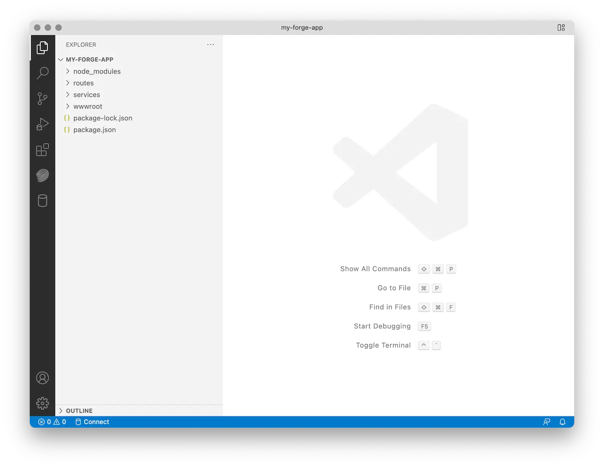

为项目创建一个新文件夹，在命令行中导航到该文件夹，然后初始化一个新的
Node.js项目：

```bash
npm init -y
```

接下来，安装我们将要使用的所有Node.js依赖项。在这种情况下，它将是
[多天夫](https://www.npmjs.com/package/dotenv）（用于从文件初始化环境变量的实用程序），
[Express.js](https://expressjs.com）（Web 框架）、Express.js [中间件](https://expressjs.com/en/guide/using-middleware.html）
用于处理“multipart/form-data”请求，最后是官方 APS SDK 的各种包：


:::caution

截至 2024 年 4 月，适用于 Node.js 的 APS SDK 处于测试阶段，这意味着公共接口仍然可以更改。
为避免任何潜在问题，我们建议安装这些软件包的特定版本，如下所示。


:::


```bash
npm install --save dotenv express express-formidable
npm install --save @aps_sdk/autodesk-sdkmanager@0.0.7-beta.1
npm install --save @aps_sdk/authentication@0.1.0-beta.1
npm install --save @aps_sdk/oss@0.1.0-beta.1
npm install --save @aps_sdk/model-derivative@0.1.0-beta.1
```

“package.json”文件中的“依赖项”现在应该如下所示
（版本号可能略有不同）：

```json
// ...
  "dependencies": {
    "@aps_sdk/authentication": "0.1.0-beta.1",
    "@aps_sdk/autodesk-sdkmanager": "0.0.7-beta.1",
    "@aps_sdk/model-derivative": "0.1.0-beta.1",
    "@aps_sdk/oss": "0.1.0-beta.1",
    "dotenv": "^16.4.1",
    "express": "^4.18.2",
    "express-formidable": "^1.2.0"
  },
// ...
```

最后，让我们在要进行的项目文件夹中再创建几个子文件夹
以后需要：

- 'wwwroot' - 这是我们要放置所有客户端资产（HTML、CSS、JavaScript、图像等）的地方。
- 'routes' - 这是我们要实现所有服务器端点的地方
- 'services' - 在这里，我们将保留所有可以由不同端点共享的服务器端逻辑

现在，当你第一次在 Visual Studio Code 中打开项目文件夹时，文件夹结构
应如下所示：


