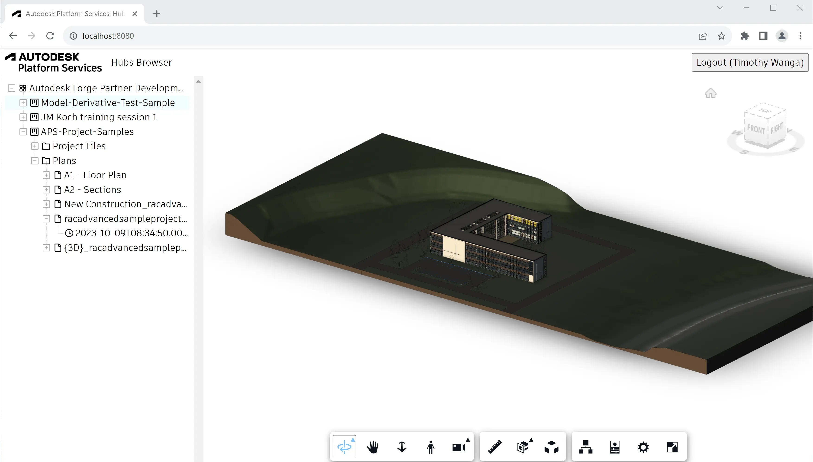

import EnvTabs from '@site/src/components/EnvTabs.js';

import NodeJsVsCodeStructure from './_shared/nodejs-vscode/final-folder-structure.mdx';
import DotNetVsCodeStructure from './_shared/dotnet-vscode/final-folder-structure.mdx';
import DotNetVs2022Structure from './_shared/dotnet-vs2022/final-folder-structure.mdx';

# 查看器 & UI

最后，我们准备构建应用程序的客户端部分。


:::tip

 
If you're developing with Node.js, you can use TypeScript definitions for the Viewer.
Run
```bash
npm install --save-dev @types/forge-viewer
``` 
in your terminal to add the TypeScript definition file to your project.


:::


## 查看器逻辑

让我们从为应用程序实现 Viewer 功能开始。
使用以下代码在“wwwroot”子文件夹下创建一个“viewer.js”文件：

```js title="wwwroot/viewer.js"
async function getAccessToken(callback) {
    try {
        const resp = await fetch('/api/auth/token');
        if (!resp.ok)
            throw new Error(await resp.text());
        const { access_token, expires_in } = await resp.json();
        callback(access_token, expires_in);
    } catch (err) {
        alert('Could not obtain access token. See the console for more details.');
        console.error(err);        
    }
}
export function initViewer(container) {
    return new Promise(function (resolve, reject) {
            Autodesk.Viewing.Initializer({ env: 'AutodeskProduction', getAccessToken }, function () {
            const config = {
                extensions: ['Autodesk.DocumentBrowser']
            };
            const viewer = new Autodesk.Viewing.GuiViewer3D(container, config);
            viewer.start();
            viewer.setTheme('light-theme');
            resolve(viewer);
        });
    });
}
export function loadModel(viewer, urn) {
    function onDocumentLoadSuccess(doc) {
        viewer.loadDocumentNode(doc, doc.getRoot().getDefaultGeometry());
    }
    function onDocumentLoadFailure(code, message) {
        alert('Could not load model. See console for more details.');
        console.error(message);
    }
    Autodesk.Viewing.Document.load('urn:' + urn, onDocumentLoadSuccess, onDocumentLoadFailure);
}
```

脚本是 [ES6 模块](https://developer.mozilla.org/en-US/docs/Web/JavaScript/Guide/Modules）
导出两个函数：

- 'initViewer' 将在指定的 DOM 容器中创建一个查看器的新实例
- 'loadModel' 用于将特定模型加载到查看器

## 侧边栏逻辑

接下来，我们将实现侧边栏的行为，我们将在其中显示
第三方树视图组件中的所有中心、项目、文件夹、项目和版本。
使用以下代码在“wwwroot”子文件夹下创建一个“sidebar.js”文件：

```js title="wwwroot/sidebar.js"
async function getJSON(url) {
    const resp = await fetch(url);
    if (!resp.ok) {
        alert('Could not load tree data. See console for more details.');
        console.error(await resp.text());
        return [];
    }
    return resp.json();
}
function createTreeNode(id, text, icon, children = false) {
    return { id, text, children, itree: { icon } };
}
async function getHubs() {
    const hubs = await getJSON('/api/hubs');
    return hubs.map(hub => createTreeNode(`hub|${hub.id}`, hub.attributes.name, 'icon-hub', true));
}
async function getProjects(hubId) {
    const projects = await getJSON(`/api/hubs/${hubId}/projects`);
    return projects.map(project => createTreeNode(`project|${hubId}|${project.id}`, project.attributes.name, 'icon-project', true));
}
async function getContents(hubId, projectId, folderId = null) {
    const contents = await getJSON(`/api/hubs/${hubId}/projects/${projectId}/contents` + (folderId ? `?folder_id=${folderId}` : ''));
    return contents.map(item => {
        if (item.type === 'folders') {
            return createTreeNode(`folder|${hubId}|${projectId}|${item.id}`, item.attributes.displayName, 'icon-my-folder', true);
        } else {
            return createTreeNode(`item|${hubId}|${projectId}|${item.id}`, item.attributes.displayName, 'icon-item', true);
        }
    });
}
async function getVersions(hubId, projectId, itemId) {
    const versions = await getJSON(`/api/hubs/${hubId}/projects/${projectId}/contents/${itemId}/versions`);
    return versions.map(version => createTreeNode(`version|${version.id}`, version.attributes.createTime, 'icon-version'));
}
export function initTree(selector, onSelectionChanged) {
    // See http://inspire-tree.com
    const tree = new InspireTree({
        data: function (node) {
            if (!node || !node.id) {
                return getHubs();
            } else {
                const tokens = node.id.split('|');
                switch (tokens[0]) {
                    case 'hub': return getProjects(tokens[1]);
                    case 'project': return getContents(tokens[1], tokens[2]);
                    case 'folder': return getContents(tokens[1], tokens[2], tokens[3]);
                    case 'item': return getVersions(tokens[1], tokens[2], tokens[3]);
                    default: return [];
                }
            }
        }
    });
    tree.on('node.click', function (event, node) {
        event.preventTreeDefault();
        const tokens = node.id.split('|');
        if (tokens[0] === 'version') {
            onSelectionChanged(tokens[1]);
        }
    });
    return new InspireTreeDOM(tree, { target: selector });
}
```

## 应用逻辑

现在，让我们将所有 UI 组件连接在一起。在下创建一个“main.js”文件
“wwwroot”文件夹，并使用以下代码填充它：

```js title="wwwroot/main.js"
import { initViewer, loadModel } from './viewer.js';
import { initTree } from './sidebar.js';
const login = document.getElementById('login');
try {
    const resp = await fetch('/api/auth/profile');
    if (resp.ok) {
        const user = await resp.json();
        login.innerText = `Logout (${user.name})`;
        login.onclick = () => {
            const iframe = document.createElement('iframe');
            iframe.style.visibility = 'hidden';
            iframe.src = 'https://accounts.autodesk.com/Authentication/LogOut';
            document.body.appendChild(iframe);
            iframe.onload = () => {
                window.location.replace('/api/auth/logout');
                document.body.removeChild(iframe);
            };
        }
        const viewer = await initViewer(document.getElementById('preview'));
        initTree('#tree', (id) => loadModel(viewer, window.btoa(id).replace(/=/g, '')));
    } else {
        login.innerText = 'Login';
        login.onclick = () => window.location.replace('/api/auth/login');
    }
    login.style.visibility = 'visible';
} catch (err) {
    alert('Could not initialize the application. See console for more details.');
    console.error(err);
}
```

该脚本将首先尝试获取用户详细信息，以检查我们是否已登录。
如果是这样，代码就可以初始化查看器以及树视图组件。
传递给“initTree”的回调函数确保当我们单击叶节点时
在树中，查看器将开始加载相应的模型。

## 用户界面

最后，让我们构建应用程序的 UI。

在“wwwroot”子文件夹下创建一个“main.css”文件，并使用以下 CSS 规则填充它：

```css title="wwwroot/main.css"
body, html {
    margin: 0;
    padding: 0;
    height: 100vh;
    font-family: ArtifaktElement;
}
#header, #sidebar, #preview {
    position: absolute;
}
#header {
    height: 3em;
    width: 100%;
    display: flex;
    flex-flow: row nowrap;
    justify-content: space-between;
    align-items: center;
}
#sidebar {
    width: 25%;
    left: 0;
    top: 3em;
    bottom: 0;
    overflow-y: scroll;
}
#preview {
    width: 75%;
    right: 0;
    top: 3em;
    bottom: 0;
}
#header > * {
    height: 2em;
    margin: 0 0.5em;
}
#login {
    font-family: ArtifaktElement;
    font-size: 1em;
}
#header .title {
    height: auto;
    margin-right: auto;
}
#tree {
    margin: 0.5em;
}
@media (max-width: 768px) {
    #sidebar {
        width: 100%;
        top: 3em;
        bottom: 75%;
    }
    #preview {
        width: 100%;
        top: 25%;
        bottom: 0;
    }
}
.icon-hub:before {
    background-image: url(https://raw.githubusercontent.com/primer/octicons/main/icons/apps-16.svg); /* or https://raw.githubusercontent.com/primer/octicons/main/icons/stack-16.svg */
    background-size: cover;
}
.icon-project:before {
    
    background-image: url(https://raw.githubusercontent.com/primer/octicons/main/icons/project-16.svg); /* or https://raw.githubusercontent.com/primer/octicons/main/icons/organization-16.svg */
    background-size: cover;
}
.icon-my-folder:before {
    background-image: url(https://raw.githubusercontent.com/primer/octicons/main/icons/file-directory-16.svg);
    background-size: cover;
}
.icon-item:before {
    background-image: url(https://raw.githubusercontent.com/primer/octicons/main/icons/file-16.svg);
    background-size: cover;
}
.icon-version:before {
    background-image: url(https://raw.githubusercontent.com/primer/octicons/main/icons/clock-16.svg);
    background-size: cover;
}
```

然后，在同一文件夹中创建一个包含以下内容的“index.html”文件：

```html title="wwwroot/index.html"
<!doctype html>
<html lang="en">
<head>
    <meta charset="utf-8">
    <meta name="viewport" content="width=device-width, initial-scale=1">
    <link rel="icon" type="image/x-icon" href="https://cdn.autodesk.io/favicon.ico">
    <link rel="stylesheet" href="https://developer.api.autodesk.com/modelderivative/v2/viewers/7.*/style.css">
    <link rel="stylesheet" href="https://unpkg.com/inspire-tree-dom@4.0.6/dist/inspire-tree-light.min.css">
    <link rel="stylesheet" href="/main.css">
    <title>Autodesk Platform Services: Hubs Browser</title>
</head>
<body>
    <div id="header">
        
        <span class="title">Hubs Browser</span>
        <button id="login" style="visibility: hidden;">Login</button>
    </div>
    <div id="sidebar">
        <div id="tree"></div>
    </div>
    <div id="preview"></div>
    <script src="https://developer.api.autodesk.com/modelderivative/v2/viewers/7.*/viewer3D.js"></script>
    <script src="https://cdnjs.cloudflare.com/ajax/libs/lodash.js/4.17.21/lodash.min.js"></script>
    <script src="https://unpkg.com/inspire-tree@4.3.1/dist/inspire-tree.js"></script>
    <script src="https://unpkg.com/inspire-tree-dom@4.0.6/dist/inspire-tree-dom.min.js"></script>
    <script src="/main.js" type="module"></script>
</body>
</html>
```

> Note that since `main.js` is also an ES6 module, we have to use `type="module"` in its `<script>` tag.

应用程序源代码的最终文件夹结构现在应如下所示：

<EnvTabs NodeJsVsCode={NodeJsVsCodeStructure} DotNetVsCode={DotNetVsCodeStructure} DotNetVs2022={DotNetVs2022Structure} />

## 试一试

就是这样！您的应用程序现在已准备好运行。像往常一样启动它，当你去
[http://localhost:8080](http://localhost:8080），您应该会看到一个简单的 UI，其中包含
左侧是树视图，右侧是空的查看器。尝试浏览树，
，然后选择其中一个文件的特定版本。之后，应加载相应的模型
进入查看器。


:::caution

请注意，上传到 Fusion Teams 的设计不会自动处理以供查看。
您需要先在 Fusion Teams 网站上打开这些设计，当它们准备就绪时，
您可以在自己的 Hubs 浏览器应用程序中查看它们。


:::



