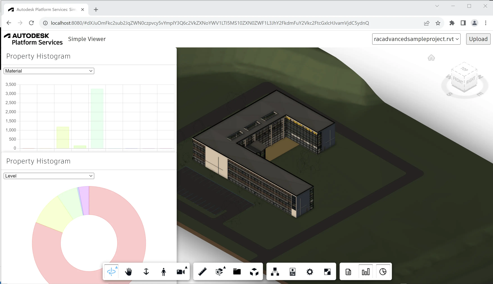

# 直方图

在此步骤中，我们将创建一个将显示直方图的查看器扩展
所有设计元素中特定属性的值。我们将使用
开源库 [Chart.js](https://www.chartjs.org） 显示直方图
作为条形图和饼图。

## 扩展骨架

就像前面的步骤一样，让我们在“extensions”子文件夹下创建一个新文件，
将其命名为“HistogramExtension.js”，并使用以下代码填充它：

```js title="wwwroot/extensions/HistogramExtension.js"
import { BaseExtension } from './BaseExtension.js';
class HistogramExtension extends BaseExtension {
    constructor(viewer, options) {
        super(viewer, options);
    }
    async load() {
        super.load();
        console.log('HistogramExtension loaded.');
        return true;
    }
    unload() {
        super.unload();
        console.log('HistogramExtension unloaded.');
        return true;
    }
    async findPropertyValueOccurrences(model, propertyName) {
        const dbids = await this.findLeafNodes(model);
        return new Promise(function (resolve, reject) {
            model.getBulkProperties(dbids, { propFilter: [propertyName] }, function (results) {
                let histogram = new Map();
                for (const result of results) {
                    if (result.properties.length > 0) {
                        const key = result.properties[0].displayValue;
                        if (histogram.has(key)) {
                            histogram.get(key).push(result.dbId);
                        } else {
                            histogram.set(key, [result.dbId]);
                        }
                    }
                }
                resolve(histogram);
            }, reject);
        });
    }
}
Autodesk.Viewing.theExtensionManager.registerExtension('HistogramExtension', HistogramExtension);
```

除了标准的扩展基架之外，我们还定义了一个“findPropertyValueOccurrences”
Helper 方法，我们稍后将使用它来收集所需的数据（特定
属性值，以及哪些对象包含此值）。

Now let's import the JavaScript file to our application, and pass the extension ID to the viewer
constructor:

```js
import './extensions/LoggerExtension.js';
import './extensions/SummaryExtension.js';
// highlight-start
import './extensions/HistogramExtension.js';
// highlight-end
```

```js
const config = {
    extensions: [
        'LoggerExtension',
        'SummaryExtension',
        // highlight-start
        'HistogramExtension',
        // highlight-end
    ]
};
const viewer = new Autodesk.Viewing.GuiViewer3D(container, config);
```

## 工具栏

接下来，让我们更新“HistogramExtension”类，以便它向查看器添加两个新按钮
工具栏，一个用于显示条形图，另一个用于显示饼图：

```js title="wwwroot/extensions/HistogramExtension.js"
import { BaseExtension } from './BaseExtension.js';
class HistogramExtension extends BaseExtension {
    constructor(viewer, options) {
        super(viewer, options);
        // highlight-start
        this._barChartButton = null;
        this._pieChartButton = null;
        // highlight-end
    }
    async load() {
        super.load();
        console.log('HistogramExtension loaded.');
        return true;
    }
    unload() {
        super.unload();
        // highlight-start
        for (const button of [this._barChartButton, this._pieChartButton]) {
            this.removeToolbarButton(button);
        }
        this._barChartButton = this._pieChartButton = null;
        // highlight-end
        console.log('HistogramExtension unloaded.');
        return true;
    }
    // highlight-start
    onToolbarCreated() {
        this._barChartButton = this.createToolbarButton('dashboard-barchart-button', 'https://img.icons8.com/small/32/bar-chart.png', 'Show Property Histogram (Bar Chart)');
        this._barChartButton.onClick = () => {
            // TODO
        };
        this._pieChartButton = this.createToolbarButton('dashboard-piechart-button', 'https://img.icons8.com/small/32/pie-chart.png', 'Show Property Histogram (Pie Chart)');
        this._pieChartButton.onClick = () => {
            // TODO
        };
    }
    // highlight-end
    async findPropertyValueOccurrences(model, propertyName) {
        const dbids = await this.findLeafNodes(model);
        return new Promise(function (resolve, reject) {
            model.getBulkProperties(dbids, { propFilter: [propertyName] }, function (results) {
                let histogram = new Map();
                for (const result of results) {
                    if (result.properties.length > 0) {
                        const key = result.properties[0].displayValue;
                        if (histogram.has(key)) {
                            histogram.get(key).push(result.dbId);
                        } else {
                            histogram.set(key, [result.dbId]);
                        }
                    }
                }
                resolve(histogram);
            }, reject);
        });
    }
}
Autodesk.Viewing.theExtensionManager.registerExtension('HistogramExtension', HistogramExtension);
```

## 依赖加载

我们的扩展需要以某种方式获取Chart.js库的依赖项。由于这个（获取依赖项
第三方库）在其他扩展中可能也需要，我们将更新“BaseExtension”类
还有几个帮助程序方法可以处理这个问题：

```js title="wwwroot/extensions/BaseExtension.js"
export class BaseExtension extends Autodesk.Viewing.Extension {
    constructor(viewer, options) {
        super(viewer, options);
        this._onObjectTreeCreated = (ev) => this.onModelLoaded(ev.model);
        this._onSelectionChanged = (ev) => this.onSelectionChanged(ev.model, ev.dbIdArray);
        this._onIsolationChanged = (ev) => this.onIsolationChanged(ev.model, ev.nodeIdArray);
    }
    load() {
        this.viewer.addEventListener(Autodesk.Viewing.OBJECT_TREE_CREATED_EVENT, this._onObjectTreeCreated);
        this.viewer.addEventListener(Autodesk.Viewing.SELECTION_CHANGED_EVENT, this._onSelectionChanged);
        this.viewer.addEventListener(Autodesk.Viewing.ISOLATE_EVENT, this._onIsolationChanged);
        return true;
    }
    unload() {
        this.viewer.removeEventListener(Autodesk.Viewing.OBJECT_TREE_CREATED_EVENT, this._onObjectTreeCreated);
        this.viewer.removeEventListener(Autodesk.Viewing.SELECTION_CHANGED_EVENT, this._onSelectionChanged);
        this.viewer.removeEventListener(Autodesk.Viewing.ISOLATE_EVENT, this._onIsolationChanged);
        return true;
    }
    onModelLoaded(model) {}
    onSelectionChanged(model, dbids) {}
    onIsolationChanged(model, dbids) {}
    findLeafNodes(model) {
        return new Promise(function (resolve, reject) {
            model.getObjectTree(function (tree) {
                let leaves = [];
                tree.enumNodeChildren(tree.getRootId(), function (dbid) {
                    if (tree.getChildCount(dbid) === 0) {
                        leaves.push(dbid);
                    }
                }, true);
                resolve(leaves);
            }, reject);
        });
    }
    async findPropertyNames(model) {
        const dbids = await this.findLeafNodes(model);
        return new Promise(function (resolve, reject) {
            model.getBulkProperties(dbids, {}, function (results) {
                let propNames = new Set();
                for (const result of results) {
                    for (const prop of result.properties) {
                        propNames.add(prop.displayName);
                    }
                }
                resolve(Array.from(propNames.values()));
            }, reject);
        });
    }
    createToolbarButton(buttonId, buttonIconUrl, buttonTooltip) {
        let group = this.viewer.toolbar.getControl('dashboard-toolbar-group');
        if (!group) {
            group = new Autodesk.Viewing.UI.ControlGroup('dashboard-toolbar-group');
            this.viewer.toolbar.addControl(group);
        }
        const button = new Autodesk.Viewing.UI.Button(buttonId);
        button.setToolTip(buttonTooltip);
        group.addControl(button);
        const icon = button.container.querySelector('.adsk-button-icon');
        if (icon) {
            icon.style.backgroundImage = `url(${buttonIconUrl})`; 
            icon.style.backgroundSize = `24px`; 
            icon.style.backgroundRepeat = `no-repeat`; 
            icon.style.backgroundPosition = `center`; 
        }
        return button;
    }
    removeToolbarButton(button) {
        const group = this.viewer.toolbar.getControl('dashboard-toolbar-group');
        group.removeControl(button);
    }
    // highlight-start
    loadScript(url, namespace) {
        if (window[namespace] !== undefined) {
            return Promise.resolve();
        }
        return new Promise(function (resolve, reject) {
            const el = document.createElement('script');
            el.src = url;
            el.onload = resolve;
            el.onerror = reject;
            document.head.appendChild(el);
        });
    }
    // highlight-end
    // highlight-start
    loadStylesheet(url) {
        return new Promise(function (resolve, reject) {
            const el = document.createElement('link');
            el.rel = 'stylesheet';
            el.href = url;
            el.onload = resolve;
            el.onerror = reject;
            document.head.appendChild(el);
        });
    }
    // highlight-end
}
```

## 图表

现在，让我们创建另一个自定义面板，该面板将托管实际的图表图形。创建“HistogramPanel.js”
文件，并在“HistogramExtension.js”所在的同一文件夹中，并向其添加以下代码：

```js title="wwwroot/extensions/HistogramPanel.js"
export class HistogramPanel extends Autodesk.Viewing.UI.DockingPanel {
    constructor(extension, id, title, options) {
        super(extension.viewer.container, id, title, options);
        this.extension = extension;
        this.container.style.left = (options.x || 0) + 'px';
        this.container.style.top = (options.y || 0) + 'px';
        this.container.style.width = (options.width || 500) + 'px';
        this.container.style.height = (options.height || 400) + 'px';
        this.container.style.resize = 'none';
        this.chartType = options.chartType || 'bar'; // See https://www.chartjs.org/docs/latest for all the supported types of charts
        this.chart = this.createChart();
    }
    initialize() {
        this.title = this.createTitleBar(this.titleLabel || this.container.id);
        this.initializeMoveHandlers(this.title);
        this.container.appendChild(this.title);
        this.content = document.createElement('div');
        this.content.style.height = '350px';
        this.content.style.backgroundColor = 'white';
        this.content.innerHTML = `
            <div class="props-container" style="position: relative; height: 25px; padding: 0.5em;">
                <select class="props"></select>
            </div>
            <div class="chart-container" style="position: relative; height: 325px; padding: 0.5em;">
                <canvas class="chart"></canvas>
            </div>
        `;
        this.select = this.content.querySelector('select.props');
        this.canvas = this.content.querySelector('canvas.chart');
        this.container.appendChild(this.content);
    }
    createChart() {
        return new Chart(this.canvas.getContext('2d'), {
            type: this.chartType,
            data: {
                labels: [],
                datasets: [{ data: [], backgroundColor: [], borderColor: [], borderWidth: 1 }],
            },
            options: { maintainAspectRatio: false }
        });
    }
    async setModel(model) {
        const propertyNames = await this.extension.findPropertyNames(model);
        this.select.innerHTML = propertyNames.map(prop => `<option value="${prop}">${prop}</option>`).join('\n');
        this.select.onchange = () => this.updateChart(model, this.select.value);
        this.updateChart(model, this.select.value);
    }
    async updateChart(model, propName) {
        const histogram = await this.extension.findPropertyValueOccurrences(model, propName);
        const propertyValues = Array.from(histogram.keys());
        this.chart.data.labels = propertyValues;
        const dataset = this.chart.data.datasets[0];
        dataset.label = propName;
        dataset.data = propertyValues.map(val => histogram.get(val).length);
        if (dataset.data.length > 0) {
            const hslaColors = dataset.data.map((val, index) => `hsla(${Math.round(index * (360 / dataset.data.length))}, 100%, 50%, 0.2)`);
            dataset.backgroundColor = dataset.borderColor = hslaColors;
        }
        this.chart.update();
        this.chart.config.options.onClick = (ev, items) => {
            if (items.length === 1) {
                const index = items[0].index;
                const dbids = histogram.get(propertyValues[index]);
                this.extension.viewer.isolate(dbids);
                this.extension.viewer.fitToView(dbids);
            }
        };
    }
}
```

最后，让我们在扩展中使用新的面板类：

```js title="wwwroot/extensions/HistogramExtension.js"
import { BaseExtension } from './BaseExtension.js';
// highlight-start
import { HistogramPanel } from './HistogramPanel.js';
// highlight-end
class HistogramExtension extends BaseExtension {
    constructor(viewer, options) {
        super(viewer, options);
        this._barChartButton = null;
        this._pieChartButton = null;
        // highlight-start
        this._barChartPanel = null;
        this._pieChartPanel = null;
        // highlight-end
    }
    async load() {
        super.load();
        // highlight-start
        await this.loadScript('https://cdnjs.cloudflare.com/ajax/libs/Chart.js/3.5.1/chart.min.js', 'Chart');
        Chart.defaults.plugins.legend.display = false;
        // highlight-end
        console.log('HistogramExtension loaded.');
        return true;
    }
    unload() {
        super.unload();
        for (const button of [this._barChartButton, this._pieChartButton]) {
            this.removeToolbarButton(button);
        }
        this._barChartButton = this._pieChartButton = null;
        // highlight-start
        for (const panel of [this._barChartPanel, this._pieChartPanel]) {
            panel.setVisible(false);
            panel.uninitialize();
        }
        this._barChartPanel = this._pieChartPanel = null;
        // highlight-end
        console.log('HistogramExtension unloaded.');
        return true;
    }
    onToolbarCreated() {
        // highlight-start
        this._barChartPanel = new HistogramPanel(this, 'dashboard-barchart-panel', 'Property Histogram', { x: 10, y: 10, chartType: 'bar' });
        this._pieChartPanel = new HistogramPanel(this, 'dashboard-piechart-panel', 'Property Histogram', { x: 10, y: 420, chartType: 'doughnut' });
        // highlight-end
        this._barChartButton = this.createToolbarButton('dashboard-barchart-button', 'https://img.icons8.com/small/32/bar-chart.png', 'Show Property Histogram (Bar Chart)');
        this._barChartButton.onClick = () => {
            // highlight-start
            this._barChartPanel.setVisible(!this._barChartPanel.isVisible());
            this._barChartButton.setState(this._barChartPanel.isVisible() ? Autodesk.Viewing.UI.Button.State.ACTIVE : Autodesk.Viewing.UI.Button.State.INACTIVE);
            if (this._barChartPanel.isVisible() && this.viewer.model) {
                this._barChartPanel.setModel(this.viewer.model);
            }
            // highlight-end
        };
        this._pieChartButton = this.createToolbarButton('dashboard-piechart-button', 'https://img.icons8.com/small/32/pie-chart.png', 'Show Property Histogram (Pie Chart)');
        this._pieChartButton.onClick = () => {
            // highlight-start
            this._pieChartPanel.setVisible(!this._pieChartPanel.isVisible());
            this._pieChartButton.setState(this._pieChartPanel.isVisible() ? Autodesk.Viewing.UI.Button.State.ACTIVE : Autodesk.Viewing.UI.Button.State.INACTIVE);
            if (this._pieChartPanel.isVisible() && this.viewer.model) {
                this._pieChartPanel.setModel(this.viewer.model);
            }
            // highlight-end
        };
    }
    // highlight-start
    onModelLoaded(model) {
        super.onModelLoaded(model);
        if (this._barChartPanel && this._barChartPanel.isVisible()) {
            this._barChartPanel.setModel(model);
        }
        if (this._pieChartPanel && this._pieChartPanel.isVisible()) {
            this._pieChartPanel.setModel(model);
        }
    }
    // highlight-end
    async findPropertyValueOccurrences(model, propertyName) {
        const dbids = await this.findLeafNodes(model);
        return new Promise(function (resolve, reject) {
            model.getBulkProperties(dbids, { propFilter: [propertyName] }, function (results) {
                let histogram = new Map();
                for (const result of results) {
                    if (result.properties.length > 0) {
                        const key = result.properties[0].displayValue;
                        if (histogram.has(key)) {
                            histogram.get(key).push(result.dbId);
                        } else {
                            histogram.set(key, [result.dbId]);
                        }
                    }
                }
                resolve(histogram);
            }, reject);
        });
    }
}
Autodesk.Viewing.theExtensionManager.registerExtension('HistogramExtension', HistogramExtension);
```

## 试一试

好了，是时候在查看器中测试我们的图表扩展了。单击任一新工具栏
按钮。应显示一个新面板，其中包含显示直方图的条形图或饼图
为特定属性显示的不同值（您可以在下拉列表中选择）。
然后单击任何条形图或饼图段将隔离所有相应的设计元素
在查看器中。


